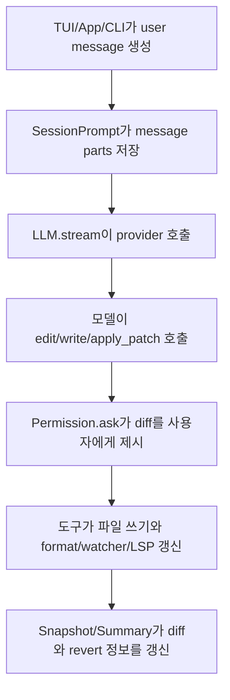
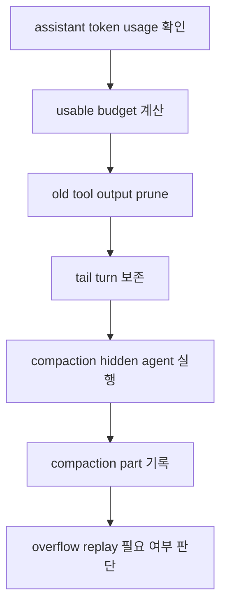
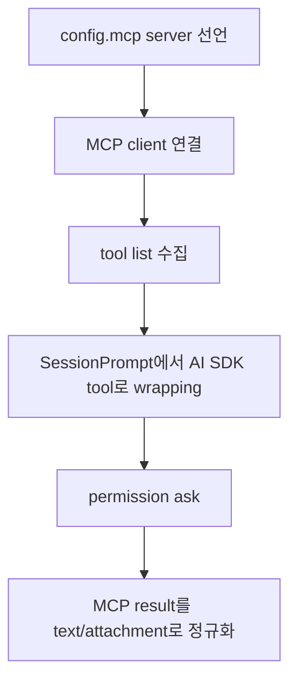

# 부록 F: 엔드투엔드 사례 추적

## 사례 1: 사용자가 파일 수정을 요청한다

읽을 파일:

- `packages/opencode/src/session/prompt.ts`
- `packages/opencode/src/session/llm.ts`
- `packages/opencode/src/tool/edit.ts`
- `packages/opencode/src/permission/index.ts`
- `packages/opencode/src/snapshot/index.ts`

## 사례 2: 컨텍스트가 넘친다

읽을 파일:

- `packages/opencode/src/session/overflow.ts`
- `packages/opencode/src/session/compaction.ts`
- `packages/opencode/src/session/prompt/compaction.txt`

## 사례 3: 외부 MCP tool을 호출한다

- `packages/opencode/src/mcp/index.ts`
- `packages/opencode/src/session/prompt.ts`
- `packages/opencode/src/plugin/index.ts`
