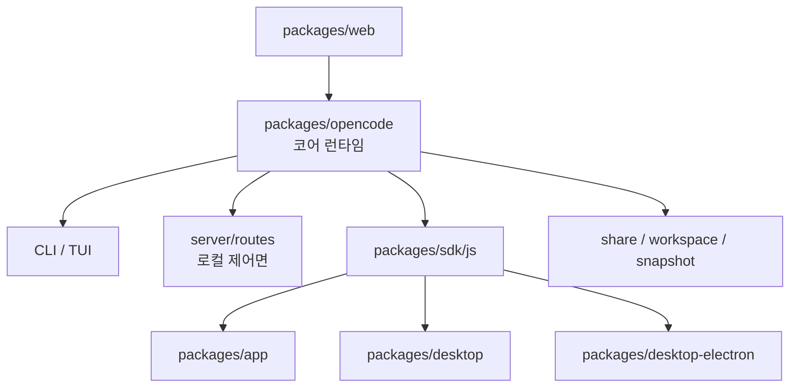
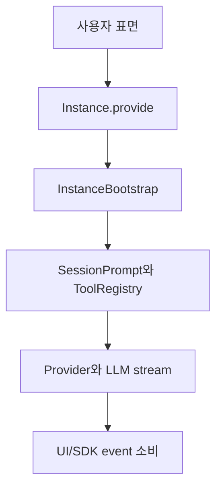

# 1장: OpenCode의 전체 시스템 토폴로지

> **포지셔닝**: 이 장은 OpenCode를 단일 CLI가 아니라, 코어 런타임 위에 여러 제품 표면과 운영 서브시스템이 올라간 하니스로 읽기 위한 입구다. 대상 독자: 저장소 전체를 어디서부터 해부해야 할지 잡고 싶은 독자, 혹은 어떤 패키지가 시스템 경계를 정의하는지 먼저 파악하고 싶은 빌더.

## 왜 중요한가

OpenCode를 잘못 읽는 가장 쉬운 방법은 이것을 "터미널 앱 하나"로 생각하는 것이다. 실제 저장소 구조는 전혀 그렇지 않다. 중심에는 `packages/opencode`라는 코어 런타임이 있고, 그 주위에 TUI, 로컬 제어면, JS SDK, 웹 문서, 브라우저 앱, 데스크톱 앱, Electron 패키징, 공유/동기화, 워크스페이스 계층이 층층이 올라앉아 있다.

이 토폴로지를 먼저 잡지 못하면 이후 장들이 전부 따로 논다. 예를 들어 permission은 단지 TUI 팝업이 아니고, session은 단지 채팅 로그가 아니며, plugin은 단지 npm 확장도 아니다. 모두 코어 런타임의 다른 표면이나 다른 제어면으로 다시 나타난 것이다.

## 소스 앵커

- `package.json`
- `packages/opencode/package.json`
- `packages/app/package.json`
- `packages/sdk/js/src/index.ts`
- `packages/web/astro.config.mjs`
- `infra/app.ts`
- `packages/desktop/package.json`
- `packages/desktop-electron/package.json`

## 구조를 한 장으로 보기

## 핵심 메커니즘

### 루트 스크립트도 결국 코어 패키지로 수렴한다

루트 `package.json`을 보면 개발 흐름의 중심이 무엇인지 금방 보인다. `dev`는 결국 `packages/opencode`를 실행하고, `postinstall` 역시 코어 패키지의 보조 스크립트를 부른다. 즉 저장소 최상단에서 보이는 명령조차 문서 사이트나 앱이 아니라 코어 런타임을 기준으로 짜여 있다.

이 패턴은 중요하다. 제품 표면이 여러 개여도 "어느 패키지가 실제 시스템의 중력 중심인가"를 잃지 않기 때문이다.

### `packages/opencode`는 화면이 아니라 운영 커널이다

`packages/opencode/package.json`을 보면 이 패키지 안에 `bin`, `exports`, `build`, `dev`, `db`가 함께 있다. 의존성도 PTY, provider SDK, MCP SDK, tree-sitter, git, auth, observability 쪽으로 넓게 퍼져 있다. 이런 모양은 보통 화면 패키지보다 운영 커널 패키지에서 나타난다.

즉 OpenCode의 진짜 정체성은 UI보다 runtime kernel 쪽에 가깝다.

### 앱 표면은 코어를 직접 복제하지 않는다

`packages/app/package.json`은 `@opencode-ai/sdk`, `@opencode-ai/ui`, `@opencode-ai/shared`를 중심 의존성으로 둔다. 이것은 아주 좋은 신호다. 브라우저 앱이 코어 내부 파일을 직접 여기저기 import해서 결합하지 않고, SDK와 공유 UI를 거쳐 올라간다는 뜻이다.

이 구조는 표면 수가 늘어날수록 가치가 커진다. 코어 변경이 앱 표면으로 흘러갈 때 coupling이 훨씬 약해지기 때문이다.

### 웹 문서는 단순 README 렌더링이 아니다

`packages/web/astro.config.mjs`는 Astro/Starlight 기반의 실제 제품 구성을 가진다. locale, sidebar, edit link, Cloudflare adapter, base path까지 모두 명시돼 있다. 즉 문서 사이트도 "있으면 좋은 정적 페이지"가 아니라 OpenCode의 공식 개념 모델을 제공하는 표면이다.

이 점은 책을 쓰는 지금 작업에도 중요하다. OpenCode에는 이미 사용자-facing 개념 모델이 있는데, 책은 그 개념 모델을 코드와 대조하는 역할을 해야 하기 때문이다.

### 데스크톱 표면은 동일한 코어를 다른 운영 책임으로 감싼다

`packages/desktop`은 Tauri 기반 패키지이고, `packages/desktop-electron`은 Electron 기반 패키지다. 둘 모두 `@opencode-ai/app`를 중심으로 소비하지만, 패키징, 운영체제 통합, 업데이터, 네이티브 의존성 관리 책임은 각자 다르다.

이 구조는 중요한 교훈을 준다. 여러 표면이 같은 UI를 공유할 수는 있지만, 배포 책임까지 같아지지는 않는다.

### 인프라에서도 경계가 유지된다

`infra/app.ts`는 이 저장소의 패키지 경계가 단지 폴더 구분이 아니라 배포 경계라는 점을 보여 준다.

- `docs.<domain>`은 `packages/web`
- `app.<domain>`은 `packages/app`
- `api.<domain>`은 worker API

즉 OpenCode는 코어, 앱, 문서를 저장소 안에서만 분리한 것이 아니라, 실제 운영 표면에서도 분리한다.

## 표면별 책임

| 표면 | 주 책임 | 코어와의 관계 |
| --- | --- | --- |
| `packages/opencode` | 에이전트 런타임, 세션, 도구, provider, permission | 중심 |
| TUI/CLI | 개발자와의 1차 상호작용 | 코어 직접 소비 |
| server routes | 로컬 제어면 | 코어 서비스 노출 |
| SDK | 외부 자동화 진입점 | 코어를 간접 소비하는 계약층 |
| app | 브라우저 UI | SDK와 공유 UI 위에 구축 |
| desktop/electron | 로컬 앱 포장 | app와 SDK 재사용 |
| web docs | 개념 모델과 사용 문서 | 코어를 설명하는 표면 |

## 이 장의 요점

OpenCode는 하나의 제품이 아니라 하나의 하니스 위에 여러 제품 표면이 매달린 구조다. 그리고 그 하니스의 중심은 언제나 `packages/opencode`다. 이 사실만 먼저 머리에 넣어도, 이후의 세션, 권한, 플러그인, 공유, worktree, snapshot을 모두 "코어 기능의 다른 표면"으로 읽기 쉬워진다.

## 빌더에게 남는 것

- 제품 표면이 많아져도 코어 패키지는 하나로 유지하는 편이 유리하다.
- 앱, 데스크톱, 문서가 생기더라도 코어와 바로 결합시키지 말고 SDK나 제어면을 사이에 두는 편이 좋다.
- 저장소를 읽을 때는 UI부터 보지 말고, 어떤 패키지가 시스템 경계를 정의하는지부터 잡아야 한다.

다음 장에서는 이 코어가 실제 실행 순간 어떻게 부팅되는지, 즉 CLI 엔트리포인트와 인스턴스 초기화 경로를 본다.

<!-- opencode-book-expansion -->
## 소스 그라운딩 확장

### 참조 강좌에서 가져올 렌즈

Claude 하니스 분석의 첫 번째 교훈은 제품의 중심을 모델 API가 아니라 모델 호출을 가능하게 하는 런타임 경계에서 찾는 것이다. OpenCode에서는 그 경계가 packages/opencode에 모인다. UI, desktop, SDK는 모두 중요하지만 코어 하니스는 session, tool, permission, provider, storage, event를 한 인스턴스 문맥 안에서 묶는 부분이다.

이 관점은 Claude 하니스의 구현을 그대로 복사하자는 뜻이 아니다. 같은 시스템 질문을 OpenCode 소스에 던지고, 다른 답이 나오는 지점을 분명히 하자는 뜻이다. 따라서 아래 흐름은 OpenCode의 실제 파일, 서비스, 상태 객체를 기준으로 다시 세운 읽기 지도다.

### 실제 OpenCode 흐름

### 확인해야 할 소스

- `packages/opencode/src/index.ts`
- `packages/opencode/src/project/instance.ts`
- `packages/opencode/src/project/bootstrap.ts`
- `packages/opencode/src/server/server.ts`
- `packages/app/src`
- `packages/sdk/js/src`

### 구현에서 읽어야 할 메커니즘

- Instance는 directory, worktree, project를 묶어 모든 Effect service가 같은 실행 경계를 공유하게 한다.
- InstanceBootstrap은 config를 먼저 읽고 plugin을 초기화한 뒤 LSP, watcher, VCS, snapshot을 기동한다. 이 순서는 실제 의존성 그래프다.
- server/app/desktop/SDK는 tool execution과 permission 의미론을 다시 구현하지 않고 core route와 event를 소비한다.

### 실패 모드와 설계 압력

- UI 중심으로 읽으면 하니스의 실제 계약이 packages/app 상태 관리로 축소된다.
- server route를 public API로만 보면 workspace router와 local control plane의 의미를 놓친다.
- worktree와 snapshot을 부가 기능으로 보면 복구 가능성과 병렬 작업의 근거가 사라진다.

### 빌더에게 남는 질문

- 먼저 core runtime 경계를 정의했는가?
- 화면이 core policy를 복제하고 있지는 않은가?
- 프로젝트 루트와 worktree를 같은 값으로 가정하고 있지는 않은가?

이 장의 핵심은 파일 이름을 외우는 것이 아니라 경계를 읽는 것이다. 어떤 상태가 어느 계층에서 만들어지고, 어떤 계약을 통과하며, 실패했을 때 어디서 관측되는지까지 따라가야 실제 하니스 설계로 옮길 수 있다.
