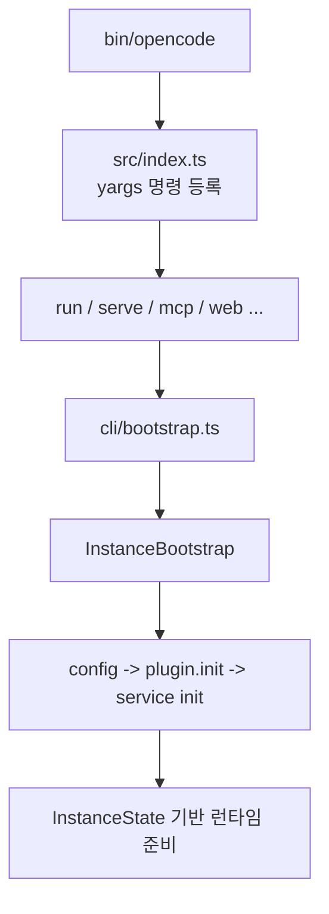
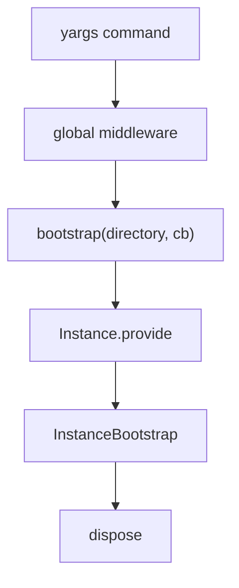

# 2장: CLI 엔트리포인트와 인스턴스 부트스트랩

> **포지셔닝**: 이 장은 사용자가 `opencode`를 실행했을 때 어떤 경로로 프로젝트 인스턴스가 세워지는지 살핀다. 대상 독자: CLI 도구가 프로젝트 문맥과 런타임 상태를 어떤 식으로 결합하는지 보고 싶은 독자.

## 왜 중요한가

에이전트 도구에서 가장 중요한 전제는 "어느 프로젝트를 기준으로 지금 동작하는가"다. 이 기준이 부정확하면 세션, 권한, 워크트리, LSP, 스냅샷 모두 흔들린다. OpenCode는 단순히 현재 디렉터리에서 파일을 읽는 대신, 부트스트랩 단계에서 프로젝트와 인스턴스를 식별하고 그 문맥을 이후 서비스 전체에 퍼뜨린다.

## 소스 앵커

- `packages/opencode/src/index.ts`
- `packages/opencode/src/cli/bootstrap.ts`
- `packages/opencode/bin/opencode`
- `packages/opencode/src/cli/cmd/run.ts`
- `packages/opencode/src/project/bootstrap.ts`
- `packages/opencode/src/project/instance.ts`
- `packages/opencode/src/project/project.ts`

## 핵심 코드

아래 두 조각이 이 장에서 반드시 읽어야 할 소스다. CLI 명령은 자기 일을 실행하지만, 실행 전후의 인스턴스 생성과 정리는 `bootstrap(...)` 경계 안에 갇힌다.

```ts
// packages/opencode/src/cli/bootstrap.ts
export async function bootstrap<T>(directory: string, cb: () => Promise<T>) {
  return Instance.provide({
    directory,
    init: () => AppRuntime.runPromise(InstanceBootstrap),
    fn: async () => {
      try {
        const result = await cb()
        return result
      } finally {
        await Instance.dispose()
      }
    },
  })
}
```

그리고 실제 서비스 초기화 순서는 `InstanceBootstrap`이 정한다. 여기서 중요한 건 config, plugin, 나머지 서비스의 순서다.

```ts
// packages/opencode/src/project/bootstrap.ts
export const InstanceBootstrap = Effect.gen(function* () {
  Log.Default.info("bootstrapping", { directory: Instance.directory })
  // everything depends on config so eager load it for nice traces
  yield* Config.Service.use((svc) => svc.get())
  // Plugin can mutate config so it has to be initialized before anything else.
  yield* Plugin.Service.use((svc) => svc.init())
  yield* Effect.all(
    [
      LSP.Service,
      ShareNext.Service,
      Format.Service,
      File.Service,
      FileWatcher.Service,
      Vcs.Service,
      Snapshot.Service,
    ].map((s) => Effect.forkDetach(s.use((i) => i.init()))),
  ).pipe(Effect.withSpan("InstanceBootstrap.init"))

  yield* Bus.Service.use((svc) =>
    svc.subscribeCallback(Command.Event.Executed, async (payload) => {
      if (payload.properties.name === Command.Default.INIT) {
        Project.setInitialized(Instance.project.id)
      }
    }),
  )
}).pipe(Effect.withSpan("InstanceBootstrap"))
```

## 부트스트랩 흐름



## 핵심 메커니즘

### 바이너리와 명령은 분리되어 있다

`packages/opencode/bin/opencode`는 얇은 진입점 역할을 하고, 실제 동작은 `src/cli/cmd/*` 아래의 명령 모듈로 분기된다. 이 구조는 전형적인 CLI 프레임워크 패턴처럼 보이지만, OpenCode에서는 각 명령이 결국 같은 프로젝트/인스턴스 계층으로 내려간다는 점이 중요하다.

`src/index.ts`를 보면 실제로 `RunCommand`, `ServeCommand`, `McpCommand`, `WebCommand`, `SessionCommand`, `PluginCommand` 같은 여러 명령이 같은 CLI에 꽂혀 있다. 즉 엔트리포인트는 하나지만 제품 표면은 이미 여러 갈래다.

`run.ts`, `serve.ts`, `web.ts`, `mcp.ts`, `agent.ts` 같은 명령은 표면은 달라도 공통 런타임을 호출한다. 명령은 서로 다른 기능이 아니라 코어 서비스로 들어가는 서로 다른 문이다.

### `cli/bootstrap.ts`는 얇지만 중요하다

`cli/bootstrap.ts`는 단순 wrapper처럼 보이지만, `AppRuntime.runPromise(InstanceBootstrap)`를 실행해 "현재 디렉터리를 인스턴스 문맥으로 바꾸는 의식"을 담당한다. 이 파일이 얇게 유지되는 이유는 부트스트랩 의도가 분명하기 때문이다. CLI 명령은 자기 일만 알고, 인스턴스 초기화는 한 곳에 모은다.

### 프로젝트와 인스턴스는 분리된 개념이다

`project.ts`, `project.sql.ts`, `schema.ts`를 보면 프로젝트는 저장된 정체성에 가깝다. 반면 `instance.ts`는 현재 실행 컨텍스트, 즉 디렉터리, 워크트리, 상태 컨테이너, 서비스 레이어를 감싼다. 이 분리는 중요하다. 사용자는 같은 프로젝트를 여러 워크트리에서 동시에 열 수 있고, 각 실행은 별도의 상태를 가질 수 있기 때문이다.

`bootstrap.ts`는 이 둘을 이어 붙이는 지점이다. 프로젝트 식별, 저장소 메타데이터 확인, 작업 디렉터리 정규화 같은 일이 여기에서 일어난다. OpenCode가 "cwd만 믿는 도구"가 아니라는 사실은 이 계층에서 드러난다.

### `InstanceBootstrap`은 서비스 초기화 순서를 강제한다

`project/bootstrap.ts`를 보면 초기화 순서에 의도가 있다.

1. `Config.Service`를 먼저 읽는다.
2. `Plugin.Service.init()`를 먼저 실행한다.
3. 그 뒤에 `LSP`, `ShareNext`, `Format`, `File`, `FileWatcher`, `Vcs`, `Snapshot`을 병렬로 초기화한다.

여기서 핵심은 "플러그인이 설정을 바꿀 수 있으므로 config 뒤, 다른 서비스보다 앞"이라는 점이다. 이건 아주 좋은 부트스트랩 규율이다. 확장이 설정을 바꿀 수 있다면, 확장 로딩은 코어 서비스 초기화보다 앞서야 한다.

### 이후 서비스는 인스턴스 상태를 공유한다

이 저장소 전반에 반복적으로 나오는 키워드는 `InstanceState`다. 권한, 세션, 플러그인, 워크트리, 스냅샷 같은 서비스가 각자 전역 싱글턴을 들고 있는 것이 아니라, 인스턴스 경계를 따라 상태를 해석한다. 이 설계 덕분에 하나의 사용자 계정, 하나의 저장소, 여러 실행 표면이 뒤엉키지 않는다.

### 명령 실행 이벤트도 부트스트랩 단계에서 연결된다

`InstanceBootstrap` 마지막 부분은 `Command.Event.Executed`를 구독해 `/init` 같은 명령이 실행되면 프로젝트 초기화 상태를 갱신한다. 즉 부트스트랩은 서비스만 켜는 단계가 아니라, 이후 명령 이벤트와 프로젝트 상태를 묶는 첫 연결점이기도 하다.

## 빌더에게 남는 것

- CLI의 진짜 문제는 파싱보다 부트스트랩이다.
- "프로젝트"와 "현재 실행 인스턴스"를 분리하면 멀티워크트리, 멀티세션, 공유 기능이 쉬워진다.
- 서비스 초기화 순서는 설계의 일부다. 특히 config와 plugin의 선후는 중요하다.
- 실행 초기에 경계를 정확히 세우면 이후의 permission, snapshot, share가 훨씬 단순해진다.

부트스트랩이 문맥을 세웠다면, 다음 장에서는 그 문맥 안에서 실제로 어떤 에이전트가 어떤 권한으로 움직이는지 본다.

<!-- opencode-book-expansion -->
## 소스 그라운딩 확장

### 참조 강좌에서 가져올 렌즈

Claude 책의 agent loop 시야를 OpenCode에 적용하면 CLI는 단순 명령 파서가 아니라 런타임 생성기다. 모델에게 입력을 보내기 전에 로그, DB migration, 인스턴스 context, plugin 초기화가 끝나야 한다.

이 관점은 Claude 하니스의 구현을 그대로 복사하자는 뜻이 아니다. 같은 시스템 질문을 OpenCode 소스에 던지고, 다른 답이 나오는 지점을 분명히 하자는 뜻이다. 따라서 아래 흐름은 OpenCode의 실제 파일, 서비스, 상태 객체를 기준으로 다시 세운 읽기 지도다.

### 실제 OpenCode 흐름



### 확인해야 할 소스

- `packages/opencode/src/index.ts`
- `packages/opencode/src/cli/bootstrap.ts`
- `packages/opencode/src/project/instance.ts`
- `packages/opencode/src/project/bootstrap.ts`
- `packages/opencode/src/storage/json-migration.ts`

### 구현에서 읽어야 할 메커니즘

- index.ts는 OPENCODE, OPENCODE_PID, AGENT 환경 변수와 로그 레벨을 세팅한다.
- 최초 실행 migration은 세션 저장소를 신뢰할 수 있게 만드는 선행 조건이다.
- cli/bootstrap.ts는 얇지만 command 구현이 Effect service 초기화 순서를 직접 알 필요 없게 만든다.

### 실패 모드와 설계 압력

- 명령별로 초기화를 흩뿌리면 plugin/config 순서가 깨진다.
- dispose를 빠뜨리면 watcher, LSP client, snapshot lock 같은 배경 상태가 남는다.
- 단발 CLI와 장기 server가 서로 다른 boot 경로를 쓰면 테스트와 운영 결과가 달라진다.

### 빌더에게 남는 질문

- CLI command와 runtime bootstrap을 분리했는가?
- 초기화와 dispose가 한 경계 안에 묶여 있는가?
- migration 실패를 사용자에게 설명할 수 있는가?

이 장의 핵심은 파일 이름을 외우는 것이 아니라 경계를 읽는 것이다. 어떤 상태가 어느 계층에서 만들어지고, 어떤 계약을 통과하며, 실패했을 때 어디서 관측되는지까지 따라가야 실제 하니스 설계로 옮길 수 있다.
