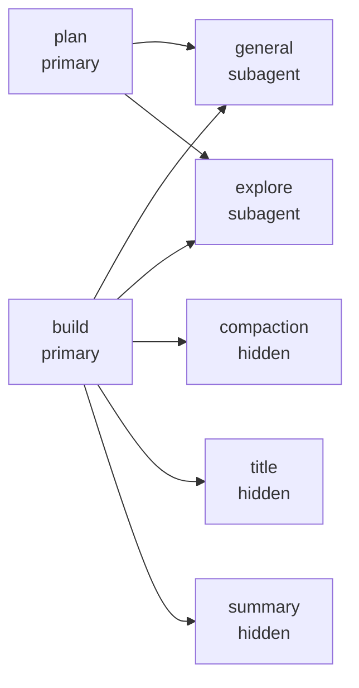
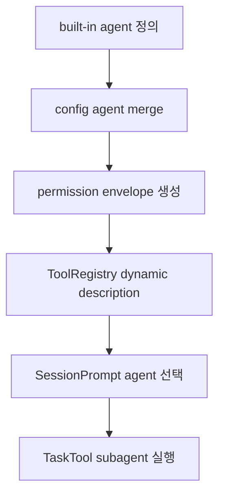

# 3장: 에이전트, 모드, 위임 구조

> **포지셔닝**: 이 장은 OpenCode의 agent를 프롬프트 프리셋이 아니라 model, permission, mode, hidden/system role을 포함한 실행 단위로 읽는다. 대상 독자: 다중 역할 assistant 구성을 설계하거나, OpenCode를 하니스 관점에서 읽고 싶은 빌더.

## 왜 중요한가

OpenCode의 agent는 단순 캐릭터 설정이 아니다. 각 agent는 설명, 모드, 모델, 프롬프트, 권한 집합, 숨김 여부를 함께 가진다. 즉 agent는 personality보다 operating envelope에 가깝다. 이걸 놓치면 build, plan, general, explore, compaction, title, summary가 왜 서로 다른지 정확히 읽을 수 없다.

## 소스 앵커

- `packages/opencode/src/agent/agent.ts`
- `packages/opencode/src/agent/generate.txt`
- `packages/opencode/src/agent/prompt/explore.txt`
- `packages/web/src/content/docs/agents.mdx`
- `packages/web/src/content/docs/permissions.mdx`

## 핵심 코드

agent가 프롬프트 이름이 아니라 실행 envelope라는 점은 `Info` 타입에서 바로 드러난다. `permission`, `model`, `mode`, `hidden`, `options`가 같은 객체에 들어간다.

```ts
// packages/opencode/src/agent/agent.ts
export const Info = z
  .object({
    name: z.string(),
    description: z.string().optional(),
    mode: z.enum(["subagent", "primary", "all"]),
    native: z.boolean().optional(),
    hidden: z.boolean().optional(),
    topP: z.number().optional(),
    temperature: z.number().optional(),
    color: z.string().optional(),
    permission: Permission.Ruleset.zod,
    model: z
      .object({
        modelID: ModelID.zod,
        providerID: ProviderID.zod,
      })
      .optional(),
    variant: z.string().optional(),
    prompt: z.string().optional(),
    options: z.record(z.string(), z.any()),
    steps: z.number().int().positive().optional(),
  })
  .meta({
    ref: "Agent",
  })
```

`build`와 `plan`의 차이도 결국 permission merge에서 만들어진다. 이 코드를 읽어야 "모드"가 프롬프트가 아니라 실행 범위라는 점이 보인다.

```ts
// packages/opencode/src/agent/agent.ts
build: {
  name: "build",
  description: "The default agent. Executes tools based on configured permissions.",
  options: {},
  permission: Permission.merge(
    defaults,
    Permission.fromConfig({
      question: "allow",
      plan_enter: "allow",
    }),
    user,
  ),
  mode: "primary",
  native: true,
},
plan: {
  name: "plan",
  description: "Plan mode. Disallows all edit tools.",
  options: {},
  permission: Permission.merge(
    defaults,
    Permission.fromConfig({
      question: "allow",
      plan_exit: "allow",
      external_directory: {
        [path.join(Global.Path.data, "plans", "*")]: "allow",
      },
      edit: {
        "*": "deny",
        [path.join(".opencode", "plans", "*.md")]: "allow",
        [path.relative(Instance.worktree, path.join(Global.Path.data, path.join("plans", "*.md")))]: "allow",
      },
    }),
    user,
  ),
  mode: "primary",
  native: true,
},
```

## 에이전트 관계도



## 핵심 메커니즘

### built-in agent는 코드 안에서 직접 조립된다

`agent.ts`를 보면 `build`, `plan`, `general`, `explore`, `compaction`, `title`, `summary`가 모두 코드로 정의된다. 이때 중요한 것은 단순 이름 목록이 아니라, 각 항목이 `mode`, `permission`, `model`, `description`, `hidden` 같은 필드를 가진다는 점이다.

즉 OpenCode는 agent를 "프롬프트 문자열 한 덩어리"로 두지 않고, 구성 가능한 운영 객체로 둔다.

### 차이는 프롬프트보다 permission envelope에서 더 선명하다

`agent.ts`의 핵심은 `Permission.merge(...)`다. 기본 규칙, 사용자 설정, built-in agent 전용 규칙이 합쳐져 각 agent의 실제 행동 범위를 만든다. 그래서 `plan`이 읽기/계획용처럼 보이는 이유도 결국 edit 계열과 bash 계열 권한이 조정되기 때문이다.

이 지점이 중요하다. 에이전트 역할을 프롬프트 하나에만 맡기면 금방 무너진다. OpenCode는 역할을 permission envelope로도 고정한다.

### primary와 subagent는 UI 분류이면서 orchestration 분류다

문서 `agents.mdx`는 primary agent와 subagent를 UI 관점에서 설명하지만, 구현을 보면 이 구분은 orchestration에도 직접 연결된다. primary agent는 사용자가 직접 탭으로 전환하는 대상이고, subagent는 task/tool 위임 대상이다. 즉 이 분류는 단순 화면 분류가 아니라 실행 흐름 분류다.

### hidden agent는 유지 기능을 담당한다

`compaction`, `title`, `summary`가 `hidden: true`인 이유는 분명하다. 이 agent들은 사용자가 직접 선택하지 않지만, 세션 품질 유지에 매우 중요하다. OpenCode가 이런 보조 작업을 helper 함수로 두지 않고 agent abstraction 안에 넣은 것은 매우 좋은 설계다. model 선택, prompt, retry, logging 같은 공통 실행 규칙을 그대로 재사용할 수 있기 때문이다.

### 사용자 정의 agent도 같은 모델에 합류한다

`cfg.agent` 병합 경로를 보면 사용자 정의 agent는 built-in과 완전히 별개 시스템이 아니다. 기존 agent를 override하거나 새 agent를 추가해도 최종적으로는 같은 `Info` 구조로 수렴한다. 이 점이 중요하다. built-in과 user-defined가 서로 다른 타입이면 시스템이 빠르게 복잡해진다.

### external directory 규칙도 자동으로 보강된다

`agent.ts` 뒤쪽을 보면 외부 디렉터리 관련 permission이 명시적으로 없는 agent에 대해 공통 규칙을 보강한다. 이건 작은 디테일 같지만 중요하다. 일부 안전 경계는 agent 개별 취향이 아니라 시스템 전체의 기본 seam으로 유지해야 하기 때문이다.

### default agent 선택도 별도 정책이다

`cfg.default_agent`가 있으면 그 agent를 기본으로 삼되, subagent이거나 hidden이면 오류를 낸다. 설정이 없으면 visible primary agent 중 첫 후보를 택한다. 즉 OpenCode는 "기본 에이전트"도 단순 하드코딩 값이 아니라, 유효성 검사와 선택 정책을 가진 기능으로 다룬다.

## 문서와 구현의 차이

문서 `agents.mdx`는 build, plan, general, explore를 사용자 시점에서 설명한다. 하지만 구현에서는 더 많은 사실이 보인다.

- hidden system agent가 존재한다.
- permission merge가 핵심이다.
- 사용자 정의 agent가 built-in과 같은 타입으로 합류한다.
- 기본 agent 선택도 검증이 필요하다.

즉 문서가 역할 설명이라면, 구현은 operating envelope 설명이다.

## 빌더에게 남는 것

- agent는 "성격"보다 "권한과 문맥 묶음"으로 설계하는 편이 낫다.
- primary/subagent/hidden 같은 실행 역할을 타입 차원에서 분리하는 것이 좋다.
- built-in agent와 user-defined agent가 같은 구조로 수렴하면 시스템이 훨씬 단순해진다.
- 유지 기능은 hidden system agent로 분리하는 편이 메인 assistant를 덜 오염시킨다.

다음 장에서는 agent가 실제로 쓰는 도구 표면이 어떤 계약과 실행 파이프라인 위에 올라가는지 본다.

<!-- opencode-book-expansion -->
## 소스 그라운딩 확장

### 참조 강좌에서 가져올 렌즈

Claude의 subagent 관점을 가져오되 OpenCode에서는 agent를 prompt 이름으로 보지 말아야 한다. OpenCode의 agent는 mode, permission, model override, prompt, options를 포함하는 실행 envelope다.

이 관점은 Claude 하니스의 구현을 그대로 복사하자는 뜻이 아니다. 같은 시스템 질문을 OpenCode 소스에 던지고, 다른 답이 나오는 지점을 분명히 하자는 뜻이다. 따라서 아래 흐름은 OpenCode의 실제 파일, 서비스, 상태 객체를 기준으로 다시 세운 읽기 지도다.

### 실제 OpenCode 흐름



### 확인해야 할 소스

- `packages/opencode/src/agent/agent.ts`
- `packages/opencode/src/tool/task.ts`
- `packages/opencode/src/session/prompt.ts`
- `packages/opencode/src/permission/index.ts`
- `packages/opencode/src/config/agent.ts`

### 구현에서 읽어야 할 메커니즘

- build, plan, general, explore, compaction, title, summary는 모두 Agent.Info로 조립된다.
- plan과 build의 차이는 prompt보다 permission envelope에서 더 선명하다. plan은 edit 계열을 막고 plan file만 제한적으로 허용한다.
- hidden agent도 같은 provider/model/prompt 경로를 쓰므로 title, summary, compaction이 예외적인 helper가 되지 않는다.

### 실패 모드와 설계 압력

- agent를 프롬프트 텍스트로만 보면 권한과 tool exposure 차이를 놓친다.
- subagent를 병렬성 기능으로만 보면 parent/child session과 permission 병합을 놓친다.
- hidden agent를 관측하지 않으면 보조 LLM 비용과 실패가 보이지 않는다.

### 빌더에게 남는 질문

- agent 타입에 prompt와 permission을 함께 넣었는가?
- primary/subagent/hidden mode를 분리했는가?
- 사용자 정의 agent가 built-in agent와 같은 모델에 합류하는가?

이 장의 핵심은 파일 이름을 외우는 것이 아니라 경계를 읽는 것이다. 어떤 상태가 어느 계층에서 만들어지고, 어떤 계약을 통과하며, 실패했을 때 어디서 관측되는지까지 따라가야 실제 하니스 설계로 옮길 수 있다.
