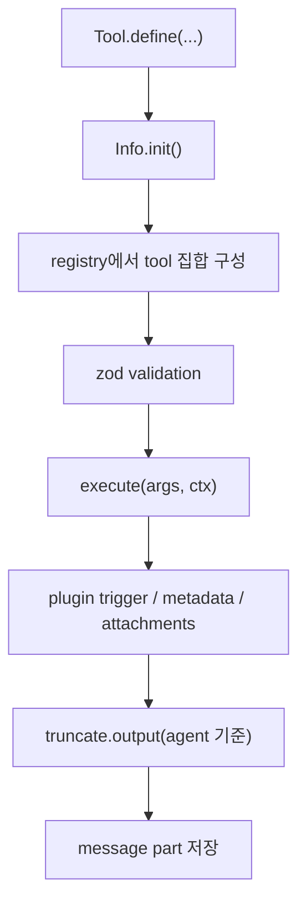
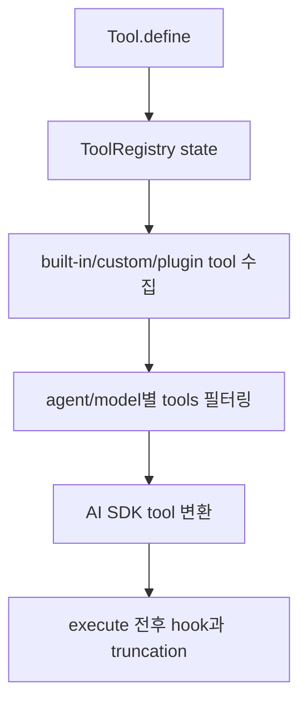

# 4장: 도구 레지스트리와 실행 파이프라인

> **포지셔닝**: 이 장은 OpenCode의 tool 계층을 함수 모음이 아니라 초기화, 검증, agent-aware truncation, plugin 주입을 가진 capability surface로 읽는다. 대상 독자: 도구 호출 중심의 에이전트 런타임을 설계하는 빌더.

## 왜 중요한가

에이전트 시스템에서 도구는 가장 위험하고 가장 중요한 층이다. 파일을 읽고, 수정하고, 쉘을 실행하고, 서브에이전트를 부르고, 검색과 웹 요청을 날리는 모든 행동이 여기서 나온다. OpenCode는 이 층을 매우 의식적으로 설계한다. 도구는 단순 함수가 아니라 스키마, 실행 컨텍스트, permission ask, metadata, output truncation, plugin hook을 함께 가진다.

## 소스 앵커

- `packages/opencode/src/tool/tool.ts`
- `packages/opencode/src/tool/registry.ts`
- `packages/opencode/src/tool/bash.ts`
- `packages/opencode/src/tool/read.ts`
- `packages/opencode/src/tool/edit.ts`
- `packages/opencode/src/tool/apply_patch.ts`
- `packages/opencode/src/tool/task.ts`

## 핵심 코드

도구는 함수 하나가 아니라 실행 계약이다. 이 타입들이 있어야 built-in tool, plugin tool, MCP tool을 같은 표면으로 다룰 수 있다.

```ts
// packages/opencode/src/tool/tool.ts
export type Context<M extends Metadata = Metadata> = {
  sessionID: SessionID
  messageID: MessageID
  agent: string
  abort: AbortSignal
  callID?: string
  extra?: { [key: string]: unknown }
  messages: MessageV2.WithParts[]
  metadata(input: { title?: string; metadata?: M }): Effect.Effect<void>
  ask(input: Omit<Permission.Request, "id" | "sessionID" | "tool">): Effect.Effect<void>
}

export interface ExecuteResult<M extends Metadata = Metadata> {
  title: string
  metadata: M
  output: string
  attachments?: Omit<MessageV2.FilePart, "id" | "sessionID" | "messageID">[]
}

export interface Def<Parameters extends z.ZodType = z.ZodType, M extends Metadata = Metadata> {
  id: string
  description: string
  parameters: Parameters
  execute(args: z.infer<Parameters>, ctx: Context): Effect.Effect<ExecuteResult<M>>
  formatValidationError?(error: z.ZodError): string
}
```

`wrap(...)`는 모든 도구가 통과하는 공통 실행 경계다. 스키마 검증, tracing, agent 기준 truncation이 여기서 걸린다.

```ts
// packages/opencode/src/tool/tool.ts
toolInfo.execute = (args, ctx) => {
  const attrs = {
    "tool.name": id,
    "session.id": ctx.sessionID,
    "message.id": ctx.messageID,
    ...(ctx.callID ? { "tool.call_id": ctx.callID } : {}),
  }
  return Effect.gen(function* () {
    yield* Effect.try({
      try: () => toolInfo.parameters.parse(args),
      catch: (error) => {
        if (error instanceof z.ZodError && toolInfo.formatValidationError) {
          return new Error(toolInfo.formatValidationError(error), { cause: error })
        }
        return new Error(
          `The ${id} tool was called with invalid arguments: ${error}.\nPlease rewrite the input so it satisfies the expected schema.`,
          { cause: error },
        )
      },
    })
    const result = yield* execute(args, ctx)
    if (result.metadata.truncated !== undefined) {
      return result
    }
    const agent = yield* agents.get(ctx.agent)
    const truncated = yield* truncate.output(result.output, {}, agent)
    return {
      ...result,
      output: truncated.content,
      metadata: {
        ...result.metadata,
        truncated: truncated.truncated,
        ...(truncated.truncated && { outputPath: truncated.outputPath }),
      },
    }
  }).pipe(Effect.orDie, Effect.withSpan("Tool.execute", { attributes: attrs }))
}
```

## 파이프라인 개요



## 핵심 메커니즘

### `Info`와 `Def`를 분리한다

`tool/tool.ts`에서 `Info`는 `init()`를 통해 실제 실행 가능한 `Def`를 만드는 초기화 핸들이다. 이 분리가 중요한 이유는 도구가 실행 시점의 서비스, 설정, 현재 agent에 의존할 수 있기 때문이다. 정적인 JSON 사전으로는 이런 의존성을 감당하기 어렵다.

즉 OpenCode는 도구를 "선언"과 "실행 가능한 실체"로 분리한다.

### 실행 전에 항상 검증과 래핑이 들어간다

`wrap(...)`를 보면 도구 실행은 바로 원본 함수로 가지 않는다. 먼저 zod 스키마 검증을 거치고, 실패하면 모델이 다시 시도할 수 있는 형태의 오류 메시지를 만든다. 그 다음 실제 execute를 호출하고, 결과를 현재 agent 기준으로 truncation한다.

이것은 아주 중요한 설계다. 잘못된 도구 호출과 과도한 출력은 LLM 시스템에서 가장 흔한 실패 원인이다.

### 도구 결과는 텍스트 이상이다

`ExecuteResult`에는 `title`, `metadata`, `output`, `attachments`가 있다. 즉 도구 결과는 문자열 하나가 아니라, 이후 세션 타임라인에서 richer part로 재구성될 수 있는 묶음이다. 이 구조가 있기 때문에 파일 첨부나 추가 메타데이터도 자연스럽게 저장 모델로 흘러간다.

### registry는 기능 목록이 아니라 정책 표면이다

`tool/registry.ts`가 중요한 이유는 어떤 도구가 존재하는지보다, 어떤 조건에서 어떤 도구를 현재 모델과 agent에게 보여 줄지를 결정하기 때문이다. 예를 들어:

- provider에 따라 `code search`나 `web search` 노출 여부가 바뀐다.
- `apply_patch`와 `edit`/`write`는 플래그나 설정에 따라 전환된다.
- experimental LSP tool은 플래그가 켜져야 열린다.
- plan mode 전용 도구도 조건부로 노출된다.

즉 registry는 단순 사전이 아니라 capability policy surface다.

### plugin 도구도 같은 표면으로 합류한다

`registry.ts`의 `fromPlugin(...)` 경로를 보면 플러그인이 제공하는 도구도 최종적으로는 같은 `Tool.Def` 형식으로 변환된다. 이 구조의 장점은 명확하다. built-in tool과 plugin tool이 상위 계층에서 같은 계약을 공유하게 된다.

### `task`와 `skill` 도구는 설명까지 동적으로 바뀐다

`describeTask(...)`, `describeSkill(...)`는 agent별 사용 가능한 subagent와 skill 목록을 동적으로 설명에 포함한다. 이건 좋은 냄새다. 도구 설명도 정적 문자열이 아니라 현재 런타임 capability를 반영해야 하기 때문이다.

## 내장 도구 표면의 실제 범위

`registry.ts`를 보면 OpenCode가 기본으로 다루는 도구 범위는 꽤 넓다.

- `bash`
- `read`
- `glob`
- `grep`
- `edit`
- `write`
- `task`
- `webfetch`
- `websearch`
- `codesearch`
- `skill`
- `apply_patch`
- `question`
- `todo`
- `lsp`
- `plan`

즉 이 시스템에서 agent capability를 바꾸는 가장 직접적인 방법은 프롬프트가 아니라 registry와 permission이다.

## 빌더에게 남는 것

- 도구는 함수가 아니라 실행 계약으로 정의해야 한다.
- `init`와 `execute`를 분리하면 서비스 의존성과 지연 초기화가 쉬워진다.
- registry는 단순 도구 목록이 아니라 capability policy surface여야 한다.
- plugin 도구도 가능하면 같은 실행 계약으로 합류시켜야 한다.

다음 장에서는 이 도구 호출들이 어떤 세션 데이터 모델 위에 저장되는지 본다.

<!-- opencode-book-expansion -->
## 소스 그라운딩 확장

### 참조 강좌에서 가져올 렌즈

Claude 책의 도구 프롬프트 분석은 OpenCode의 ToolRegistry에 그대로 적용된다. 도구는 함수가 아니라 schema, description, permission ask, metadata, truncation, plugin hook이 붙은 micro-harness다.

이 관점은 Claude 하니스의 구현을 그대로 복사하자는 뜻이 아니다. 같은 시스템 질문을 OpenCode 소스에 던지고, 다른 답이 나오는 지점을 분명히 하자는 뜻이다. 따라서 아래 흐름은 OpenCode의 실제 파일, 서비스, 상태 객체를 기준으로 다시 세운 읽기 지도다.

### 실제 OpenCode 흐름



### 확인해야 할 소스

- `packages/opencode/src/tool/tool.ts`
- `packages/opencode/src/tool/registry.ts`
- `packages/opencode/src/session/prompt.ts`
- `packages/opencode/src/mcp/index.ts`
- `packages/opencode/src/plugin/index.ts`
- `packages/opencode/src/tool/truncate.ts`

### 구현에서 읽어야 할 메커니즘

- Tool.Info와 Tool.Def가 분리되어 Effect service가 필요한 도구를 lazy init할 수 있다.
- Tool.define wrapper가 zod validation, tracing, output truncation을 공통 처리한다.
- task와 skill tool description은 현재 agent permission과 available skill/agent 목록에 따라 동적으로 바뀐다.
- MCP tool은 별도 출처지만 SessionPrompt.resolveTools에서 permission, hook, attachment 정규화를 공유한다.

### 실패 모드와 설계 압력

- 도구별로 truncation과 permission을 따로 구현하면 built-in, plugin, MCP 사이 의미가 달라진다.
- 정적 tool description은 agent 권한과 실제 가능한 행동 사이를 어긋나게 만든다.
- 긴 tool output을 그대로 모델에 돌려주면 compaction 압력이 급격히 커진다.

### 빌더에게 남는 질문

- 모든 도구가 같은 execution wrapper를 통과하는가?
- tool description은 runtime state를 반영하는가?
- plugin/MCP tool도 core permission 모델 안에 있는가?

이 장의 핵심은 파일 이름을 외우는 것이 아니라 경계를 읽는 것이다. 어떤 상태가 어느 계층에서 만들어지고, 어떤 계약을 통과하며, 실패했을 때 어디서 관측되는지까지 따라가야 실제 하니스 설계로 옮길 수 있다.
