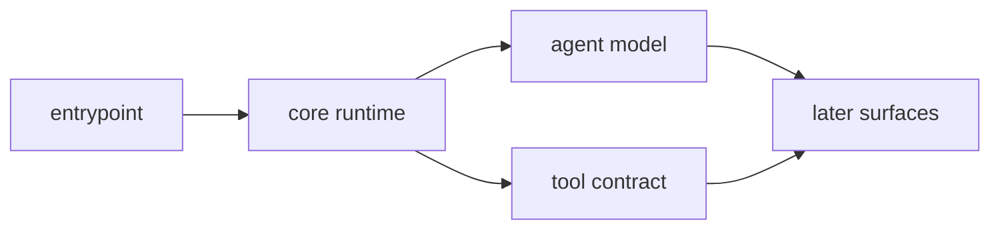

# 제1부: 어디에 시스템 경계를 두는가

제1부는 OpenCode를 소개하지 않는다. 대신 저장소 안에서 어디가 시스템 경계이고 어디가 표면인지부터 가른다. 이 구분이 먼저 서지 않으면 뒤의 세션, 권한, 플러그인, 스냅샷, 앱 표면을 모두 기능 목록처럼 읽게 된다.

이 파트의 핵심 질문은 단순하다. OpenCode는 어디서부터 "터미널 앱"이 아니고 "운영 가능한 하니스"가 되는가. 답은 대개 `packages/opencode`와 그 주변의 책임 배치에 있다. CLI 엔트리포인트, agent 모드, tool registry는 겉으로는 사용성 기능처럼 보이지만, 실제로는 시스템의 실행 경계를 정하는 장치들이다.

이 파트를 읽을 때는 세 가지를 계속 확인해야 한다.

- 어떤 패키지가 코어 중력 중심인가
- 어떤 책임이 표면으로 올라가지 않고 코어에 남아 있는가
- 어떤 추상화가 이후 파트들의 공통 기반이 되는가

1장은 저장소 전체 토폴로지를 잡는다. 2장은 그 토폴로지가 실제 실행 순간 어떻게 부팅되는지 본다. 3장은 agent와 mode가 단순 프롬프트 템플릿이 아니라 operating envelope라는 점을 보여 준다. 4장은 모델 출력이 실제 실행으로 바뀌는 최소 계약이 무엇인지 추적한다.

이 파트를 다 읽고 나면 독자는 적어도 다음은 말할 수 있어야 한다. OpenCode의 진짜 제품은 UI가 아니라 코어 런타임이고, 이후에 나오는 모든 표면과 운영 서브시스템은 그 코어의 다른 표현이라는 것.

<!-- opencode-book-expansion -->
## 확장된 읽기 관점

이 부는 시스템 경계부터 잡는다. Claude 하니스 분석에서 가장 먼저 배운 것은 UI보다 하니스 경계를 먼저 읽어야 한다는 점이다. OpenCode에서는 그 경계가 Instance, Bootstrap, Agent, ToolRegistry에 있다.

### 핵심 소스

- `packages/opencode/src/project/instance.ts`
- `packages/opencode/src/project/bootstrap.ts`
- `packages/opencode/src/agent/agent.ts`
- `packages/opencode/src/tool/registry.ts`
