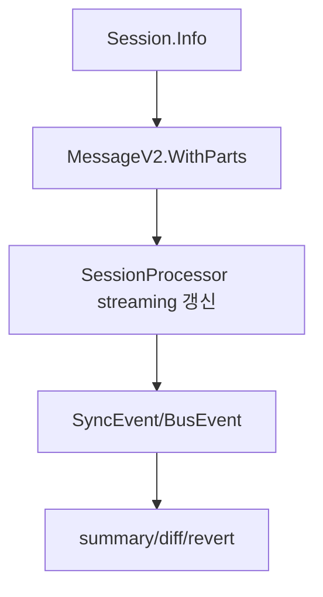

# 5장: 세션 데이터 모델과 메시지 흐름

> **포지셔닝**: 이 장은 OpenCode 세션을 "대화 로그"가 아니라 part 기반 상태 타임라인으로 읽는 장이다. 대상 독자: 긴 에이전트 대화를 저장하고 재생해야 하는 빌더.

## 왜 중요한가

OpenCode의 세션은 user/assistant 문자열 몇 개를 쌓는 구조가 아니다. 실제 중심은 `message-v2.ts`의 파트 모델이다. 이 구조가 있어야 tool 실행, reasoning, 파일 첨부, subtask, compaction, patch, retry, step start/finish를 같은 타임라인 위에 놓을 수 있다. 이 설계가 없으면 나중에 요약, 공유, 복구, UI 렌더링, provider 변환이 전부 취약해진다.

## 소스 앵커

- `packages/opencode/src/session/session.ts`
- `packages/opencode/src/session/message-v2.ts`
- `packages/opencode/src/session/message.ts`
- `packages/opencode/src/session/schema.ts`
- `packages/opencode/src/session/todo.ts`
- `packages/opencode/src/session/status.ts`

## 핵심 코드

메시지 모델은 문자열 로그가 아니라 discriminated union이다. 아래 조각에서 tool, snapshot, patch, compaction이 모두 같은 `Part`로 올라오는 것을 봐야 한다.

```ts
// packages/opencode/src/session/message-v2.ts
const _Part = Schema.Union([
  TextPart,
  SubtaskPart,
  ReasoningPart,
  FilePart,
  ToolPart,
  StepStartPart,
  StepFinishPart,
  SnapshotPart,
  PatchPart,
  AgentPart,
  RetryPart,
  CompactionPart,
]).annotate({ discriminator: "type", identifier: "Part" })

export type Part =
  | TextPart
  | SubtaskPart
  | ReasoningPart
  | FilePart
  | ToolPart
  | StepStartPart
  | StepFinishPart
  | SnapshotPart
  | PatchPart
  | AgentPart
  | RetryPart
  | CompactionPart
```

도구 상태도 단순 문자열이 아니다. pending, running, completed, error가 명확히 분리되기 때문에 UI streaming과 복구가 같은 모델을 쓴다.

```ts
// packages/opencode/src/session/message-v2.ts
export const ToolStateCompleted = Schema.Struct({
  status: Schema.Literal("completed"),
  input: Schema.Record(Schema.String, Schema.Any),
  output: Schema.String,
  title: Schema.String,
  metadata: Schema.Record(Schema.String, Schema.Any),
  time: Schema.Struct({
    start: Schema.Number,
    end: Schema.Number,
    compacted: Schema.optional(Schema.Number),
  }),
  attachments: Schema.optional(Schema.Array(FilePart)),
})

export const ToolPart = Schema.Struct({
  ...partBase,
  type: Schema.Literal("tool"),
  callID: Schema.String,
  tool: Schema.String,
  state: _ToolState,
  metadata: Schema.optional(Schema.Record(Schema.String, Schema.Any)),
})
```

provider 호출 직전에는 이 part 모델을 AI SDK가 이해하는 메시지로 투영한다. 아래는 user part 변환부만 잘라낸 발췌다. 같은 함수 뒤쪽에서 assistant/tool-result 변환이 이어지며, 이 경계를 놓치면 세션 저장 모델과 모델 입력 모델을 혼동하게 된다.

```ts
// packages/opencode/src/session/message-v2.ts
export const toModelMessagesEffect = Effect.fnUntraced(function* (
  input: WithParts[],
  model: Provider.Model,
  options?: { stripMedia?: boolean },
) {
  const result: UIMessage[] = []
  const toolNames = new Set<string>()
  // Track media from tool results that need to be injected as user messages
  // for providers that don't support media in tool results.
  const supportsMediaInToolResults = (() => {
    if (model.api.npm === "@ai-sdk/anthropic") return true
    if (model.api.npm === "@ai-sdk/openai") return true
    if (model.api.npm === "@ai-sdk/amazon-bedrock") return true
    if (model.api.npm === "@ai-sdk/google-vertex/anthropic") return true
    if (model.api.npm === "@ai-sdk/google") {
      const id = model.api.id.toLowerCase()
      return id.includes("gemini-3") && !id.includes("gemini-2")
    }
    return false
  })()

  for (const msg of input) {
    if (msg.parts.length === 0) continue

    if (msg.info.role === "user") {
      const userMessage: UIMessage = {
        id: msg.info.id,
        role: "user",
        parts: [],
      }
      result.push(userMessage)
      for (const part of msg.parts) {
        if (part.type === "text" && !part.ignored)
          userMessage.parts.push({
            type: "text",
            text: part.text,
          })
        // text/plain and directory files are converted into text parts, ignore them
        if (part.type === "file" && part.mime !== "text/plain" && part.mime !== "application/x-directory") {
          if (options?.stripMedia && isMedia(part.mime)) {
            userMessage.parts.push({
              type: "text",
              text: `[Attached ${part.mime}: ${part.filename ?? "file"}]`,
            })
          } else {
            userMessage.parts.push({
              type: "file",
              url: part.url,
              mediaType: part.mime,
              filename: part.filename,
            })
          }
        }

        if (part.type === "compaction") {
          userMessage.parts.push({
            type: "text",
            text: "What did we do so far?",
          })
        }
        if (part.type === "subtask") {
          userMessage.parts.push({
            type: "text",
            text: "The following tool was executed by the user",
          })
        }
      }
    }
  }
})
```

## 핵심 타입

`message-v2.ts`에 들어 있는 타입 이름만 봐도 의도가 보인다.

- `TextPart`
- `FilePart`
- `ToolPart`
- `AgentPart`
- `CompactionPart`
- `SubtaskPart`
- `RetryPart`
- `StepStartPart`
- `StepFinishPart`
- `SnapshotPart`
- `PatchPart`

도구 상태도 다시 세분화되어 있다.

- `ToolStatePending`
- `ToolStateRunning`
- `ToolStateCompleted`
- `ToolStateError`

즉 OpenCode의 메시지 모델은 "assistant가 tool을 썼다" 정도로 뭉개지지 않는다. 어떤 도구가 어떤 상태로 진행되었는지까지 명시적이다.

## 핵심 메커니즘

### user와 assistant도 같은 `WithParts`로 만난다

`User`, `Assistant`, `WithParts`, `Info` 타입을 함께 보면 role은 다르지만 최종 렌더와 저장의 기본 단위는 모두 part 집합이다. 이 구조 덕분에 user 메시지 안에도 `subtask`나 `compaction` 파트를 넣을 수 있고, assistant 메시지 안에도 단순 텍스트 외에 파일/도구/추론 파트를 섞을 수 있다.

### 이벤트도 message-v2를 중심으로 설계된다

`MessageV2.Event`는 업데이트, 파트 변경, 삭제 같은 흐름을 별도 이벤트로 정의한다. 이 점이 중요하다. 세션 타임라인은 DB row 집합이면서 동시에 이벤트 스트림이다. 공유 계층과 TUI는 이 이벤트를 받아 실시간으로 화면을 업데이트한다.

### `toModelMessages`는 세션 모델과 provider 모델의 변환 경계다

`toModelMessagesEffect`, `toModelMessages(...)`는 내부 part 모델을 provider SDK가 이해할 메시지 배열로 바꾼다. 이 함수가 복잡한 이유는 단순 role 변환이 아니라, compaction part 처리, 오래된 tool output 제거, 첨부 파일 포함 여부, stripMedia 여부까지 함께 결정해야 하기 때문이다.

즉 세션 저장 모델은 최종 provider 호출 직전까지 살아 있고, 마지막에야 선형 메시지로 투영된다.

### pagination과 stream도 일급 기능이다

`page(...)`, `stream(sessionID)`, `parts(message_id)`, `get(...)`을 보면 세션 읽기는 전부 "한 번에 전부 로드"가 아니다. 페이지네이션, 스트림 구독, 메시지 단건 조회, 파트 조회가 따로 있다. 이런 API가 필요한 이유는 세션이 단순 채팅창이 아니라, 제품 전체에서 읽고 갱신하는 데이터셋이기 때문이다.

### compacted 메시지 필터링은 별도 concern이다

`filterCompacted(...)`와 `filterCompactedEffect(...)`가 따로 있는 것도 중요하다. compaction 이후에는 예전 메시지를 그대로 보여 줄 것인지, 요약된 메시지만 보여 줄 것인지 같은 정책이 생긴다. OpenCode는 이 concern을 저장 모델 안으로 끌어들여 처리한다.

## 세션이 대화 이상의 상태를 담는 방식

OpenCode 세션 주위에는 다음 상태가 함께 돈다.

- `todo`
- `status`
- `summary`
- `share`
- `revert`
- `children`

이것은 결국 세션을 "대화방"이 아니라 "작업 단위"로 본다는 뜻이다.

## 빌더에게 남는 것

- 긴 에이전트 대화를 설계할 때는 role/message 모델만으로는 금방 한계가 온다.
- part 기반 메시지 모델을 두면 tool, file, reasoning, compaction을 같은 타임라인에 올릴 수 있다.
- 세션은 채팅 로그가 아니라 작업 상태 컨테이너여야 한다.

다음 장에서는 이 세션 안으로 실제 프롬프트가 어떤 계층을 거쳐 들어오는지 본다.

<!-- opencode-book-expansion -->
## 소스 그라운딩 확장

### 참조 강좌에서 가져올 렌즈

Claude의 transcript persistence 관점은 OpenCode에서 MessageV2 part 모델로 확장된다. 대화는 문자열 로그가 아니라 tool, file, subtask, compaction, snapshot step을 포함한 구조화 상태다.

이 관점은 Claude 하니스의 구현을 그대로 복사하자는 뜻이 아니다. 같은 시스템 질문을 OpenCode 소스에 던지고, 다른 답이 나오는 지점을 분명히 하자는 뜻이다. 따라서 아래 흐름은 OpenCode의 실제 파일, 서비스, 상태 객체를 기준으로 다시 세운 읽기 지도다.

### 실제 OpenCode 흐름



### 확인해야 할 소스

- `packages/opencode/src/session/session.ts`
- `packages/opencode/src/session/message-v2.ts`
- `packages/opencode/src/session/session.sql.ts`
- `packages/opencode/src/session/processor.ts`
- `packages/opencode/src/sync/index.ts`
- `specs/v2/session.md`

### 구현에서 읽어야 할 메커니즘

- Session.Info는 projectID, workspaceID, directory, summary, share, permission, revert를 함께 보존한다.
- message part는 UI streaming 상태와 복구 가능한 저장 상태를 같은 구조로 연결한다.
- session.created/updated/deleted는 sync 가능한 이벤트이고 session.diff/error는 즉시 UI 신호에 가깝다.

### 실패 모드와 설계 압력

- 텍스트 transcript만 저장하면 tool 상태, 파일 diff, revert 경로를 재구성할 수 없다.
- streaming 상태와 DB 상태가 분리되면 UI와 복구 경로가 서로 다른 사실을 말한다.
- 세션 permission을 저장하지 않으면 사용자의 세션 중 결정이 다음 tool call에 반영되지 않는다.

### 빌더에게 남는 질문

- 메시지를 typed parts로 저장했는가?
- 세션 row에 작업 공간과 복구 정보를 같이 둔 이유를 설명할 수 있는가?
- event와 persisted state의 경계를 정했는가?

이 장의 핵심은 파일 이름을 외우는 것이 아니라 경계를 읽는 것이다. 어떤 상태가 어느 계층에서 만들어지고, 어떤 계약을 통과하며, 실패했을 때 어디서 관측되는지까지 따라가야 실제 하니스 설계로 옮길 수 있다.
