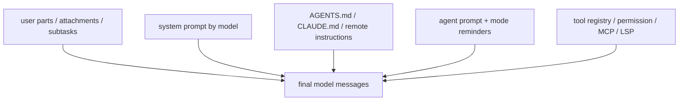
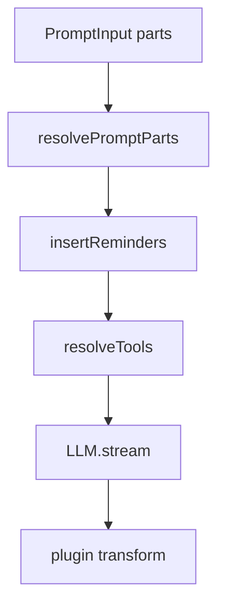

# 6장: 프롬프트 조립과 에이전트별 문맥층

> **포지셔닝**: 이 장은 OpenCode의 프롬프트 계층을 정적 문자열 템플릿이 아니라, 시스템 프롬프트, instruction 파일, agent 규칙, tool/permission/MCP/LSP 상태를 한데 모으는 런타임 통합층으로 읽는다. 대상 독자: 프롬프트를 단순 prompt engineering이 아니라 시스템 제어면으로 다루고 싶은 빌더.

## 왜 중요한가

에이전트 런타임이 얕을 때 프롬프트는 파일 몇 개로 끝난다. 시스템 프롬프트 하나, 모드별 텍스트 몇 개, 문자열 치환 정도면 충분하다. 하지만 OpenCode 정도로 기능이 늘어나면 프롬프트는 더 이상 텍스트 자산만이 아니다. 어떤 instruction 파일을 실어야 하는지, 현재 agent가 무엇을 허용하는지, 어떤 tool이 노출되는지, structured output이 요구되는지, compaction이 필요한지, 세션이 어떤 상태인지까지 반영해야 한다.

즉 이 장의 핵심은 "좋은 문장을 어떻게 쓰는가"가 아니다. 어떤 상태와 제약을 어떤 순서로 모델 문맥에 싣는가다.

## 소스 앵커

- `packages/opencode/src/session/prompt.ts`
- `packages/opencode/src/session/system.ts`
- `packages/opencode/src/session/instruction.ts`
- `packages/opencode/src/session/prompt/default.txt`
- `packages/opencode/src/session/prompt/plan.txt`
- `packages/opencode/src/session/prompt/max-steps.txt`
- `packages/opencode/src/agent/agent.ts`
- `packages/opencode/src/command/template/*.txt`

## 핵심 코드

`resolvePromptParts(...)`를 보면 프롬프트 템플릿은 문자열 include로 끝나지 않는다. `{file:...}` 참조는 파일 part가 되고, 파일이 없지만 agent 이름이면 agent part가 된다.

```ts
// packages/opencode/src/session/prompt.ts
const resolvePromptParts = Effect.fn("SessionPrompt.resolvePromptParts")(function* (template: string) {
  const ctx = yield* InstanceState.context
  const parts: PromptInput["parts"] = [{ type: "text", text: template }]
  const files = ConfigMarkdown.files(template)
  const seen = new Set<string>()
  yield* Effect.forEach(
    files,
    Effect.fnUntraced(function* (match) {
      const name = match[1]
      if (seen.has(name)) return
      seen.add(name)
      const filepath = name.startsWith("~/")
        ? path.join(os.homedir(), name.slice(2))
        : path.resolve(ctx.worktree, name)

      const info = yield* fsys.stat(filepath).pipe(Effect.option)
      if (Option.isNone(info)) {
        const found = yield* agents.get(name)
        if (found) parts.push({ type: "agent", name: found.name })
        return
      }
      const stat = info.value
      parts.push({
        type: "file",
        url: pathToFileURL(filepath).href,
        filename: name,
        mime: stat.type === "Directory" ? "application/x-directory" : "text/plain",
      })
    }),
    { concurrency: "unbounded", discard: true },
  )
  return parts
})
```

최종 호출 직전에는 skill, environment, instruction, part 변환 결과가 합쳐진다. structured output은 문구만 붙는 것이 아니라 전용 tool까지 강제된다.

```ts
// packages/opencode/src/session/prompt.ts
const [skills, env, instructions, modelMsgs] = yield* Effect.all([
  sys.skills(agent),
  Effect.sync(() => sys.environment(model)),
  instruction.system().pipe(Effect.orDie),
  MessageV2.toModelMessagesEffect(msgs, model),
])
const system = [...env, ...(skills ? [skills] : []), ...instructions]
const format = lastUser.format ?? { type: "text" as const }
if (format.type === "json_schema") system.push(STRUCTURED_OUTPUT_SYSTEM_PROMPT)
const result = yield* handle.process({
  user: lastUser,
  agent,
  permission: session.permission,
  sessionID,
  parentSessionID: session.parentID,
  system,
  messages: [...modelMsgs, ...(isLastStep ? [{ role: "assistant" as const, content: MAX_STEPS }] : [])],
  tools,
  model,
  toolChoice: format.type === "json_schema" ? "required" : undefined,
})
```

```ts
// packages/opencode/src/session/prompt.ts
export function createStructuredOutputTool(input: {
  schema: Record<string, any>
  onSuccess: (output: unknown) => void
}): AITool {
  const { $schema: _, ...toolSchema } = input.schema

  return tool({
    description: STRUCTURED_OUTPUT_DESCRIPTION,
    inputSchema: jsonSchema(toolSchema as JSONSchema7),
    async execute(args) {
      input.onSuccess(args)
      return {
        output: "Structured output captured successfully.",
        title: "Structured Output",
        metadata: { valid: true },
      }
    },
    toModelOutput({ output }) {
      return {
        type: "text",
        value: output.output,
      }
    },
  })
}
```

## 프롬프트 교차로



`session/prompt.ts`가 거대한 이유는 우연이 아니다. OpenCode는 최종 모델 입력이 시스템의 교차로라는 사실을 숨기지 않는다.

## 핵심 메커니즘

### `SessionPrompt.Service`는 프롬프트 생성기가 아니라 orchestrator다

`packages/opencode/src/session/prompt.ts` 상단 import만 봐도 이 파일의 역할이 드러난다. 여기에는 `SessionCompaction`, `SessionSummary`, `Agent`, `Provider`, `Plugin`, `Command`, `Permission`, `ToolRegistry`, `MCP`, `LSP`, `Instruction`, `SystemPrompt`, `SessionProcessor`, `LLM`이 모두 들어온다.

이건 매우 중요한 신호다. OpenCode는 프롬프트 조립을 문자열 함수로 취급하지 않는다. 모델에게 보내는 최종 문맥은 세션, 권한, 도구, instruction, hidden agent 작업이 모두 만나는 통합점이기 때문이다.

### system prompt는 모델별 base constitution이다

`packages/opencode/src/session/system.ts`를 보면 system prompt는 단일 파일이 아니다.

- GPT 계열은 `gpt.txt` 혹은 `codex.txt`
- Claude 계열은 `anthropic.txt`
- Gemini는 `gemini.txt`
- Kimi, Trinity, Beast 등은 각기 별도 prompt

그리고 `environment(model)`은 다음 환경 정보를 추가한다.

- 현재 model id와 provider id
- working directory
- workspace root
- git repo 여부
- platform
- 현재 날짜

즉 system prompt는 철학 문장만이 아니라, 런타임 환경 선언이기도 하다.

### skill 정보도 시스템 프롬프트 층에 실린다

`SystemPrompt.skills(agent)`는 해당 agent permission에서 `skill`이 금지되지 않은 경우, 사용 가능한 skill 목록을 verbose 포맷으로 붙인다. 이건 중요한 설계다. skill은 도구 목록의 일부이기도 하지만, 동시에 "언제 어떤 specialized workflow를 불러와야 하는가"라는 판단 재료이기 때문이다.

즉 OpenCode는 skill을 별도 문서로만 두지 않고, 시스템 문맥의 일부로 모델에게 반복 주입한다.

### instruction 파일은 문자열 include가 아니라 별도 해결기(resolver)를 가진다

`packages/opencode/src/session/instruction.ts`는 이 장의 핵심 파일이다. 이 서비스는 다음을 수행한다.

- project-level `AGENTS.md`, `CLAUDE.md`, `CONTEXT.md` 탐색
- global config 경로와 `~/.claude/CLAUDE.md` 탐색
- `config.instructions`에 적힌 파일 glob 혹은 원격 URL 로드
- read tool이 이미 읽은 instruction 파일은 중복 부착 방지
- 특정 assistant message에 이미 붙인 instruction file claim 추적
- 읽는 파일 주변의 상위 instruction 파일을 walk하며 추가

즉 instruction은 단순 치환 문자열이 아니다. 파일 시스템과 원격 URL과 message lifecycle을 이해하는 별도 서비스다.

### `resolvePromptParts()`는 include를 구조로 바꾼다

`session/prompt.ts`의 `resolvePromptParts(template)`는 `{file:...}` 형태의 참조를 문자열 치환으로 끝내지 않는다. 실제 파일이면 `file` part로, agent 이름이면 `agent` part로, 일반 문자열이면 `text` part로 변환한다.

이 설계는 매우 좋다. 프롬프트 자산도 결국 세션의 part 모델 위에 올려야 이후 LLM 입력과 저장/압축/요약 흐름에서 일관되게 다룰 수 있기 때문이다.

### 프롬프트는 base prompt 위에 상황별 amendment를 덧붙인다

OpenCode의 prompt 층은 "하나의 기본 프롬프트"가 아니다. `session/prompt.ts`는 필요에 따라 아래 같은 문구를 추가한다.

- `PROMPT_PLAN`
- `BUILD_SWITCH`
- `MAX_STEPS`
- structured output system prompt

즉 시스템 prompt는 헌법이고, 현재 mode와 작업 조건은 amendment처럼 위에 얹힌다. 이 구조가 중요한 이유는 모든 규칙을 base prompt 하나에 몰아넣지 않기 때문이다.

### structured output은 문구만이 아니라 전용 tool까지 붙는다

`STRUCTURED_OUTPUT_SYSTEM_PROMPT`와 `StructuredOutput` tool 생성 경로는 이 장의 좋은 예다. OpenCode는 "JSON으로 답하라" 같은 텍스트 지시만으로는 충분하지 않다고 본다. 그래서 강한 시스템 문구와 전용 tool 계약을 함께 제공한다.

이 판단은 맞다. 모델은 텍스트 지시를 어길 수 있지만, tool call contract까지 주어지면 훨씬 안정적으로 구조화된 출력을 낼 수 있다.

### user input 자체도 먼저 part 모델로 정규화된다

`createUserMessage(...)`와 주변 로직을 보면 OpenCode는 사용자 입력을 바로 모델 메시지로 던지지 않는다. attachment, subtask, synthetic reminder, instruction part 등을 포함한 `MessageV2` 구조로 먼저 저장하고, 그다음 `MessageV2.toModelMessagesEffect(...)`로 모델 입력 형태로 변환한다.

이 말은 곧 프롬프트 조립이 "문자열을 붙여서 보내는 마지막 단계"가 아니라, 이미 구조화된 대화 상태를 모델 문맥으로 투영하는 단계라는 뜻이다.

### compaction, summary, title도 prompt 교차로 안에서 연결된다

`session/prompt.ts`는 단지 메인 assistant 호출만 담당하지 않는다.

- 첫 메시지 시 `ensureTitle(...)`
- overflow 시 `compaction.create(...)`
- compaction part가 있을 때 `compaction.process(...)`
- assistant 완료 후 `summary.summarize(...)`

즉 프롬프트 루프는 메인 assistant 답변 생성기이면서, hidden agent maintenance loop를 호출하는 orchestration point이기도 하다.

### 중요한 제약은 코드와 프롬프트 양쪽에서 표현된다

예를 들어 plan mode에서는 permission envelope가 edit를 막지만, 동시에 `PROMPT_PLAN` 같은 문구로 모델에게도 다시 상기시킨다. 이런 중복은 낭비가 아니라 방어적 설계다.

- 코드 제약: 실제 실행을 막는다
- 프롬프트 제약: 잘못된 의도를 줄인다

에이전트 시스템에서는 둘 다 필요하다. 코드만 믿으면 모델이 계속 금지 행동을 시도하고, 프롬프트만 믿으면 실제 안전성이 약해진다.

## 이 장의 핵심 논지

OpenCode에서 프롬프트 조립은 prompt engineering이 아니라 runtime integration이다. 시스템 프롬프트, instruction 파일, agent 역할, tool registry, structured output, hidden agent maintenance가 모두 이 계층을 거친다.

그래서 이 층은 텍스트 생성기보다 제어면에 가깝다. 무엇을 모델에게 보여 줄지 결정하는 일은 곧 시스템 경계를 어디서 노출할지 결정하는 일이기 때문이다.

## 트레이드오프

- 장점: 모델 입력이 실제 런타임 상태와 더 밀접하게 연결된다.
- 장점: system/instruction/agent/tool 제약을 한 교차로에서 조합할 수 있다.
- 장점: hidden agent maintenance와 메인 프롬프트 루프가 같은 인프라를 공유한다.
- 단점: `session/prompt.ts`가 빠르게 두꺼워지고 읽기 어려워진다.
- 단점: 프롬프트 변경이 종종 시스템 전반의 상태 흐름을 이해해야 가능한 작업이 된다.

## 빌더에게 남는 것

- 프롬프트 조립기는 독립 템플릿 모듈이 아니라 시스템 통합 계층이 된다.
- instruction 파일, structured output, mode reminder는 문자열 치환보다 구조화된 resolver 위에 두는 편이 낫다.
- 중요한 행동 제약은 코드와 프롬프트 양쪽에서 방어적으로 표현하는 것이 좋다.
- 에이전트 시스템이 커질수록 "무엇을 보낼지" 결정하는 계층이 점점 더 중요해진다.

다음 장에서는 이렇게 조립된 문맥이 실제 provider와 모델 선택 계층 위에서 어떻게 실행되는지 본다.

<!-- opencode-book-expansion -->
## 소스 그라운딩 확장

### 참조 강좌에서 가져올 렌즈

Claude 책의 시스템 프롬프트 분석을 OpenCode에 적용하면 핵심은 거대한 prompt 하나가 아니라 레이어 조립 시점이다. agent prompt, provider prompt, instruction file, synthetic reminder, tool description, plugin transform이 최종 호출 직전에 합쳐진다.

이 관점은 Claude 하니스의 구현을 그대로 복사하자는 뜻이 아니다. 같은 시스템 질문을 OpenCode 소스에 던지고, 다른 답이 나오는 지점을 분명히 하자는 뜻이다. 따라서 아래 흐름은 OpenCode의 실제 파일, 서비스, 상태 객체를 기준으로 다시 세운 읽기 지도다.

### 실제 OpenCode 흐름



### 확인해야 할 소스

- `packages/opencode/src/session/prompt.ts`
- `packages/opencode/src/session/system.ts`
- `packages/opencode/src/session/instruction.ts`
- `packages/opencode/src/session/llm.ts`
- `packages/opencode/src/config/markdown.ts`
- `packages/opencode/src/tool/registry.ts`

### 구현에서 읽어야 할 메커니즘

- resolvePromptParts는 파일 참조를 문자열 include가 아니라 file/agent part로 바꾼다.
- plan/build 전환 reminder는 코드가 조건부 synthetic part로 삽입하는 정책 문서다.
- llm.ts는 agent prompt가 있으면 provider prompt보다 우선하고 plugin이 system transform에 마지막으로 개입한다.
- structured output은 문구뿐 아니라 전용 tool로 강제된다.

### 실패 모드와 설계 압력

- 모든 프롬프트를 한 문자열로 합치면 provider 예외와 tool schema 변환을 통제하기 어렵다.
- plan mode를 UI 상태로만 두면 모델이 실행 단계에서 잊을 수 있다.
- plugin transform을 너무 이르게 적용하면 이후 재조립에서 사라질 수 있다.

### 빌더에게 남는 질문

- 프롬프트 조립을 마지막 순간까지 구조화된 상태로 유지하는가?
- 정책 reminder가 code gate와 연결되어 있는가?
- provider별 system 처리 차이를 한 계층에 가뒀는가?

이 장의 핵심은 파일 이름을 외우는 것이 아니라 경계를 읽는 것이다. 어떤 상태가 어느 계층에서 만들어지고, 어떤 계약을 통과하며, 실패했을 때 어디서 관측되는지까지 따라가야 실제 하니스 설계로 옮길 수 있다.
