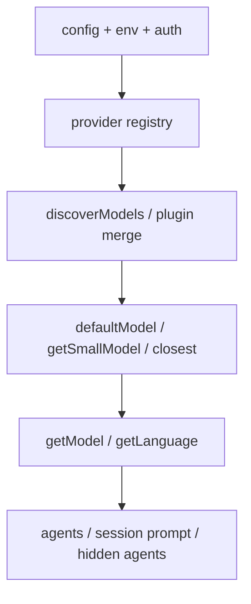
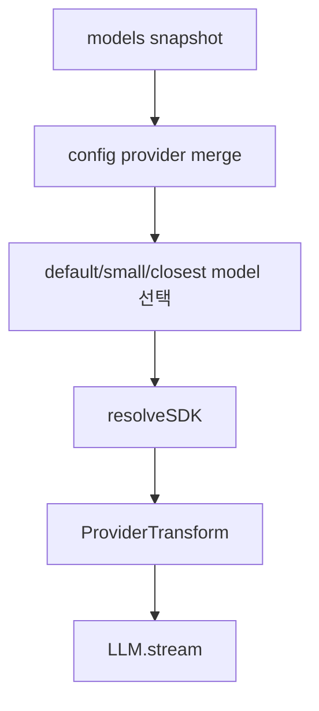

# 7장: Provider 추상화와 모델 라우팅

> **포지셔닝**: 이 장은 OpenCode의 provider 계층을 "API 키 폼 모음"이 아니라, 모델 카탈로그, 기본 모델 선택, small model 선택, SDK 로딩, closest-match 해석을 한곳에 모은 selection service로 읽는다. 대상 독자: provider-agnostic 에이전트 런타임을 만들고 싶은 빌더.

## 왜 중요한가

multi-provider 지원은 종종 UI에서만 설명된다. OpenAI, Anthropic, Copilot, Vertex 같은 항목이 목록으로 보이면 마치 지원이 끝난 것처럼 보인다. 하지만 런타임 입장에서 더 어려운 문제는 그다음이다. 어떤 provider를 autoload할 수 있는지, 어떤 모델을 기본으로 써야 하는지, 가벼운 보조 작업에는 어떤 small model을 써야 하는지, 최근에 쓰던 모델이 아직 유효한지, 모델 ID 일부만 주어졌을 때 어느 실제 모델로 해석할지를 결정해야 한다.

OpenCode의 provider 서비스는 바로 이 판단들을 맡는다. 그래서 이 계층은 transport wrapper가 아니라 selection + loading + normalization의 앞단이다.

## 소스 앵커

- `packages/opencode/src/provider/provider.ts`
- `packages/opencode/src/provider/models.ts`
- `packages/opencode/src/provider/schema.ts`
- `packages/opencode/src/provider/transform.ts`
- `packages/opencode/src/plugin/index.ts`
- `packages/opencode/src/agent/agent.ts`

## 핵심 코드

provider service의 공개 표면부터 보면 이 계층이 단순 API wrapper가 아니라 selection service라는 점이 보인다.

```ts
// packages/opencode/src/provider/provider.ts
export interface Interface {
  readonly list: () => Effect.Effect<Record<ProviderID, Info>>
  readonly getProvider: (providerID: ProviderID) => Effect.Effect<Info>
  readonly getModel: (providerID: ProviderID, modelID: ModelID) => Effect.Effect<Model>
  readonly getLanguage: (model: Model) => Effect.Effect<LanguageModelV3>
  readonly closest: (
    providerID: ProviderID,
    query: string[],
  ) => Effect.Effect<{ providerID: ProviderID; modelID: string } | undefined>
  readonly getSmallModel: (providerID: ProviderID) => Effect.Effect<Model | undefined>
  readonly defaultModel: () => Effect.Effect<{ providerID: ProviderID; modelID: ModelID }>
}
```

`getSmallModel(...)`은 hidden agent 비용을 낮추는 정책이다. provider별 우선순위와 Bedrock 지역 prefix까지 여기서 처리한다.

```ts
// packages/opencode/src/provider/provider.ts
const getSmallModel = Effect.fn("Provider.getSmallModel")(function* (providerID: ProviderID) {
  const cfg = yield* config.get()

  if (cfg.small_model) {
    const parsed = parseModel(cfg.small_model)
    return yield* getModel(parsed.providerID, parsed.modelID)
  }

  const s = yield* InstanceState.get(state)
  const provider = s.providers[providerID]
  if (!provider) return undefined

  let priority = [
    "claude-haiku-4-5",
    "claude-haiku-4.5",
    "3-5-haiku",
    "3.5-haiku",
    "gemini-3-flash",
    "gemini-2.5-flash",
    "gpt-5-nano",
  ]
  if (providerID.startsWith("opencode")) {
    priority = ["gpt-5-nano"]
  }
  if (providerID.startsWith("github-copilot")) {
    priority = ["gpt-5-mini", "claude-haiku-4.5", ...priority]
  }
  for (const item of priority) {
    if (providerID === ProviderID.amazonBedrock) {
      const crossRegionPrefixes = ["global.", "us.", "eu."]
      const candidates = Object.keys(provider.models).filter((m) => m.includes(item))

      const globalMatch = candidates.find((m) => m.startsWith("global."))
      if (globalMatch) return yield* getModel(providerID, ModelID.make(globalMatch))

      const region = provider.options?.region
      if (region) {
        const regionPrefix = region.split("-")[0]
        if (regionPrefix === "us" || regionPrefix === "eu") {
          const regionalMatch = candidates.find((m) => m.startsWith(`${regionPrefix}.`))
          if (regionalMatch) return yield* getModel(providerID, ModelID.make(regionalMatch))
        }
      }

      const unprefixed = candidates.find((m) => !crossRegionPrefixes.some((p) => m.startsWith(p)))
      if (unprefixed) return yield* getModel(providerID, ModelID.make(unprefixed))
    } else {
      for (const model of Object.keys(provider.models)) {
        if (model.includes(item)) return yield* getModel(providerID, ModelID.make(model))
      }
    }
  }

  return undefined
})
```

기본 모델 선택도 config, 최근 모델 기록, 현재 사용 가능한 provider 목록을 순서대로 본다.

```ts
// packages/opencode/src/provider/provider.ts
const defaultModel = Effect.fn("Provider.defaultModel")(function* () {
  const cfg = yield* config.get()
  if (cfg.model) return parseModel(cfg.model)

  const s = yield* InstanceState.get(state)
  const recent = yield* fs.readJson(path.join(Global.Path.state, "model.json")).pipe(
    Effect.map((x): { providerID: ProviderID; modelID: ModelID }[] => {
      if (!isRecord(x) || !Array.isArray(x.recent)) return []
      return x.recent.flatMap((item) => {
        if (!isRecord(item)) return []
        if (typeof item.providerID !== "string") return []
        if (typeof item.modelID !== "string") return []
        return [{ providerID: ProviderID.make(item.providerID), modelID: ModelID.make(item.modelID) }]
      })
    }),
    Effect.catch(() => Effect.succeed([] as { providerID: ProviderID; modelID: ModelID }[])),
  )
  for (const entry of recent) {
    const provider = s.providers[entry.providerID]
    if (!provider) continue
    if (!provider.models[entry.modelID]) continue
    return { providerID: entry.providerID, modelID: entry.modelID }
  }

  const provider = Object.values(s.providers).find((p) => !cfg.provider || Object.keys(cfg.provider).includes(p.id))
  if (!provider) throw new Error("no providers found")
  const [model] = sort(Object.values(provider.models))
  if (!model) throw new Error("no models found")
  return {
    providerID: provider.id,
    modelID: model.id,
  }
})
```

## Provider 서비스의 역할



이 그림에서 핵심은 `defaultModel()`과 `getSmallModel()`이 provider 서비스의 일부라는 점이다. OpenCode는 모델 선택을 세션 계층이나 에이전트 계층에 흩뿌리지 않는다.

## 핵심 메커니즘

### provider 서비스는 "목록"보다 "판단"을 더 많이 한다

`packages/opencode/src/provider/provider.ts`의 인터페이스는 아래 메서드들로 드러난다.

- `list()`
- `getProvider()`
- `getModel(providerID, modelID)`
- `getLanguage(...)`
- `closest(providerID, query[])`
- `getSmallModel(providerID)`
- `defaultModel()`

여기서 중요한 것은 `getModel`이 단순 조회가 아니라, 실제 SDK language model 객체를 lazy-load하는 함수라는 점이다. 반면 `defaultModel`, `getSmallModel`, `closest`는 selection policy를 담당한다. 즉 provider 서비스는 카탈로그와 실행 로더를 동시에 가진다.

### 어떤 provider를 켤지부터 이미 정책 문제다

`provider.ts`의 `custom(...)` loader들을 보면 각 provider가 같은 방식으로 활성화되지 않는다.

- 어떤 provider는 env key가 있어야 autoload된다.
- 어떤 provider는 auth 토큰이 있어야 models를 노출한다.
- 어떤 provider는 config에 baseURL이 있으면 자동 발견을 끈다.
- `opencode` provider는 인증이 없으면 무료 모델만 남긴다.
- GitLab, Azure, Bedrock 같은 공급자는 별도 env/config 조합을 확인한다.

즉 OpenCode는 provider 목록을 정적 상수로 보지 않는다. 현재 환경과 설정에 따라 "이 provider를 지금 실제로 쓸 수 있는가"를 다시 계산한다.

### 모델 카탈로그는 고정 상수가 아니라 시간에 따라 변하는 데이터다

`packages/opencode/src/provider/models.ts`와 `discoverModels()` 경로는 이 시스템이 모델 목록을 하드코딩으로 끝내지 않음을 보여 준다. 일부 provider는 런타임에 모델을 발견하고, 그 결과를 provider registry에 합친다.

이건 좋은 판단이다. 모델 카탈로그는 시간이 지나면 바뀐다. 릴리스 날짜, reasoning variant, provider-specific alias가 계속 추가된다. 따라서 "코드 안에 적힌 목록"보다는 "발견하고 캐시하고 다시 머지하는 데이터"로 보는 편이 현실적이다.

### plugin도 provider registry를 바꾼다

`provider.ts` 중간의 plugin merge 경로는 이 장의 중요한 포인트다. provider 지원은 코어 패키지의 닫힌 목록이 아니라 plugin에 의해 확장될 수 있다. 이 말은 provider 서비스가 내부 고정 구현체가 아니라, 외부 확장도 받아들이는 control point라는 뜻이다.

즉 OpenCode는 provider를 "환경 설정 항목"으로만 보지 않고, 확장 생태계의 일부로 취급한다.

### `defaultModel()`은 단순 첫 번째 모델 선택이 아니다

`defaultModel()`의 흐름을 보면 선택 우선순위가 꽤 실전적이다.

1. `cfg.model`이 있으면 그것을 사용
2. 아니면 `Global.Path.state/model.json`의 recent model 기록을 확인
3. recent 목록에서 아직 유효한 provider/model 조합을 찾음
4. 그래도 없으면 활성 provider 중 하나를 고르고 정렬된 첫 모델을 택함

이 선택은 중요하다. 사용자가 직전에 쓰던 모델을 기억하는 일은 UX 문제처럼 보이지만, 사실은 런타임 기본값 문제다. OpenCode는 이를 provider 서비스 안에 둔다.

### `getSmallModel()`은 보조 작업의 비용 모델을 별도 정책으로 다룬다

`getSmallModel()`이 존재하는 이유는 title, summary, compaction 같은 hidden work가 메인 모델과 항상 같은 비용 구조를 가질 필요가 없기 때문이다. 구현을 보면 provider별 우선순위 목록이 있고, 예를 들어 다음 같은 휴리스틱이 보인다.

- Haiku, Gemini Flash, GPT-5 nano 우선
- `opencode` provider는 `gpt-5-nano`를 우선
- `github-copilot`은 `gpt-5-mini`, `claude-haiku-4.5`를 우선
- Bedrock은 `global.`, `us.`, `eu.` 접두 지역 모델까지 고려

이건 단순 편의 기능이 아니라 중요한 운영 감각이다. 모든 작업에 동일한 주 모델을 쓰면 품질은 단순해질 수 있지만 비용과 지연이 불필요하게 커진다.

### `closest()`는 모델 문자열을 느슨하게 해석하는 완충 장치다

`closest(providerID, query[])`는 아주 짧지만 의미가 크다. 특정 모델 ID 일부만 들어와도 provider 내부 모델 목록을 훑어 가장 가까운 후보를 찾는다. 이런 완충 장치는 CLI, 설정 마이그레이션, 외부 자동화에서 의외로 자주 필요하다.

provider 계층이 이런 fuzzy resolution을 제공하면 상위 계층은 모델 naming 변화에 덜 민감해진다.

### 실제 model 객체 로딩은 selection 이후에 일어난다

`getModel(...)` 경로를 보면 selection으로 끝나지 않는다. 선택된 `Provider.Model`을 바탕으로 `BUNDLED_PROVIDERS`의 SDK 팩토리를 로드하고, 필요하면 custom loader가 `sdk.responses(...)`, `sdk.chat(...)`, `sdk.languageModel(...)` 중 무엇을 쓸지 결정한다.

즉 OpenCode는 selection과 loading을 같은 서비스 안에 두되, 분리된 단계로 다룬다.

- selection: 어떤 provider/model을 쓸지 고른다
- loading: 그 provider에서 실제 language model 객체를 만든다

이 분리가 중요하다. 선택 정책을 바꾸는 일과 SDK 적응 코드를 바꾸는 일은 성격이 다르기 때문이다.

### transform 층은 이 장의 바깥이 아니라 일부다

28장에서 더 자세히 보겠지만, `provider.ts`가 selection service라면 `transform.ts`는 selection 이후의 적응 계층이다. 중요한 점은 둘이 완전히 분리된 세계가 아니라는 것이다. `provider.ts`는 이미 `ProviderTransform.variants(...)`를 써서 model variant를 합치고, transform 규칙을 model metadata의 일부처럼 다룬다.

즉 provider 추상화는 "목록"과 "변환"이 만나는 경계다.

## 에이전트 계층과의 연결

이 provider 정책이 실제로 어디에 쓰이는지는 `agent.ts`와 `session/prompt.ts`를 보면 더 명확해진다. 예를 들어 title agent는 `getSmallModel(...)`을 우선 쓰고, 없으면 현재 provider/model을 fallback으로 쓴다. 즉 provider 서비스의 결정은 곧 hidden agent 비용 모델과 세션 UX에 مباشرة 영향을 준다.

이 점이 중요하다. provider selection은 설정 화면에만 보이는 문제가 아니라, 런타임 전체 품질과 비용 모델에 스며 있다.

## 트레이드오프

- 장점: 모델 선택 정책이 상위 세션/에이전트 계층에 흩어지지 않는다.
- 장점: recent model, small model, fuzzy match 같은 UX 정책을 한곳에서 다룰 수 있다.
- 장점: plugin과 runtime discovery를 통해 provider registry를 확장할 수 있다.
- 단점: provider 서비스가 단순 wrapper보다 훨씬 많은 정책을 떠안는다.
- 단점: selection과 loading을 한 서비스가 맡기 때문에 파일이 빠르게 커진다.

## 빌더에게 남는 것

- multi-provider 시스템의 핵심은 auth UI보다 selection service다.
- default model과 small model은 별도 정책으로 취급하는 편이 낫다.
- 모델 카탈로그는 정적 코드 상수보다 런타임 데이터로 보는 편이 현실적이다.
- provider 예외를 상위 계층에 흩뿌리지 말고, selection과 transform 경계에 모아 두는 편이 좋다.

다음 장에서는 이런 모델 계층을 바탕으로 긴 세션에서 비용과 문맥을 어떻게 제어하는지, 즉 overflow와 compaction을 본다.

<!-- opencode-book-expansion -->
## 소스 그라운딩 확장

### 참조 강좌에서 가져올 렌즈

Claude의 모델별 튜닝 관점은 OpenCode에서 provider bridge 문제로 나타난다. 여러 provider는 모두 LLM처럼 보이지만 system prompt, tool schema, caching, reasoning, modality 처리가 다르다.

이 관점은 Claude 하니스의 구현을 그대로 복사하자는 뜻이 아니다. 같은 시스템 질문을 OpenCode 소스에 던지고, 다른 답이 나오는 지점을 분명히 하자는 뜻이다. 따라서 아래 흐름은 OpenCode의 실제 파일, 서비스, 상태 객체를 기준으로 다시 세운 읽기 지도다.

### 실제 OpenCode 흐름



### 확인해야 할 소스

- `packages/opencode/src/provider/provider.ts`
- `packages/opencode/src/provider/transform.ts`
- `packages/opencode/src/provider/models.ts`
- `packages/opencode/src/provider/auth.ts`
- `packages/opencode/src/config/provider.ts`

### 구현에서 읽어야 할 메커니즘

- Provider.Service는 목록 반환보다 default model, small model, closest matching, SDK resolution 같은 판단을 더 많이 한다.
- models.ts는 시간에 따라 변하는 provider/model metadata를 snapshot과 refresh 정책으로 다룬다.
- ProviderTransform은 unsupported modality를 조용히 버리지 않고 설명 가능한 텍스트로 승격한다.

### 실패 모드와 설계 압력

- 공통화를 과도하게 하면 capability 차이를 잃는다.
- provider별 예외가 session loop로 새면 새 provider를 붙일 때마다 루프가 복잡해진다.
- model id fuzzy matching이 없으면 설정 파일의 작은 차이가 실행 실패가 된다.

### 빌더에게 남는 질문

- registry, catalog, transform, auth를 분리했는가?
- 보조 작업용 small model 정책이 있는가?
- 공통 API가 아니라 공통 하니스 계약을 목표로 삼고 있는가?

이 장의 핵심은 파일 이름을 외우는 것이 아니라 경계를 읽는 것이다. 어떤 상태가 어느 계층에서 만들어지고, 어떤 계약을 통과하며, 실패했을 때 어디서 관측되는지까지 따라가야 실제 하니스 설계로 옮길 수 있다.
