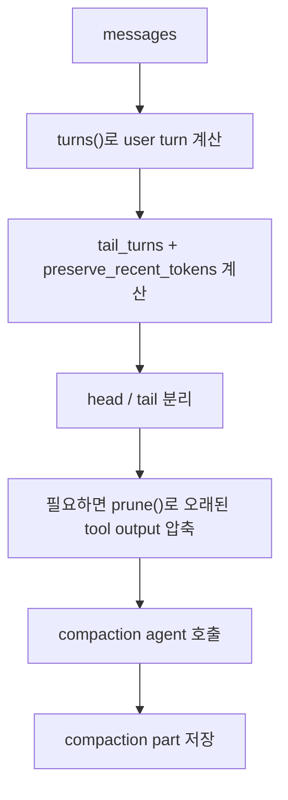
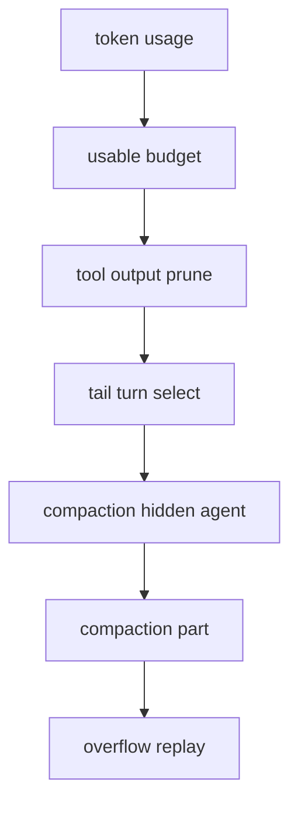

# 8장: 오버플로와 컨텍스트 컴팩션

> **포지셔닝**: 이 장은 OpenCode가 긴 세션을 어떤 기준으로 압축하고, tail turn을 보존하며, tool output을 prune하는지 설명한다. 대상 독자: 장기 대화를 다루는 에이전트 런타임을 설계하는 빌더.

## 왜 중요한가

에이전트 세션이 길어질수록 가장 비싼 자원은 모델 그 자체보다 컨텍스트 예산이다. OpenCode는 이를 단순히 오래된 메시지를 버리는 문제로 다루지 않는다. 어느 turn을 tail로 보호할지, 어떤 tool output은 잘라도 되는지, overflow 시 어떤 parent를 기준으로 재생성할지를 세밀하게 조정한다.

## 소스 앵커

- `packages/opencode/src/session/compaction.ts`
- `packages/opencode/src/session/overflow.ts`
- `packages/opencode/src/session/summary.ts`
- `packages/opencode/src/agent/prompt/compaction.txt`
- `packages/web/src/content/docs/tui.mdx`

## 핵심 코드

compaction은 감으로 돌지 않는다. 먼저 overflow 기준이 되는 usable context를 계산하고, tail 보존 예산을 별도 상수와 설정으로 만든다.

```ts
// packages/opencode/src/session/overflow.ts
const COMPACTION_BUFFER = 20_000

export function usable(input: { cfg: Config.Info; model: Provider.Model }) {
  const context = input.model.limit.context
  if (context === 0) return 0

  const reserved =
    input.cfg.compaction?.reserved ?? Math.min(COMPACTION_BUFFER, ProviderTransform.maxOutputTokens(input.model))
  return input.model.limit.input
    ? Math.max(0, input.model.limit.input - reserved)
    : Math.max(0, context - ProviderTransform.maxOutputTokens(input.model))
}

export function isOverflow(input: { cfg: Config.Info; tokens: MessageV2.Assistant["tokens"]; model: Provider.Model }) {
  if (input.cfg.compaction?.auto === false) return false
  if (input.model.limit.context === 0) return false

  const count =
    input.tokens.total || input.tokens.input + input.tokens.output + input.tokens.cache.read + input.tokens.cache.write
  return count >= usable(input)
}
```

```ts
// packages/opencode/src/session/compaction.ts
export const PRUNE_MINIMUM = 20_000
export const PRUNE_PROTECT = 40_000
const PRUNE_PROTECTED_TOOLS = ["skill"]
const DEFAULT_TAIL_TURNS = 2
const MIN_PRESERVE_RECENT_TOKENS = 2_000
const MAX_PRESERVE_RECENT_TOKENS = 8_000

function preserveRecentBudget(input: { cfg: Config.Info; model: Provider.Model }) {
  return (
    input.cfg.compaction?.preserve_recent_tokens ??
    Math.min(MAX_PRESERVE_RECENT_TOKENS, Math.max(MIN_PRESERVE_RECENT_TOKENS, Math.floor(usable(input) * 0.25)))
  )
}
```

tail 선택은 "최근 N턴"을 무조건 남기는 게 아니라, 실제 토큰 추정치가 예산 안에 들어오는지 확인한다.

```ts
// packages/opencode/src/session/compaction.ts
const select = Effect.fn("SessionCompaction.select")(function* (input: {
  messages: MessageV2.WithParts[]
  cfg: Config.Info
  model: Provider.Model
}) {
  const limit = input.cfg.compaction?.tail_turns ?? DEFAULT_TAIL_TURNS
  if (limit <= 0) return { head: input.messages, tail_start_id: undefined }
  const budget = preserveRecentBudget({ cfg: input.cfg, model: input.model })
  const all = turns(input.messages)
  if (!all.length) return { head: input.messages, tail_start_id: undefined }
  const recent = all.slice(-limit)
  const sizes = yield* Effect.forEach(
    recent,
    (turn) =>
      estimate({
        messages: input.messages.slice(turn.start, turn.end),
        model: input.model,
      }),
    { concurrency: 1 },
  )
  if (sizes.at(-1)! > budget) {
    log.info("tail fallback", { budget, size: sizes.at(-1) })
    return { head: input.messages, tail_start_id: undefined }
  }

  let total = 0
  let keep: Turn | undefined
  for (let i = recent.length - 1; i >= 0; i--) {
    const size = sizes[i]
    if (total + size > budget) break
    total += size
    keep = recent[i]
  }

  if (!keep || keep.start === 0) return { head: input.messages, tail_start_id: undefined }
  return {
    head: input.messages.slice(0, keep.start),
    tail_start_id: keep.id,
  }
})
```

## 컴팩션 흐름



## 핵심 메커니즘

### tail 보호는 고정 규칙이 아니다

`compaction.ts`에는 `DEFAULT_TAIL_TURNS`, `MIN_PRESERVE_RECENT_TOKENS`, `MAX_PRESERVE_RECENT_TOKENS`가 있다. 즉 OpenCode는 단순히 "최근 두 턴을 남긴다"가 아니라, 현재 모델의 usable budget에 비례해 최근 문맥을 보호한다. 이 점은 builder 관점에서 중요하다. 최근성은 턴 수만이 아니라 토큰 양으로도 정의되어야 하기 때문이다.

### pruning은 compaction과 별도의 단계다

`PRUNE_MINIMUM`, `PRUNE_PROTECT`, `PRUNE_PROTECTED_TOOLS` 상수는 OpenCode가 pruning을 꽤 보수적으로 다룬다는 걸 보여 준다. `prune()`는 완료된 오래된 tool output을 역방향으로 훑으면서 보호 구간을 넘는 부분만 압축 대상으로 삼는다. 이 설계는 "메시지 요약"과 "tool output 손실 압축"을 분리한다. 요약이 의미를 재기술하는 작업이라면 pruning은 저장 비용과 모델 비용을 줄이기 위한 손실 허용 작업이다.

### overflow는 단순 실패가 아니라 제어 경로다

`processCompaction()`을 보면 overflow 시 replay 후보 user message를 다시 잡고, 적절한 parent를 고른 뒤 compaction agent를 호출한다. 즉 overflow는 에러 핸들링이 아니라 정상적인 운영 경로다.

### `usable()`과 reserved budget이 먼저 계산된다

`overflow.ts`의 `usable(...)`은 model limit에서 reserved budget을 뺀 usable context를 계산한다. 여기서 `COMPACTION_BUFFER`와 `cfg.compaction?.reserved`가 함께 작동한다. 즉 OpenCode는 "모델 최대 컨텍스트"를 전부 쓰지 않는다. compaction과 후속 응답을 위한 숨은 버퍼를 남겨 둔다.

### plugin도 compaction 문맥에 개입할 수 있다

`compaction.ts` 중간의 `plugin.trigger("experimental.session.compacting", ...)`는 매우 흥미롭다. 플러그인이 compaction prompt를 대체하거나 추가 문맥을 주입할 수 있기 때문이다. 이는 compaction이 고정된 요약기가 아니라, 확장 가능한 유지 작업이라는 뜻이다.

### auto-continue까지 고려한다

compaction 후에는 auto-continue용 후속 user message가 생성될 수 있고, overflow 원인이 media attachment였는지에 따라 안내 문구도 달라진다. 이 부분은 중요하다. 단순히 "압축 완료"로 끝내지 않고, 사용자가 왜 문맥이 줄어들었는지 이해할 수 있게 하기 때문이다.

## compaction이 어려운 진짜 이유

긴 세션 압축은 사실 세 문제의 결합이다.

1. 어떤 턴을 보존할 것인가
2. 어떤 tool output을 잃어도 되는가
3. 압축 뒤 대화를 어떻게 자연스럽게 이어 갈 것인가

OpenCode는 이 세 문제를 각각 tail 보호, prune, auto-continue로 나눠 다룬다. 이 분리가 좋아서 구현이 복잡해도 읽을 때 의도는 명확하다.

## 빌더에게 남는 것

- 긴 세션 운영에서 "무엇을 남길 것인가"는 최근 턴 수와 최근 토큰 양을 함께 봐야 한다.
- compaction과 pruning은 같은 문제가 아니다.
- overflow는 reserved budget 계산까지 포함한 운영 시나리오로 다뤄야 한다.
- overflow를 예외가 아니라 일급 시나리오로 설계해야 한다.

다음 장에서는 이런 긴 세션을 보조하는 title, summary, hidden agent들이 어떤 역할을 하는지 본다.

<!-- opencode-book-expansion -->
## 소스 그라운딩 확장

### 참조 강좌에서 가져올 렌즈

Claude 책의 컨텍스트 아레나 관점은 OpenCode의 SessionCompaction에서도 중요하다. 차이는 OpenCode가 hidden compaction agent, message part, prune marker, overflow replay를 조합한다는 점이다.

이 관점은 Claude 하니스의 구현을 그대로 복사하자는 뜻이 아니다. 같은 시스템 질문을 OpenCode 소스에 던지고, 다른 답이 나오는 지점을 분명히 하자는 뜻이다. 따라서 아래 흐름은 OpenCode의 실제 파일, 서비스, 상태 객체를 기준으로 다시 세운 읽기 지도다.

### 실제 OpenCode 흐름



### 확인해야 할 소스

- `packages/opencode/src/session/compaction.ts`
- `packages/opencode/src/session/overflow.ts`
- `packages/opencode/src/session/prompt/compaction.txt`
- `packages/opencode/src/tool/truncate.ts`
- `packages/opencode/test/session/compaction.test.ts`

### 구현에서 읽어야 할 메커니즘

- usable budget은 context limit에서 출력/압축 공간을 뺀 값이다.
- tail preservation은 턴 수뿐 아니라 preserve_recent_tokens 예산을 같이 본다.
- prune은 오래된 tool output을 compacted 처리해 요약 호출 전에 압력을 낮춘다.
- overflow 경로는 직전 사용자 요청을 재실행할 replay 후보를 계산한다.

### 실패 모드와 설계 압력

- 최근 메시지를 무조건 보존하면 tool output 하나가 전체 예산을 먹는다.
- 요약만 믿고 prune을 하지 않으면 비용과 지연이 커진다.
- overflow replay가 없으면 방금 요청한 작업이 사라진 것처럼 보인다.

### 빌더에게 남는 질문

- context limit에서 output/reserved budget을 먼저 빼는가?
- 요약 전 저비용 prune 경로가 있는가?
- 압축 결과가 다음 루프에서 읽히는 구조화 상태로 남는가?

이 장의 핵심은 파일 이름을 외우는 것이 아니라 경계를 읽는 것이다. 어떤 상태가 어느 계층에서 만들어지고, 어떤 계약을 통과하며, 실패했을 때 어디서 관측되는지까지 따라가야 실제 하니스 설계로 옮길 수 있다.
