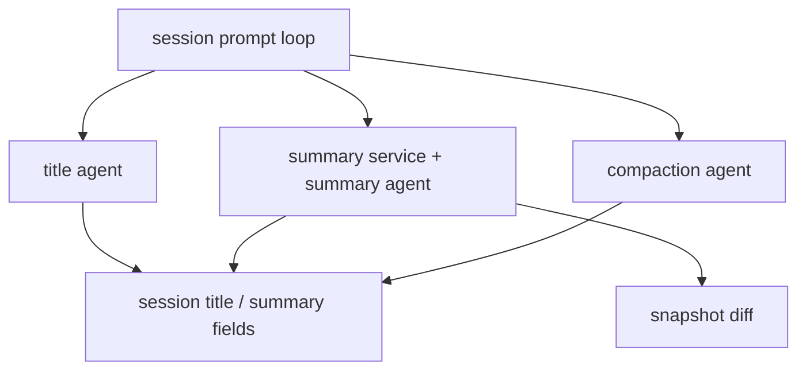
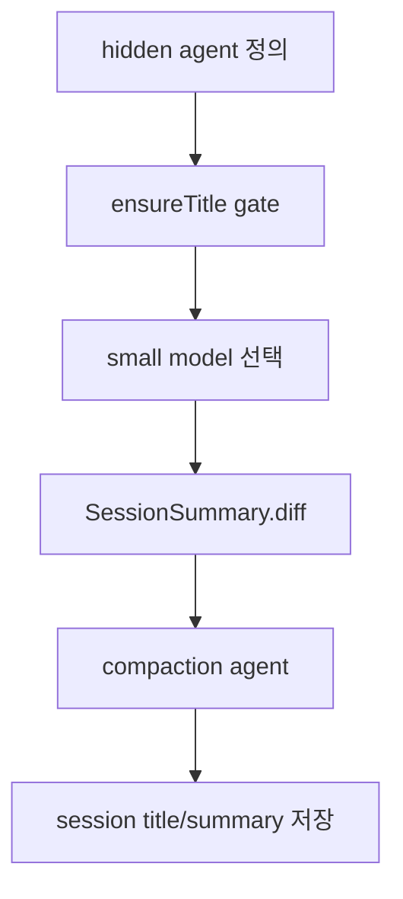

# 9장: 제목, 요약, 보조 시스템 에이전트

> **포지셔닝**: 이 장은 title, summary, compaction 같은 hidden agent를 OpenCode의 유지 기능이 아니라, 메인 assistant를 오래 살게 만드는 시스템 에이전트로 읽는다. 대상 독자: 제목 생성, 세션 요약, 문맥 압축 같은 보조 작업을 메인 채팅 루프에서 분리하고 싶은 빌더.

## 왜 중요한가

사용자는 보통 build agent나 plan agent만 의식한다. 하지만 긴 세션을 실제로 유지하는 것은 눈에 잘 보이지 않는 시스템 작업들이다. 제목 생성, diff 요약, compaction, 요약 메시지 주입 같은 기능은 화려하지 않지만 세션 품질과 복구 가능성에 직접 닿는다.

많은 시스템이 이 보조 작업을 helper 함수로 처리한다. OpenCode는 다르게 간다. `title`, `summary`, `compaction`을 정식 agent로 등록하고, 같은 모델 선택 규칙, prompt 자산, permission envelope, 세션 저장 경로를 재사용한다. 이 선택은 중요하다. 유지 기능도 결국 모델 호출과 문맥 관리와 산출물 저장을 필요로 하기 때문이다.

## 소스 앵커

- `packages/opencode/src/agent/agent.ts`
- `packages/opencode/src/agent/prompt/title.txt`
- `packages/opencode/src/agent/prompt/summary.txt`
- `packages/opencode/src/agent/prompt/compaction.txt`
- `packages/opencode/src/session/prompt.ts`
- `packages/opencode/src/session/summary.ts`
- `packages/opencode/src/session/compaction.ts`
- `packages/opencode/src/session/session.ts`

## 숨은 에이전트의 위치

이 구조에서 핵심은 title/summary/compaction이 "부가기능"이 아니라 세션 루프에 기생하는 시스템 에이전트라는 점이다.

## 핵심 메커니즘

### hidden agent도 `agent.ts`의 정식 항목이다

`packages/opencode/src/agent/agent.ts`를 보면 `compaction`, `title`, `summary`는 모두 `hidden: true`인 agent로 등록된다. 이 세 에이전트는 이름만 따로 있는 것이 아니라, 일반 agent와 같은 `Info` 구조를 공유한다.

- `prompt`
- `permission`
- `model`
- `variant`
- `temperature`
- `options`

이 구조가 중요한 이유는 보조 작업도 결국 모델을 호출하고, 문맥을 만들고, 결과를 파싱하고, 실패를 다뤄야 하기 때문이다. helper 함수로 만들면 나중에 다시 agent abstraction을 재구현하게 된다.

### 이 hidden agent들은 매우 좁은 permission envelope를 가진다

`agent.ts`에서 `compaction`, `title`, `summary`는 모두 `Permission.fromConfig({ "*": "deny" })`를 merge한 규칙을 사용한다. 즉 이 agent들은 도구 실행용 assistant가 아니다. 읽고 요약하고 산출물을 만드는 역할만 하도록 의도적으로 좁혀져 있다.

이건 좋은 설계다. 유지 기능을 메인 assistant와 같은 권한으로 두면, 언젠가 보조 작업이 본래 목적을 넘는 행동을 하기 시작한다. OpenCode는 이를 permission envelope로 먼저 막는다.

### 제목 생성도 별도 세션 경로와 small model 정책을 가진다

`packages/opencode/src/session/prompt.ts`의 `ensureTitle(...)`는 title 기능이 단순 문자열 절단이 아님을 보여 준다.

- 기본 제목인지 검사
- 첫 user message만 있는지 확인
- `agents.get("title")`로 title agent 조회
- 가능하면 `provider.getSmallModel(...)` 사용
- 없으면 현재 provider/model fallback
- `"Generate a title for this conversation:\n"` 프롬프트를 앞에 붙여 `llm.stream(...)`
- 첫 번째 유효한 줄만 뽑아 세션 title로 저장

즉 title은 "세션 메타데이터 필드 하나 채우기"가 아니라, 보조 모델 호출과 세션 저장이 결합된 별도 시스템 작업이다.

### summary는 텍스트 요약만이 아니라 snapshot diff 요약까지 책임진다

`packages/opencode/src/session/summary.ts`가 중요한 이유는 요약이 단순 문장 생성이 아니라는 점을 보여 주기 때문이다. `computeDiff(...)`는 메시지 파트 안의 `step-start`와 `step-finish` snapshot hash를 읽어 `snapshot.diffFull(from, to)`를 계산한다. 이후 `summarize(...)`는 다음을 수행한다.

- additions/deletions/files 집계
- 세션 summary 메타데이터 저장
- `session_diff` 스토리지에 diff 기록
- `Session.Event.Diff` 버스 이벤트 발행
- 특정 user message의 `info.summary.diffs`까지 갱신

즉 summary는 단순 natural language 산출물이 아니라, 세션의 변경 메타데이터와 diff 레코드를 관리하는 운영 계층이다.

### compaction은 overflow 대응을 담당하는 별도 정책 서비스다

`packages/opencode/src/session/compaction.ts`는 이 책의 중요한 파일 중 하나다. 여기서 compaction은 "길어지면 요약한다" 수준이 아니라 다음 정책들을 가진다.

- `isOverflow(...)`로 모델별 usable context 기준 초과 여부 판단
- `preserveRecentBudget(...)`로 recent turn 보존 토큰 예산 계산
- `select(...)`로 어느 구간을 head/tail로 나눌지 결정
- `prune(...)`로 오래된 tool output을 context에서 압축
- `process(...)`와 `create(...)`로 실제 compaction 작업 메시지 생성

즉 compaction은 문맥 압축이라는 이름의 별도 운영 서브시스템이다. 메인 assistant의 일부로 섞어 두면 이 정도 정책을 유지하기 어렵다.

### hidden agent는 세션 루프 안에서 "적절한 때" 자동 호출된다

`session/prompt.ts`를 보면 이 시스템 에이전트들이 언제 실행되는지 드러난다.

- 첫 user message 이후 `ensureTitle(...)`
- assistant step 완료 후 `summary.summarize(...)`
- overflow 감지 시 `compaction.create(...)`
- compaction 파트가 있는 경우 `compaction.process(...)`

이 흐름의 의미는 분명하다. hidden agent는 사용자가 직접 호출하는 기능이 아니라, 세션 루프가 건강을 유지하기 위해 자동으로 호출하는 maintenance worker다.

### helper 함수 대신 hidden agent를 택한 이유

이 선택의 장점은 명확하다.

- prompt 자산을 독립 파일로 관리할 수 있다.
- small model 정책을 그대로 재사용할 수 있다.
- permission envelope를 별도로 줄 수 있다.
- 같은 LLM 실행기와 스트리밍 경로를 쓸 수 있다.
- 세션 저장/이벤트/메타데이터 흐름과 자연스럽게 붙는다.

반대로 helper 함수로 두면 제목 생성, 요약, compaction마다 모델 선택과 retry와 저장 경로를 다시 구현해야 한다.

## 이 장의 핵심 논지

OpenCode가 잘한 점은 maintenance work를 "보이지 않는 helper"가 아니라 "보이지 않는 agent"로 다룬다는 데 있다. 보조 기능도 결국 에이전트 시스템의 일부라는 사실을 숨기지 않는다. 그래서 유지 기능이 늘어나도 실행 모델은 상대적으로 일관되게 유지된다.

이 선택은 특히 세션이 길어질수록 강해진다. title은 검색성을 주고, summary는 변경 메타데이터를 남기고, compaction은 문맥을 되살린다. 셋 다 메인 assistant를 대체하지 않지만, 메인 assistant가 무너지지 않게 만든다.

## 트레이드오프

- 장점: 보조 기능도 같은 에이전트 실행 인프라를 재사용할 수 있다.
- 장점: permission, model selection, prompt 자산을 일관되게 관리할 수 있다.
- 장점: summary가 diff 메타데이터까지 관리하므로 세션 설명 가능성이 좋아진다.
- 단점: 사용자에게 잘 보이지 않는 기능도 런타임 구조상 agent 수를 늘린다.
- 단점: 세션 루프와 maintenance work의 결합이 깊어지므로 디버깅 포인트가 늘어난다.

## 빌더에게 남는 것

- 제목, 요약, compaction 같은 유지 기능은 helper보다 hidden agent로 두는 편이 낫다.
- maintenance work는 메인 assistant와 다른 permission envelope와 small model 정책을 가져야 한다.
- summary를 텍스트만이 아니라 diff 메타데이터와 함께 저장하면 이후 기능 확장이 쉬워진다.
- 세션 품질은 눈에 보이는 답변 품질만이 아니라, 이런 보조 시스템 에이전트 품질에도 달려 있다.

이제 세션과 프롬프트의 중심축이 보였다. 다음 부에서는 사용자가 가장 직접적으로 만나는 인터페이스 계층으로 올라간다.

<!-- opencode-book-expansion -->
## 소스 그라운딩 확장

### 참조 강좌에서 가져올 렌즈

Claude 하니스 분석에서 중요한 시야는 사용자의 주 호출 밖에도 많은 LLM 호출이 있다는 점이다. OpenCode도 title, summary, compaction을 hidden agent로 모델링한다.

이 관점은 Claude 하니스의 구현을 그대로 복사하자는 뜻이 아니다. 같은 시스템 질문을 OpenCode 소스에 던지고, 다른 답이 나오는 지점을 분명히 하자는 뜻이다. 따라서 아래 흐름은 OpenCode의 실제 파일, 서비스, 상태 객체를 기준으로 다시 세운 읽기 지도다.

### 실제 OpenCode 흐름

### 확인해야 할 소스

- `packages/opencode/src/agent/agent.ts`
- `packages/opencode/src/session/prompt.ts`
- `packages/opencode/src/session/summary.ts`
- `packages/opencode/src/session/prompt/title.txt`
- `packages/opencode/src/session/prompt/summary.txt`
- `packages/opencode/src/session/prompt/compaction.txt`

### 구현에서 읽어야 할 메커니즘

- title, summary, compaction은 hidden일 뿐 정식 Agent.Info다.
- ensureTitle은 parent session이 아니고 기본 제목이며 실제 user turn이 하나일 때만 실행된다.
- summary는 텍스트가 아니라 snapshot diff 기반 additions/deletions/files도 계산한다.

### 실패 모드와 설계 압력

- 자동 제목 생성 조건이 느슨하면 사용자 제목을 덮을 수 있다.
- 요약을 문자열만 저장하면 diff 기반 UX와 공유 화면을 만들 수 없다.
- hidden 작업을 trace하지 않으면 비용과 지연 원인이 보이지 않는다.

### 빌더에게 남는 질문

- 보조 LLM 작업도 agent 체계에 올렸는가?
- 자동 호출 gate가 보수적인가?
- 요약 결과가 사람과 기계 모두 읽을 수 있는 형태인가?

이 장의 핵심은 파일 이름을 외우는 것이 아니라 경계를 읽는 것이다. 어떤 상태가 어느 계층에서 만들어지고, 어떤 계약을 통과하며, 실패했을 때 어디서 관측되는지까지 따라가야 실제 하니스 설계로 옮길 수 있다.
