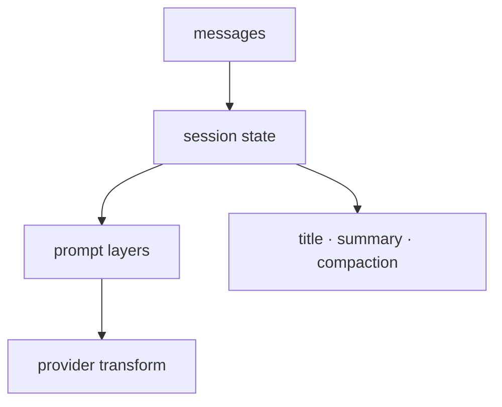

# 제2부: 대화를 어떻게 상태와 문맥으로 바꾸는가

에이전트 시스템이 장난감에서 시스템으로 넘어가는 첫 번째 순간은 대화를 문자열 로그로만 취급하지 않을 때다. 제2부는 바로 그 지점을 읽는다. 세션, 프롬프트, provider 정규화, compaction, 보조 시스템 에이전트는 모두 같은 문제의 다른 면이다. 대화형 인터페이스를 유지하면서도, 내부에서는 훨씬 더 풍부한 상태와 문맥층을 다루는 문제다.

이 파트의 핵심 질문은 "채팅을 어떻게 작업 상태로 승격하는가"다. 세션 모델이 빈약하면 compaction도 불가능하고, 복구도 불안정해지고, UI도 현재 상태를 제대로 보여 주지 못한다. 프롬프트 조립이 거칠면 agent 역할 차이가 흐려지고, provider bridge가 부실하면 모델별 예외가 상위 계층으로 새어 나온다.

이 파트를 읽을 때는 아래 축을 계속 붙잡아야 한다.

- 메시지와 작업 상태는 어디서 갈라지는가
- 문맥은 어떤 층으로 조립되는가
- 모델별 차이는 어디에서 흡수되는가
- 유지 기능은 왜 별도 시스템 에이전트가 되는가

5장은 세션과 메시지 흐름이 어디서 구조화되는지 본다. 6장은 프롬프트가 한 덩어리 문자열이 아니라 여러 문맥층의 합이라는 점을 보여 준다. 7장은 provider 차이를 어디에 가두는지 추적한다. 8장은 긴 대화를 다시 작게 만드는 compaction을, 9장은 title/summary 같은 보조 에이전트가 왜 독립된 실행 단위여야 하는지를 다룬다.

이 파트를 다 읽고 나면 독자는 좋은 에이전트 시스템이 "대화를 잘하는 모델"보다 먼저 "대화를 상태, 문맥, 보조 유지 흐름으로 분해하는 런타임"에 달려 있다는 점을 이해하게 된다.

<!-- opencode-book-expansion -->
## 확장된 읽기 관점

이 부는 대화가 어떻게 상태와 문맥으로 승격되는지 본다. 모델에게 들어가는 텍스트보다 중요한 것은 그 텍스트가 어떤 session/message/tool/provider 상태에서 만들어졌는가다.

### 핵심 소스

- `packages/opencode/src/session/session.ts`
- `packages/opencode/src/session/prompt.ts`
- `packages/opencode/src/session/llm.ts`
- `packages/opencode/src/session/compaction.ts`
