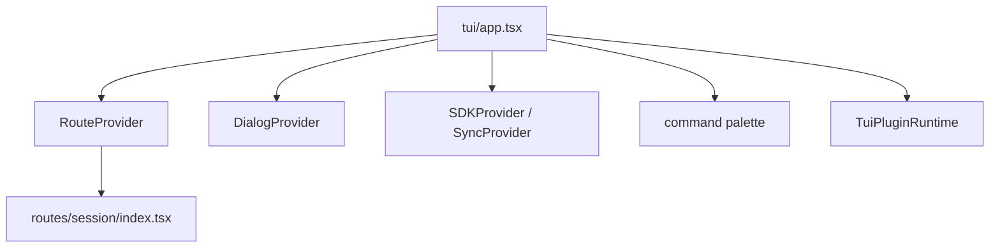
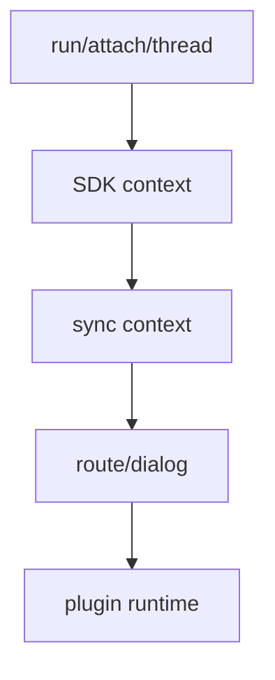

# 10장: TUI는 어떻게 앱처럼 동작하는가

> **포지셔닝**: 이 장은 OpenCode TUI를 단순 REPL이 아니라 route, context, dialog, plugin runtime, command palette를 가진 앱으로 읽는다. 대상 독자: 터미널에서 복합적인 에이전트 UI를 만들고 싶은 빌더.

## 왜 중요한가

OpenCode의 TUI는 프롬프트 한 줄 입력창이 전부인 전통적 CLI가 아니다. `app.tsx`를 보면 이 시스템은 route provider, dialog provider, keybind provider, SDK provider, sync provider, theme provider, plugin runtime을 가진 작은 앱 플랫폼에 더 가깝다. 이 점을 이해해야 permission dialog, session fork, plugin route, sidebar, model chooser가 왜 자연스럽게 공존하는지 읽을 수 있다.

## 소스 앵커

- `packages/opencode/src/cli/cmd/tui/app.tsx`
- `packages/opencode/src/cli/cmd/tui/routes/session/index.tsx`
- `packages/opencode/src/cli/cmd/tui/context/*`
- `packages/opencode/src/cli/cmd/tui/plugin/runtime.ts`
- `packages/opencode/src/cli/cmd/tui/ui/*`

## 구조도

## 핵심 메커니즘

### `app.tsx`는 provider 조립기다

이 파일 상단 import만 봐도 TUI 구조가 보인다.

- `RouteProvider`
- `DialogProvider`
- `ProjectProvider`
- `SDKProvider`
- `SyncProvider`
- `LocalProvider`
- `KeybindProvider`
- `ThemeProvider`
- `KVProvider`
- `ArgsProvider`
- `TuiConfigProvider`

즉 TUI의 핵심은 렌더링보다 provider 조립이다. 시스템 상태를 어디서 읽고 어떻게 전파할지 먼저 설계했기 때문에 화면이 커져도 구조를 유지할 수 있다.

### route와 dialog가 명시적 1급 개념이다

`useRoute()`, `useDialog()`, `route.navigate(...)`, `dialog.replace(...)` 사용 패턴을 보면 OpenCode TUI는 명시적인 route/modeless app 구조를 가진다. 사용자는 단일 채팅 화면 안에 갇혀 있지 않고, session 화면, plugin route, model dialog, provider dialog, MCP dialog, session list dialog를 계속 이동한다.

이 구조는 "CLI도 결국 앱이다"라는 판단의 직접적 결과다.

### command palette가 중심 인터랙션 채널이다

`command.register(() => [...])` 블록은 이 파일의 큰 축이다. 여기서 세션 전환, 새 세션, 모델 선택, agent 선택, MCP 열기, 상태 보기, 테마 선택, 도움말, 기타 토글 명령이 등록된다. 즉 slash command와 keybind, palette는 서로 다른 기능이 아니라 하나의 interaction surface로 수렴한다.

### session 화면은 통합 레이어다

`routes/session/index.tsx`가 매우 큰 이유는 우연이 아니다. 에이전트 채팅, tool part 렌더링, fork timeline, permission, attachments, todo, status, subagent footer가 모두 여기서 만난다. TUI에서 메인 session 화면은 단순 page가 아니라 코어 상태가 합류하는 통합 레이어다.

### plugin route도 같은 앱 모델 안에 있다

`TuiPluginRuntime.init(...)`이 실행되면 플러그인이 route, command, slot을 등록할 수 있고, route가 존재하지 않으면 `PluginRouteMissing`을 띄운다. 이 점이 중요하다. 플러그인도 TUI 바깥의 별도 세계가 아니라 같은 route 모델 안에서 산다.

### sync와 event가 UI를 살아 있게 만든다

`useSync()`, `event.on("session.created" ...)`, `event.on("session.deleted" ...)`, `event.on("session.error" ...)`를 보면 TUI는 단순 local state app이 아니라 서버/세션 이벤트를 계속 반영하는 이벤트 기반 표면이다. 그래서 session 생성이나 삭제가 즉시 화면 이동과 토스트로 이어진다.

### terminal title까지 route 상태를 반영한다

`renderer.setTerminalTitle(...)` 흐름은 작은 디테일이지만 의미 있다. OpenCode는 현재 route와 session title까지 터미널 창 제목에 반영한다. 즉 TUI는 출력 스트림이 아니라 애플리케이션 윈도우처럼 행동한다.

## 빌더에게 남는 것

- 복합 에이전트 UI는 CLI보다 앱 아키텍처로 생각하는 편이 낫다.
- route, dialog, command palette를 명시적으로 나누면 기능이 늘어나도 구조를 유지하기 쉽다.
- plugin과 session UI가 같은 route 모델을 공유하게 설계하는 것이 좋다.

다음 장에서는 이 TUI와 앱이 기대는 로컬 서버 라우트, 즉 OpenCode의 제어면을 본다.

<!-- opencode-book-expansion -->
## 소스 그라운딩 확장

### 참조 강좌에서 가져올 렌즈

Claude 책의 제품 표면 분석을 OpenCode에 적용하면 TUI는 로그 출력이 아니라 상태 앱이다. route, context, dialog, keybind, plugin slot, sync state를 가진 클라이언트다.

이 관점은 Claude 하니스의 구현을 그대로 복사하자는 뜻이 아니다. 같은 시스템 질문을 OpenCode 소스에 던지고, 다른 답이 나오는 지점을 분명히 하자는 뜻이다. 따라서 아래 흐름은 OpenCode의 실제 파일, 서비스, 상태 객체를 기준으로 다시 세운 읽기 지도다.

### 실제 OpenCode 흐름

### 확인해야 할 소스

- `packages/opencode/src/cli/cmd/tui/app.tsx`
- `packages/opencode/src/cli/cmd/tui/context/sdk.tsx`
- `packages/opencode/src/cli/cmd/tui/context/sync.tsx`
- `packages/opencode/src/cli/cmd/tui/routes/home.tsx`
- `packages/opencode/src/cli/cmd/tui/plugin/runtime.ts`

### 구현에서 읽어야 할 메커니즘

- cli/cmd/tui 아래 app, route, context, component, plugin이 분리되어 있다.
- 화면 컴포넌트는 직접 server fetch를 반복하기보다 context가 제공하는 상태를 소비한다.
- TUI plugin은 provider 요청이 아니라 화면 slot, keybind, theme 같은 표현 확장을 다룬다.

### 실패 모드와 설계 압력

- TUI를 CLI 출력으로 보면 sync와 route lifecycle을 놓친다.
- server truth와 TUI local state가 섞이면 attach/thread 흐름이 깨진다.
- UI 확장과 server 확장을 한 채널에 몰면 실패 영향이 커진다.

### 빌더에게 남는 질문

- 터미널 UI도 앱처럼 route/context를 갖는가?
- event stream과 local rendering state가 분리되어 있는가?
- UI 확장과 runtime 확장의 계약이 분리되어 있는가?

이 장의 핵심은 파일 이름을 외우는 것이 아니라 경계를 읽는 것이다. 어떤 상태가 어느 계층에서 만들어지고, 어떤 계약을 통과하며, 실패했을 때 어디서 관측되는지까지 따라가야 실제 하니스 설계로 옮길 수 있다.
