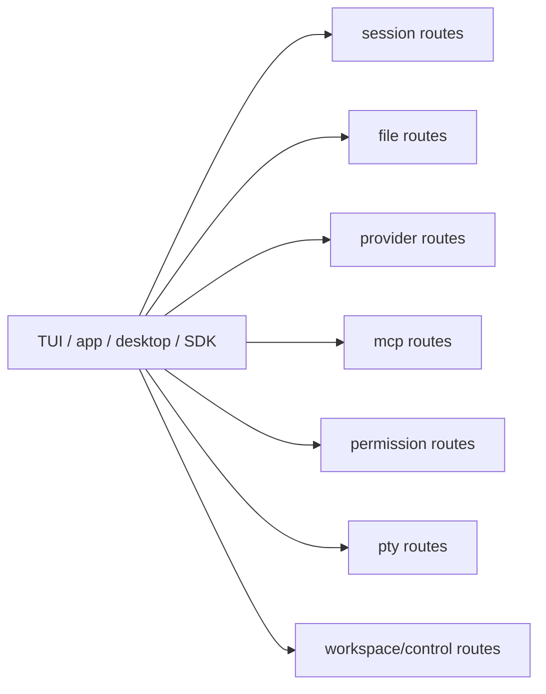
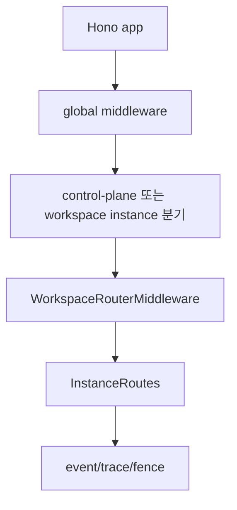

# 11장: 서버 라우트와 로컬 제어면

> **포지셔닝**: 이 장은 `packages/opencode/src/server/routes`를 OpenCode의 로컬 control plane으로 읽는다. 대상 독자: CLI, 앱, SDK, 데스크톱이 공유하는 제어면을 설계하려는 빌더.

## 왜 중요한가

OpenCode는 UI가 코어 함수를 직접 두드리는 구조에 머무르지 않는다. 세션, 파일, provider, permission, MCP, PTY, project, workspace, experimental API가 모두 서버 라우트로 노출된다. 이 선택 덕분에 TUI, 브라우저 앱, 데스크톱, SDK가 모두 같은 런타임 계약을 공유할 수 있다.

## 소스 앵커

- `packages/opencode/src/server/routes/instance/session.ts`
- `packages/opencode/src/server/routes/instance/file.ts`
- `packages/opencode/src/server/routes/instance/provider.ts`
- `packages/opencode/src/server/routes/instance/mcp.ts`
- `packages/opencode/src/server/routes/instance/permission.ts`
- `packages/opencode/src/server/routes/global.ts`
- `packages/opencode/specs/effect/routes.md`

## 라우트 그래프

## 핵심 메커니즘

### `session.ts`가 가장 넓은 표면이다

`server/routes/instance/session.ts`를 보면 OpenCode 사용자의 핵심 동작 대부분이 여기로 수렴한다.

- 세션 목록/조회/자식 조회
- todo 조회
- 세션 생성/삭제/업데이트
- init/fork/abort
- share/unshare
- summarize/diff
- message 조회/삭제/수정
- prompt / prompt_async / command / shell
- revert

즉 session route 파일 하나가 사실상 OpenCode product API의 중심이다.

### 라우트는 단순 CRUD가 아니라 운영 액션까지 노출한다

이 파일에서 흥미로운 점은 단순 `create/get/delete`만 있는 것이 아니라, `fork`, `abort`, `summarize`, `share`, `revert`, `shell`, `command` 같은 운영 액션이 함께 있다는 것이다. 이 말은 곧 세션이 단순 데이터 row가 아니라, 실행 가능한 작업 단위라는 뜻이다.

### helper 경계가 Effect 서비스 스타일을 통일한다

`jsonRequest(...)`, `runRequest(...)` 같은 헬퍼는 라우트가 서비스와 만나는 표준 경계를 제공한다. `specs/effect/routes.md`가 강조하듯, 무거운 핸들러는 한 번의 `AppRuntime.runPromise(Effect.gen(...))`로 묶이고, 서비스는 context에서 yield하는 방향으로 정리되고 있다. 즉 라우트 정리는 단순 Promise 제거가 아니라 서비스 경계 일관성을 맞추는 작업이다.

### 세션 라우트가 여러 하위 서비스를 조합한다

`session.ts` 상단 import만 봐도 이 파일이 단순 resource controller가 아님을 알 수 있다.

- `Session`
- `MessageV2`
- `SessionPrompt`
- `SessionRunState`
- `SessionCompaction`
- `SessionRevert`
- `SessionStatus`
- `SessionSummary`
- `Todo`

즉 로컬 제어면은 데이터를 바로 읽는 thin layer가 아니라, 여러 코어 서비스를 orchestration하는 표면이다.

### prompt와 prompt_async는 제품적 차이를 가진다

동기 `prompt`와 비동기 `prompt_async`를 따로 둔 것은 좋은 제품 감각이다. 어떤 소비자는 스트리밍 응답을 바로 받고 싶고, 어떤 소비자는 작업만 시작하고 나중에 상태를 보러 오고 싶다. OpenCode는 이 둘을 제어면에서 명시적으로 분리한다.

### share, summarize, revert가 같은 API 표면에 있다

이 세 기능이 같은 session route 파일 안에 있다는 사실도 중요하다. 이는 OpenCode가 세션을 단순 채팅 단위가 아니라, 공유되고 요약되고 되돌릴 수 있는 작업 단위로 본다는 뜻이다. 즉 control plane 설계가 storage와 recovery 철학을 그대로 드러낸다.

## 로컬 제어면의 가치

로컬 제어면이 있으면 좋은 점은 단순하다.

- TUI가 코어 함수를 직접 알 필요가 없다.
- 앱과 데스크톱이 같은 계약을 재사용할 수 있다.
- SDK가 안정적인 자동화 표면을 얻는다.
- 향후 표면이 늘어나도 코어 로직을 다시 복제하지 않아도 된다.

반대로 이 계층이 없으면 UI가 늘어날수록 코어 함수 호출 경로가 표면별로 찢어진다.

## 빌더에게 남는 것

- 여러 UI를 가질 생각이 있다면 로컬 control plane을 초기에 분리하는 편이 좋다.
- 세션은 CRUD 리소스가 아니라 운영 액션을 함께 가진 작업 단위로 보는 편이 맞다.
- 라우트 계층은 REST 미학보다 서비스 경계 일관성을 유지하는 도구로 봐야 한다.

다음 장에서는 웹, 앱, 데스크톱이 이런 코어와 제어면을 어떻게 서로 다르게 소비하는지 본다.

<!-- opencode-book-expansion -->
## 소스 그라운딩 확장

### 참조 강좌에서 가져올 렌즈

OpenCode server는 단순 REST API가 아니라 로컬 런타임 제어면이다. Claude 책의 remote bridge 관점을 가져오면 route graph와 workspace middleware가 더 잘 보인다.

이 관점은 Claude 하니스의 구현을 그대로 복사하자는 뜻이 아니다. 같은 시스템 질문을 OpenCode 소스에 던지고, 다른 답이 나오는 지점을 분명히 하자는 뜻이다. 따라서 아래 흐름은 OpenCode의 실제 파일, 서비스, 상태 객체를 기준으로 다시 세운 읽기 지도다.

### 실제 OpenCode 흐름

### 확인해야 할 소스

- `packages/opencode/src/server/server.ts`
- `packages/opencode/src/server/routes/instance/index.ts`
- `packages/opencode/src/server/routes/global.ts`
- `packages/opencode/src/server/workspace.ts`
- `packages/opencode/src/server/fence.ts`
- `packages/opencode/src/server/routes/instance/trace.ts`

### 구현에서 읽어야 할 메커니즘

- OPENCODE_WORKSPACE_ID 존재 여부에 따라 single instance mode와 control-plane mode가 갈린다.
- Auth, Logger, Compression, CORS, Error middleware가 route보다 넓은 정책 표면을 만든다.
- OpenAPI 생성은 SDK의 빌드 입력이므로 route metadata는 자동화 계약이다.

### 실패 모드와 설계 압력

- server를 localhost API로만 보면 workspace routing과 instance lifecycle을 놓친다.
- route마다 auth/sync 로직을 반복하면 클라이언트별 차이가 생긴다.
- OpenAPI metadata가 깨지면 SDK가 실제 server와 어긋난다.

### 빌더에게 남는 질문

- control plane과 instance data plane을 분리했는가?
- instance context가 필요한 route를 middleware로 강제하는가?
- API route 변경이 SDK 생성과 함께 검증되는가?

이 장의 핵심은 파일 이름을 외우는 것이 아니라 경계를 읽는 것이다. 어떤 상태가 어느 계층에서 만들어지고, 어떤 계약을 통과하며, 실패했을 때 어디서 관측되는지까지 따라가야 실제 하니스 설계로 옮길 수 있다.
