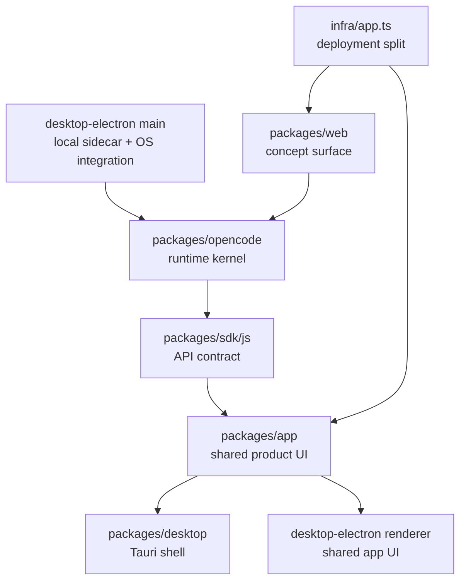
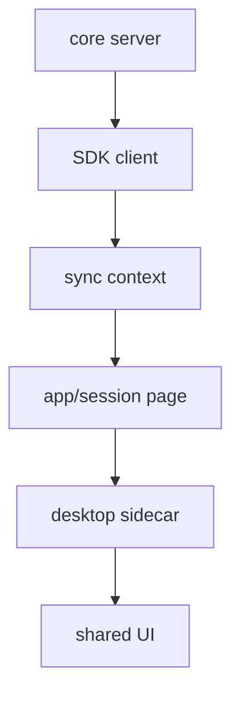

# 12장: 웹, 앱, 데스크톱의 공유 코어

> **포지셔닝**: 이 장은 OpenCode가 여러 제품 표면을 가지면서도 코어와 UI를 어떻게 재사용하는지, 그리고 어디서부터는 다시 표면별 운영 책임이 두꺼워지는지를 해부한다. 대상 독자: 하나의 코어를 웹 앱, 데스크톱 앱, 문서 사이트로 나누어 내보내려는 빌더.

## 왜 중요한가

대부분의 에이전트 프로젝트는 여기서 둘 중 하나를 택한다. CLI 중심으로 남거나, 웹 앱을 만들면서 코어를 다시 구현한다. OpenCode는 상대적으로 드문 세 번째 길을 택한다. 코어 런타임은 `packages/opencode`에 남겨 두고, 브라우저 앱은 `packages/app`, 문서 사이트는 `packages/web`, 데스크톱 표면은 `packages/desktop`과 `packages/desktop-electron`으로 갈라 낸다. 중요한 점은 이 표면들이 같은 저장소 안에 있다고 해서 같은 책임을 지지 않는다는 것이다.

이 장을 읽어야 하는 이유는 간단하다. 제품 표면이 늘어날수록 어려운 것은 "화면을 더 만드는 것"이 아니라 "무엇을 공유하고 무엇을 갈라야 하는지"를 끝까지 지키는 일이다. OpenCode는 완벽하지는 않지만, 이 문제를 꽤 일관된 방식으로 다룬다.

## 소스 앵커

- `packages/app/package.json`
- `packages/app/src/index.ts`
- `packages/desktop/package.json`
- `packages/desktop/src/index.tsx`
- `packages/desktop/src/entry.tsx`
- `packages/desktop-electron/package.json`
- `packages/desktop-electron/src/renderer/index.tsx`
- `packages/desktop-electron/src/main/index.ts`
- `packages/desktop-electron/src/main/server.ts`
- `packages/web/astro.config.mjs`
- `infra/app.ts`

## 표면 지형도

이 그림에서 중요한 것은 `packages/app`가 최종 제품이 아니라 공유 UI 계층이라는 점이다. 그리고 문서 사이트와 데스크톱 메인 프로세스는 이 공유 UI와 전혀 다른 종류의 책임을 가진다.

## 핵심 메커니즘

### `packages/app`은 "웹 앱"이 아니라 공유 제품 UI다

`packages/app/package.json`을 보면 의존성 중심이 분명하다. `@opencode-ai/sdk`, `@opencode-ai/ui`, `@opencode-ai/shared`가 중심이고, Vite/Solid 기반 브라우저 UI가 그 위에 올라간다. 더 중요한 근거는 `packages/app/src/index.ts`다. 이 파일은 화면 구현 전체를 노출하지 않고 `AppBaseProviders`, `AppInterface`, `PlatformProvider`, `ServerConnection`, `useCommand` 같은 상위 조립 단위를 export한다.

이 말은 곧 `packages/app`이 독립 제품이라기보다 "브라우저 기반 제품 표면을 조립하는 공유 인터페이스 계층"이라는 뜻이다. 데스크톱이 이 계층을 그대로 끌어다 쓰는 이유도 여기에 있다.

### Tauri 표면은 공유 UI 위에 플랫폼 어댑터를 얹는다

`packages/desktop/src/index.tsx`를 보면 Tauri 표면의 성격이 선명하다. 이 파일은 `@opencode-ai/app`에서 `AppBaseProviders`, `AppInterface`, `PlatformProvider`, `ServerConnection`을 가져온 뒤, Tauri 전용 플러그인들을 이용해 `Platform` 객체를 채운다.

- `@tauri-apps/plugin-dialog`로 파일 선택기 연결
- `@tauri-apps/plugin-deep-link`로 딥링크 연결
- `@tauri-apps/plugin-http`로 HTTP fetch 대체
- `@tauri-apps/plugin-store`로 로컬 저장소 연결
- `commands.*` 바인딩으로 WSL 경로 변환, 경로 열기, 메뉴 등 네이티브 기능 연결

즉 Tauri 표면은 UI를 거의 새로 쓰지 않는다. 대신 "브라우저 앱이 기대하는 platform contract"를 Tauri 플러그인으로 채워 넣는다. 이것이 코어와 UI를 재사용하면서도 운영체제 통합을 제공하는 방식이다.

### Electron은 같은 UI를 쓰되, 메인 프로세스 책임이 훨씬 두꺼워진다

`packages/desktop-electron/src/renderer/index.tsx`도 마찬가지로 `@opencode-ai/app`를 중심으로 조립된다. 하지만 Electron 표면은 Tauri와 결정적인 차이가 있다. `packages/desktop-electron/src/main/index.ts`가 별도의 운영 커널처럼 두꺼워진다는 점이다.

이 메인 프로세스는 단순 창 관리자에 그치지 않는다.

- 단일 인스턴스 락과 딥링크 처리
- 로컬 sidecar 서버 부팅
- SQLite 마이그레이션 오버레이
- auto updater
- 메뉴와 IPC
- 앱 userData 경로와 프로토콜 설정

특히 `process.env.OPENCODE_DISABLE_EMBEDDED_WEB_UI = "true"` 설정과, `packages/desktop-electron/src/main/server.ts`의 `spawnLocalServer(...)`는 이 표면의 정체를 잘 보여 준다. Electron은 웹 UI를 감싸는 것만이 아니라, 같은 머신 안에서 `virtual:opencode-server`를 띄워 로컬 제어면까지 책임진다.

즉 Electron 표면은 "렌더러는 공유 UI, 메인은 운영 어댑터"라는 이중 구조를 가진다.

### 데스크톱 표면에서 진짜로 달라지는 것은 UI가 아니라 운영 책임이다

Tauri와 Electron을 비교하면 겉으로는 둘 다 데스크톱 앱이다. 하지만 코드에서는 전혀 다르게 무거워진다.

| 표면 | 공유하는 것 | 새로 책임지는 것 |
| --- | --- | --- |
| `packages/desktop` | `@opencode-ai/app` 기반 UI, command/context 구조 | Tauri plugin 연결, 네이티브 대화상자, 업데이트, WSL 경로 적응 |
| `packages/desktop-electron` renderer | `@opencode-ai/app` 기반 UI, platform contract | preload/IPC를 통한 데스크톱 브리지 |
| `packages/desktop-electron` main | 거의 공유하지 않음 | sidecar 서버, 윈도우/메뉴, deep link, shell env, local state |

이 표는 좋은 교훈을 준다. 여러 표면이 같은 UI를 공유할 수는 있어도, 배포와 프로세스 모델과 OS 통합 책임까지 같아지지는 않는다.

### 문서 사이트는 별도 제품 표면이면서도 개념 모델의 본진이다

`packages/web/astro.config.mjs`는 문서가 단순 보조 산출물이 아니라는 점을 보여 준다. Astro/Starlight 기반 설정에는 다국어 locale, sidebar 구조, edit link, Cloudflare adapter, `/docs` base path가 모두 들어 있다. 이 사이트는 앱 UI를 재사용하지 않지만, OpenCode의 공식 개념 모델을 제공한다는 점에서 동일한 제품군의 표면이다.

책 작업에 이것이 중요한 이유는, 문서 사이트가 이미 "사용자에게 보여 주는 OpenCode의 개념 모델"을 가지고 있기 때문이다. 따라서 책은 이 문서와 경쟁하는 것이 아니라, 문서가 설명하는 개념을 코어 구현과 대조해 주는 역할을 해야 한다.

### 저장소 분리는 실제 배포 분리로 이어진다

`infra/app.ts`를 보면 폴더 경계가 곧 운영 경계라는 점이 더 분명해진다.

- `docs.<domain>`은 `packages/web`
- `app.<domain>`은 `packages/app`
- `api.<domain>`은 Cloudflare worker API

즉 OpenCode는 "같은 repo 안에 폴더를 나눠 두는 미학"에 머무르지 않는다. 문서, 앱, API를 실제 다른 배포 표면으로 나눠 둔다. 제품 표면 분리가 저장소 안에서만 성립하면 시간이 지날수록 무너진다. OpenCode는 적어도 이 점에서 일관적이다.

## 이 장에서 진짜 봐야 하는 것

OpenCode의 표면 전략은 "웹, 데스크톱, 문서가 모두 있다"가 아니다. 더 중요한 논지는 아래 세 가지다.

1. 코어는 `packages/opencode`에 남는다.
2. 브라우저 기반 제품 UI는 `packages/app`라는 공유 계층으로 모은다.
3. 데스크톱과 문서는 각자의 운영 책임 때문에 다시 갈라진다.

이 순서가 깨지면 표면 수가 늘수록 코어 로직이 여기저기 복제되기 쉽다. OpenCode는 그 복제를 SDK와 공유 UI, 그리고 표면별 어댑터 계층으로 늦춘다.

## 트레이드오프

- 장점: 앱, 데스크톱, 문서가 커져도 코어 런타임이 직접 UI 패키지에 새지 않는다.
- 장점: 데스크톱 표면도 공유 UI를 재사용하므로 제품 감각을 맞추기 쉽다.
- 단점: 저장소 패키지 수, 빌드 체인, 배포 경로가 빠르게 복잡해진다.
- 단점: 공유 UI와 플랫폼 어댑터의 경계가 흐려지면 한 번에 여러 표면이 깨질 수 있다.
- 장점: 문서 사이트도 별도 표면으로 유지되어 개념 모델을 독립적으로 운영할 수 있다.

## 빌더에게 남는 것

- 여러 표면을 지원하고 싶다면 먼저 공유할 대상이 UI인지, SDK인지, 코어인지부터 분명히 해야 한다.
- 데스크톱 앱의 복잡성은 화면보다 메인 프로세스와 OS 통합에서 더 빨리 커진다.
- 문서 사이트는 부속물이 아니라 제품의 개념 모델을 담당하는 표면으로 취급하는 편이 낫다.
- 저장소 분리는 배포 분리까지 이어져야 오래 유지된다.

다음 장에서는 이 여러 표면이 공통으로 기대는 가장 노골적인 계약층, 즉 JS SDK와 자동화 진입점을 본다.

<!-- opencode-book-expansion -->
## 소스 그라운딩 확장

### 참조 강좌에서 가져올 렌즈

OpenCode는 표면이 넓지만 core가 여러 벌인 것은 아니다. Claude 하니스의 핵심처럼 모델 루프는 하나의 계약으로 남고 UI는 그 상태를 다른 방식으로 보여 준다.

이 관점은 Claude 하니스의 구현을 그대로 복사하자는 뜻이 아니다. 같은 시스템 질문을 OpenCode 소스에 던지고, 다른 답이 나오는 지점을 분명히 하자는 뜻이다. 따라서 아래 흐름은 OpenCode의 실제 파일, 서비스, 상태 객체를 기준으로 다시 세운 읽기 지도다.

### 실제 OpenCode 흐름

### 확인해야 할 소스

- `packages/app/src/context/sdk.tsx`
- `packages/app/src/context/sync.tsx`
- `packages/app/src/pages/session.tsx`
- `packages/desktop-electron-live/electron/services/opencode-sidecar.ts`
- `packages/desktop-electron-live/electron/services/opencode-bridge.ts`
- `packages/ui`

### 구현에서 읽어야 할 메커니즘

- packages/app은 prompt input과 session UI를 갖지만 tool execution과 provider call은 core에 맡긴다.
- desktop 계층은 sidecar process, shell env, bridge, data location을 운영한다.
- packages/ui는 표현 공유 계층이지 permission이나 tool semantics의 소유자가 아니다.

### 실패 모드와 설계 압력

- desktop에서 core 의미론을 재구현하면 CLI/TUI/app과 다른 permission 결과가 나온다.
- UI store가 server truth를 대체하면 stale 상태가 생긴다.
- 표면별 문서가 소스 근거를 잃으면 오래 유지되지 않는다.

### 빌더에게 남는 질문

- 제품 표면이 core API와 event stream을 소비하는가?
- desktop process 운영 책임이 별도 service로 격리되어 있는가?
- 공유 UI와 공유 runtime을 혼동하지 않는가?

이 장의 핵심은 파일 이름을 외우는 것이 아니라 경계를 읽는 것이다. 어떤 상태가 어느 계층에서 만들어지고, 어떤 계약을 통과하며, 실패했을 때 어디서 관측되는지까지 따라가야 실제 하니스 설계로 옮길 수 있다.
