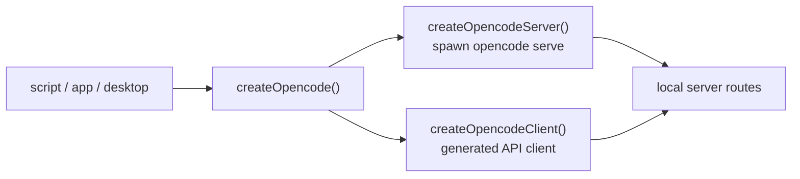
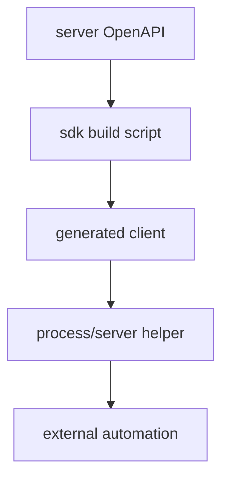

# 13장: SDK와 자동화 진입점

> **포지셔닝**: 이 장은 OpenCode JS SDK를 단순 타입 패키지가 아니라, 로컬 서버 부팅, 디렉터리 문맥 전달, 생성 클라이언트 계약을 묶은 자동화 진입 제어층으로 읽는다. 대상 독자: OpenCode를 다른 앱, 스크립트, 데스크톱 표면에 내장하려는 빌더.

## 왜 중요한가

CLI만 있는 도구는 사용자를 직접 상대한다. SDK가 있는 도구는 다른 프로그램 안으로 들어간다. 이 차이는 단순한 편의성 추가가 아니다. 시스템의 경계가 바뀌는 일이다. OpenCode의 JS SDK는 HTTP 타입 묶음을 제공하는 데 그치지 않고, 필요하면 `opencode serve`를 직접 띄우고, 그 서버를 가리키는 클라이언트를 함께 만든다.

이 장에서 중요한 것은 SDK가 "외부 개발자를 위한 별도 제품"이라는 사실보다, OpenCode 내부 표면도 이 계층을 통해 코어와 거리를 유지한다는 점이다. 즉 SDK는 바깥을 위한 패키지이자, 안쪽 결합을 줄이기 위한 계약층이다.

## 소스 앵커

- `packages/sdk/js/src/index.ts`
- `packages/sdk/js/src/client.ts`
- `packages/sdk/js/src/server.ts`
- `packages/sdk/js/src/v2/index.ts`
- `packages/sdk/js/src/gen/client/client.gen.ts`
- `packages/sdk/js/src/gen/sdk.gen.ts`
- `packages/opencode/src/server/routes/instance/session.ts`
- `packages/app/package.json`

## SDK의 최소 흐름

이 구조는 단순하다. 하지만 핵심은 호출자가 `opencode serve`의 부팅 의식과 HTTP 클라이언트 초기화를 직접 알 필요가 없다는 데 있다.

## 핵심 메커니즘

### `createOpencode()`는 복잡성을 접어 넣는 가장 얇은 진입점이다

`packages/sdk/js/src/index.ts`와 `packages/sdk/js/src/v2/index.ts`는 거의 같은 패턴을 쓴다. `createOpencode(options?)`는 내부에서 `createOpencodeServer(...)`로 로컬 서버를 띄우고, 반환된 `server.url`을 바탕으로 `createOpencodeClient(...)`를 만든 뒤 `{ client, server }`를 돌려준다.

표면상으론 너무 단순해 보여도, 이 API의 미덕은 분명하다.

- 호출자는 프로세스 부팅과 HTTP 계약을 따로 조립하지 않아도 된다.
- 테스트/자동화 코드에서 서버 lifecycle을 명시적으로 닫을 수 있다.
- SDK가 "서버 없는 클라이언트"와 "클라이언트 없는 서버"를 동시에 숨긴다.

좋은 SDK는 보통 기능이 많아서 좋은 것이 아니라, 사용자가 반드시 해야 했을 ceremony를 지워 줘서 좋다.

### 서버 래퍼는 사실상 `opencode serve` 프로세스 관리자다

`packages/sdk/js/src/server.ts`의 `createOpencodeServer(...)`는 진짜 HTTP 서버를 직접 구현하지 않는다. 대신 `cross-spawn`으로 `opencode serve --hostname=... --port=...`를 띄우고, stdout에서 `opencode server listening on ...` 로그를 읽어 URL을 파싱한다.

여기서 보이는 설계 포인트는 세 가지다.

1. **설정 전달**: `OPENCODE_CONFIG_CONTENT` 환경 변수로 config를 통째로 넘긴다.
2. **준비 완료 판정**: 단순 프로세스 생성이 아니라, 실제 listening 로그를 기준으로 준비 완료를 판정한다.
3. **종료 제어**: timeout, abort signal, `close()`를 모두 지원해 외부 자동화가 lifecycle을 통제할 수 있게 한다.

즉 SDK 서버 래퍼는 "프로세스를 띄운다"보다 "로컬 제어면을 안전하게 부팅하고 정리한다"에 가깝다.

### 클라이언트 래퍼는 디렉터리 문맥을 HTTP 계약으로 승격한다

`packages/sdk/js/src/client.ts`의 핵심은 생성 클라이언트보다 `rewrite(request, directory)`에 있다. 이 함수는 GET/HEAD 요청에서 `x-opencode-directory` 헤더를 읽어 query param `directory`로 정규화하고, 필요한 경우 헤더를 지운 새 `Request`를 만든다.

겉보기엔 사소하지만, 이 설계는 OpenCode의 중요한 제약을 드러낸다. OpenCode 요청은 단순 URL 호출이 아니라 "어느 작업 디렉터리 문맥에서 실행되는가"를 알아야 한다. SDK는 이 제약을 호출자에게 노출시키되, 모든 요청마다 수작업으로 반복하지 않도록 감싼다.

이 점이 중요하다. 런타임 제약을 감춘 SDK는 편하지만 부정확해지기 쉽고, 제약을 그대로 노출하는 SDK는 정확하지만 쓰기 어려워진다. OpenCode는 `directory`를 옵션과 interceptor 안으로 밀어 넣는 절충안을 택한다.

### generated client 계층은 내부 결합도 줄인다

`packages/sdk/js/src/gen/client/client.gen.ts`, `gen/sdk.gen.ts`, `gen/types.gen.ts`가 보여 주는 것은 명확하다. SDK는 hand-written wrapper만 있는 것이 아니라, 서버 라우트와 맞물린 생성 계약층을 가진다.

이 생성 계층이 있으면 좋은 점은 두 가지다.

- 앱/데스크톱/외부 스크립트가 서버 라우트 내부 세부 구현을 직접 알지 않아도 된다.
- 라우트 변경이 있을 때 계약 경계가 더 빨리 드러난다.

즉 SDK는 편의성 계층이면서 동시에 "코어를 직접 import하지 않고 제어면을 통해 소비하게 만드는 내부 아키텍처 장치"다.

### `createOpencodeTui()`는 SDK가 CLI 자체도 자동화 대상으로 본다는 뜻이다

같은 `server.ts` 안의 `createOpencodeTui(options?)`도 중요하다. 이 함수는 `--project`, `--model`, `--session`, `--agent` 같은 CLI 옵션을 붙여 `opencode` 프로세스를 띄우고 `stdio: "inherit"`로 붙인다.

이건 OpenCode가 SDK를 HTTP API만 위한 것으로 보지 않는다는 뜻이다. 런타임 외부에서 OpenCode의 TUI 세션 자체를 제어하거나 내장할 수 있도록, CLI 실행도 SDK 층의 일부로 취급한다.

즉 JS SDK는 단지 "API client"가 아니라 "OpenCode 실행 표면 전체의 automation entrypoint"에 가깝다.

### v1과 v2 공존은 진입점 안정성을 위한 완충 장치다

`src/index.ts`와 `src/v2/index.ts`가 병렬로 존재하고, v2는 추가로 `data` namespace를 export한다. 이건 사소한 버전 폴더 정리가 아니다. OpenCode는 SDK를 한 번 정하면 영원히 고정된 입구로 보지 않고, 새로운 데이터 모델이나 API shape를 별도 진입점으로 분리해 이동 비용을 줄인다.

표면이 많은 시스템에서 이런 완충 장치는 매우 중요하다. 앱, 데스크톱, 외부 자동화 코드가 동시에 SDK를 소비하면, "다 같이 한 번에 깨뜨리는" 방식은 유지하기 어렵다.

## 내부 제품 구조에서 SDK가 갖는 의미

`packages/app/package.json`이 `@opencode-ai/sdk`를 직접 의존한다는 사실은 이 장의 핵심 결론을 뒷받침한다. SDK는 외부 개발자를 위한 추가 기능이 아니라, OpenCode 내부 제품 표면이 코어와 안전한 거리를 유지하기 위한 계층이기도 하다.

이것이 중요한 이유는 분명하다. 표면 수가 늘어날수록 "코어 파일 직접 import"는 매우 빨리 독이 된다. SDK나 제어면 같은 계약층을 사이에 두면 느리고 답답해 보일 수는 있어도, 장기적으로 훨씬 덜 깨진다.

## 트레이드오프

- 장점: 호출자는 서버 부팅, URL 해석, 클라이언트 생성의 의식을 직접 알 필요가 없다.
- 장점: 디렉터리 문맥 같은 런타임 제약을 SDK 내부로 부분적으로 흡수할 수 있다.
- 장점: 생성 계약층 덕분에 여러 표면이 코어 내부 구현과 거리를 둘 수 있다.
- 단점: 실제 서버 readiness를 로그 파싱에 의존하므로 CLI 출력 형식에 민감하다.
- 단점: SDK가 단순 타입 패키지보다 훨씬 많은 lifecycle 책임을 진다.

## 빌더에게 남는 것

- 좋은 SDK는 함수 모음이 아니라 진입 제어층이다.
- 로컬 서버를 함께 쓰는 시스템이라면, "부팅 + 클라이언트 생성 + 종료"를 한 번에 감싸는 API가 유리하다.
- 디렉터리 문맥, 인증, base URL 같은 반복 제약은 interceptor와 옵션 계층으로 밀어 넣는 편이 좋다.
- 표면이 많은 시스템일수록 generated client 같은 계약층이 내부 결합도까지 줄여 준다.

이제 표면 얘기는 여기서 잠시 멈춘다. 다음 부에서는 플러그인, 스킬, MCP, 워크스페이스처럼 확장 채널을 왜 서로 다른 계약으로 갈라 두는지 본다.

<!-- opencode-book-expansion -->
## 소스 그라운딩 확장

### 참조 강좌에서 가져올 렌즈

Claude 책의 API 계층 관점을 OpenCode에 가져오면 SDK는 편의 wrapper가 아니라 자동화 진입점이다. 사람이 누르는 UI 밖에서도 같은 하니스 정책을 사용하게 만드는 경계다.

이 관점은 Claude 하니스의 구현을 그대로 복사하자는 뜻이 아니다. 같은 시스템 질문을 OpenCode 소스에 던지고, 다른 답이 나오는 지점을 분명히 하자는 뜻이다. 따라서 아래 흐름은 OpenCode의 실제 파일, 서비스, 상태 객체를 기준으로 다시 세운 읽기 지도다.

### 실제 OpenCode 흐름

### 확인해야 할 소스

- `packages/sdk/js/src/client.ts`
- `packages/sdk/js/src/gen/sdk.gen.ts`
- `packages/sdk/js/src/process.ts`
- `packages/sdk/js/src/server.ts`
- `packages/sdk/js/script/build.ts`
- `packages/sdk/openapi.json`

### 구현에서 읽어야 할 메커니즘

- JS SDK는 수동 작성 API가 아니라 OpenAPI 기반 생성물이다.
- AGENTS.md의 SDK 재생성 명령은 route/schema 변경과 client 타입을 맞추기 위한 필수 절차다.
- SDK 호출은 core route를 호출하므로 permission과 session state를 우회하지 않는다.

### 실패 모드와 설계 압력

- generated SDK를 수동 patch하면 다음 생성에서 사라진다.
- OpenAPI와 route가 어긋나면 자동화 사용자가 잘못된 타입을 믿게 된다.
- 자동화 전용 bypass를 만들면 UI와 CLI의 안전성 모델이 깨진다.

### 빌더에게 남는 질문

- API spec에서 SDK를 생성하는가?
- local server lifecycle helper가 있는가?
- SDK가 core policy를 우회하지 않는가?

이 장의 핵심은 파일 이름을 외우는 것이 아니라 경계를 읽는 것이다. 어떤 상태가 어느 계층에서 만들어지고, 어떤 계약을 통과하며, 실패했을 때 어디서 관측되는지까지 따라가야 실제 하니스 설계로 옮길 수 있다.
