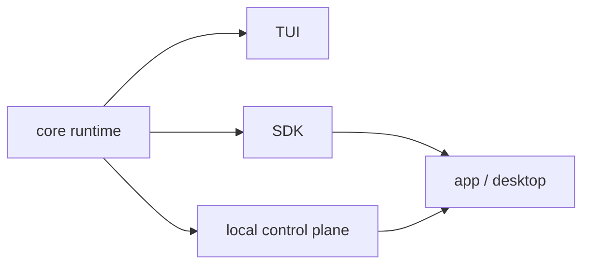

# 제3부: 하나의 코어를 어떻게 여러 표면으로 펼치는가

제3부는 OpenCode가 코어를 복제하지 않고 제품 표면을 늘리는 방식을 읽는다. TUI, 로컬 서버, 앱, 데스크톱, SDK는 겉으로 보면 서로 다른 제품처럼 보이지만, 저장소 안에서는 하나의 코어가 각기 다른 제어면과 소비 경로를 통해 드러난 결과다.

이 파트의 질문은 "동일한 실행 코어를 어떻게 여러 형태의 제품으로 드러낼 수 있는가"다. 많은 시스템이 여기서 무너진다. 표면이 하나 늘어날 때마다 코어 로직도 한 번씩 복제되기 때문이다. OpenCode는 완벽하지는 않지만, 대체로 코어를 고정하고 표면을 갈라 내는 방향을 유지한다.

이 파트에서 주의해서 볼 것은 다음이다.

- 어떤 표면이 코어를 직접 소비하고, 어떤 표면이 SDK나 제어면을 거쳐 들어가는가
- 서버 라우트는 API가 아니라 로컬 control plane으로서 어떤 역할을 하는가
- 앱과 데스크톱은 동일한 UI를 공유해도 왜 같은 운영 책임을 지지 않는가

10장은 TUI가 단순 CLI가 아니라 상태 기반 앱처럼 동작하도록 만드는 구조를 본다. 11장은 server routes가 외부 SaaS API가 아니라 같은 머신 안의 제어면이라는 점을 분석한다. 12장은 웹, 앱, 데스크톱이 공유 코어 위에서 어떻게 갈라지는지 보고, 13장은 SDK가 외부 자동화의 최소 계약으로서 어떤 책임을 지는지 정리한다.

이 파트를 다 읽고 나면 독자는 "표면을 늘리는 것"과 "코어를 복제하는 것"이 전혀 다른 문제라는 점을 분명히 보게 된다. OpenCode의 실전 감각은 여기서도 드러난다.

<!-- opencode-book-expansion -->
## 확장된 읽기 관점

이 부는 하나의 core가 여러 표면으로 펼쳐지는 방식을 본다. TUI, app, desktop, SDK는 서로 다르지만 세션과 도구 의미론은 core에 남아야 한다.

### 핵심 소스

- `packages/opencode/src/cli/cmd/tui`
- `packages/opencode/src/server/server.ts`
- `packages/app/src`
- `packages/sdk/js/src`
