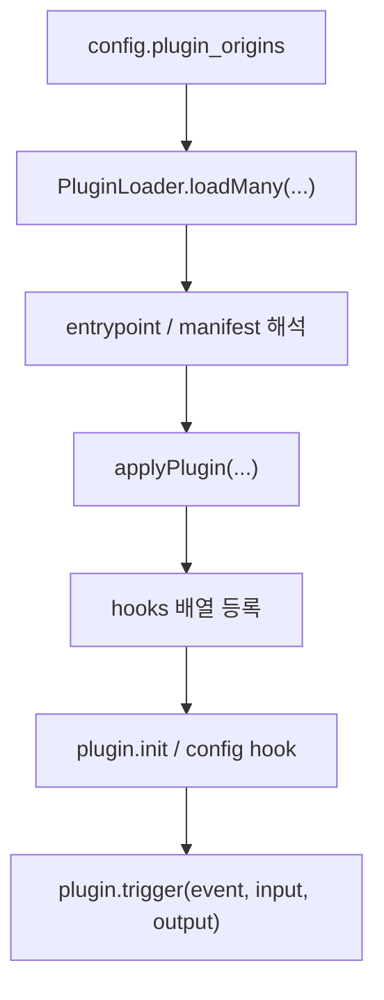
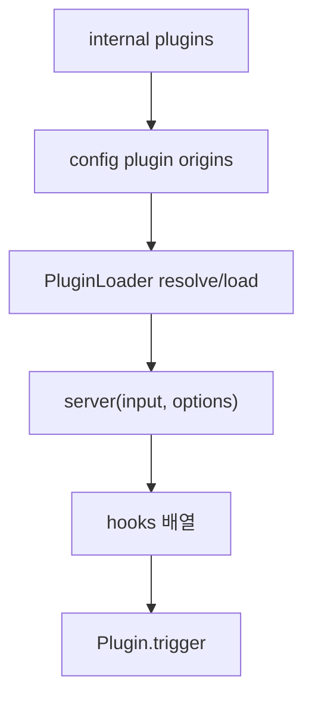

# 14장: 서버 플러그인 런타임

> **포지셔닝**: 이 장은 OpenCode의 서버 플러그인이 단순 스크립트 로딩이 아니라, 설치 해석기와 훅 실행기를 가진 런타임이라는 점을 분석한다. 대상 독자: 에이전트 시스템 안쪽에 커스텀 확장 포인트를 설계하려는 빌더.

## 왜 중요한가

많은 에이전트 프로젝트가 확장성을 말하지만 실제 구현은 두 극단으로 갈린다. 하나는 아예 확장이 없고, 다른 하나는 "아무 JS 파일이나 eval"에 가까운 느슨한 메커니즘이다. OpenCode의 서버 플러그인 계층은 그 중간쯤에서 꽤 실용적인 절충을 택한다. 내부 플러그인과 외부 플러그인을 같은 훅 모델로 맞추되, 설치, 엔트리 해석, 로드 실패, 훅 순서를 별도 런타임으로 관리한다.

이 장이 중요한 이유는 플러그인 시스템이 단지 편의 기능이 아니라 코어의 진화 전략이기 때문이다. 세션 compacting에 문맥을 주입하거나, tool 실행 전후를 가로채거나, 서버와 SDK 사이에 추가 행동을 주입하려면 이 계층이 필요하다.

## 소스 앵커

- `packages/opencode/src/plugin/index.ts`
- `packages/opencode/src/plugin/loader.ts`
- `packages/opencode/src/plugin/install.ts`
- `packages/opencode/src/plugin/shared.ts`
- `packages/web/src/content/docs/plugins.mdx`

## 로드 흐름

## 핵심 메커니즘

### 플러그인은 한 단계 더 감싼 뒤 훅으로 등록된다

`plugin/index.ts`를 보면 플러그인 로딩의 목표는 "모듈을 import하는 것"이 아니다. 최종 목표는 `Hooks[]` 배열을 만드는 것이다. `applyPlugin(...)`은 불러온 모듈을 v1 형식으로 읽거나, 레거시 함수 export를 받아 서버 플러그인으로 감싼 뒤, 실제 훅 객체를 `hooks` 배열에 누적한다.

이 구조의 장점은 명확하다. 런타임 입장에서는 로컬 파일 플러그인, npm 패키지 플러그인, 내부 빌트인 플러그인 사이의 차이를 조기에 흡수할 수 있다. 그 다음 단계부터는 모두 "어떤 훅 이름을 구현했는가"만 중요해진다.

### 내부 플러그인과 외부 플러그인이 같은 경로를 지나간다

`INTERNAL_PLUGINS` 상수는 OpenCode가 자체 기능 중 일부도 플러그인 런타임으로 태운다는 점을 보여 준다. 즉 플러그인 시스템은 외부 생태계만을 위한 장식이 아니라, 코어 팀이 내부 기능을 확장 가능한 방식으로 유지하기 위한 구조이기도 하다.

이 점은 기준서가 계속 강조한 "내부와 외부를 같은 계약으로 다뤄야 시스템이 단단해진다"는 원칙과 잘 맞는다.

### 입력 컨텍스트가 생각보다 풍부하다

플러그인 함수는 단순히 `project`만 받지 않는다. `plugin/index.ts`의 입력 조립을 보면 다음 같은 문맥이 전달된다.

- `project`
- `directory`
- `worktree`
- `client`
- `serverUrl`
- `experimental_workspace`
- Bun shell 접근

즉 플러그인은 "텍스트 후처리"가 아니라 서버 런타임의 꽤 안쪽까지 접근하는 확장 포인트다. 그래서 설치/호환성/에러 처리 계층이 필수다.

### 실행 순서는 일부러 순차적이다

파일 안의 주석은 훅 등록과 실행 순서를 deterministic하게 유지하기 위해 플러그인 로딩을 순차적으로 유지한다고 명시한다. 성능만 보면 병렬 로딩이 더 매력적일 수 있지만, 확장 시스템에서 순서 안정성은 재현성과 디버깅 비용에 직접 연결된다.

이 선택은 OpenCode가 플러그인을 "빠르면 좋은 것"보다 "예측 가능해야 하는 것"으로 본다는 증거다.

### 실패는 무시되지 않고 세션 오류로 승격된다

`publishPluginError(...)`가 따로 있는 이유는 간단하다. 플러그인 로딩 실패는 조용히 삼킬 일이 아니기 때문이다. 설치 실패, 서버 엔트리 해석 실패, 호환성 실패는 모두 사용자에게 보이는 경고로 승격된다. 이 덕분에 외부 확장 계층의 문제가 코어 버그처럼 묻히지 않는다.

## 문서와 구현의 차이

`plugins.mdx`는 로컬 파일 플러그인과 npm 플러그인의 개념 모델을 잘 설명한다. 하지만 구현을 보면 실제 시스템은 문서보다 더 엄격하다.

- v1 플러그인 형식과 레거시 fallback이 공존한다.
- pure 모드에서는 외부 플러그인이 건너뛰어진다.
- 설치, 엔트리 해석, 로딩, 훅 등록이 단계별로 분리되어 있다.
- 훅 실행 순서를 고의로 안정화한다.

즉 문서는 "플러그인을 어떻게 쓰는가"를 설명하지만, 코드는 "플러그인을 어떻게 고장 나지 않게 품는가"를 보여 준다.

## 트레이드오프

- 유연성이 크다: 파일 기반, npm 기반, 내부 플러그인을 모두 수용한다.
- 대신 로더가 두꺼워진다: manifest, target, 호환성, fallback을 모두 알아야 한다.
- 확장성이 좋다: 훅 모델로 기능 추가가 쉽다.
- 대신 순서와 실패 처리를 제대로 설계하지 않으면 디버깅이 지옥이 된다.

## 빌더에게 남는 것

- 플러그인 시스템의 진짜 핵심은 "모듈 로드"가 아니라 "훅 계약"이다.
- 내부 기능도 같은 확장 계약 위에 올리면 코어 설계가 더 정직해진다.
- 순서 안정성과 오류 가시성은 플러그인 시스템의 필수 속성이다.
- 외부 확장은 불가피하게 로더를 두껍게 만든다. 두꺼워진 로더를 부끄러워하기보다, 그 두께를 한 파일군에 모아 두는 편이 낫다.

다음 장에서는 같은 플러그인이라도 TUI 표면 쪽 확장이 왜 별도 시스템으로 분리되어 있는지 본다.

<!-- opencode-book-expansion -->
## 소스 그라운딩 확장

### 참조 강좌에서 가져올 렌즈

Claude 책의 hook 관점은 OpenCode에서 server plugin runtime으로 나타난다. plugin은 provider header, chat params, system transform, tool lifecycle, workspace adaptor에 개입할 수 있는 런타임 확장이다.

이 관점은 Claude 하니스의 구현을 그대로 복사하자는 뜻이 아니다. 같은 시스템 질문을 OpenCode 소스에 던지고, 다른 답이 나오는 지점을 분명히 하자는 뜻이다. 따라서 아래 흐름은 OpenCode의 실제 파일, 서비스, 상태 객체를 기준으로 다시 세운 읽기 지도다.

### 실제 OpenCode 흐름

### 확인해야 할 소스

- `packages/opencode/src/plugin/index.ts`
- `packages/opencode/src/plugin/loader.ts`
- `packages/opencode/src/plugin/shared.ts`
- `packages/opencode/src/plugin/install.ts`
- `packages/opencode/test/plugin/trigger.test.ts`

### 구현에서 읽어야 할 메커니즘

- Codex, Copilot, GitLab, Poe, Cloudflare auth plugin은 INTERNAL_PLUGINS로 들어와 같은 hook 경로를 탄다.
- PluginLoader는 install, entry, compatibility, load 실패를 구분한다.
- plugin input은 internal service가 아니라 opencode client, project, worktree, serverUrl, workspace adaptor registration을 제공한다.

### 실패 모드와 설계 압력

- plugin 실패 단계를 뭉개면 사용자가 설치 문제인지 entry 문제인지 알 수 없다.
- hook 순서가 비결정적이면 provider header와 tool transform이 재현되지 않는다.
- plugin에 내부 mutable state를 직접 주면 version compatibility가 깨진다.

### 빌더에게 남는 질문

- plugin lifecycle을 단계별로 관측할 수 있는가?
- hook은 input/output 변환 계약인가?
- plugin에 안정된 client와 context만 제공하는가?

이 장의 핵심은 파일 이름을 외우는 것이 아니라 경계를 읽는 것이다. 어떤 상태가 어느 계층에서 만들어지고, 어떤 계약을 통과하며, 실패했을 때 어디서 관측되는지까지 따라가야 실제 하니스 설계로 옮길 수 있다.
