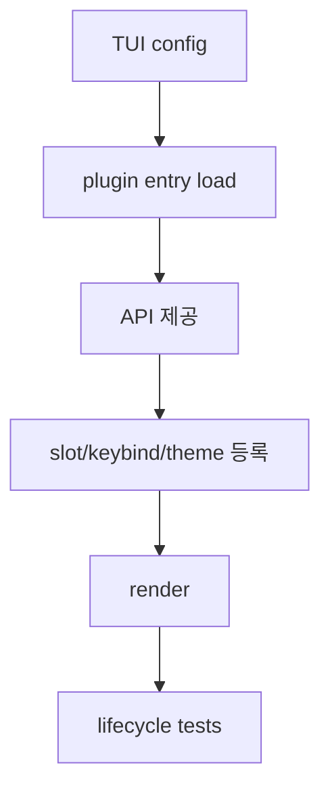

# 15장: TUI 플러그인 시스템

> **포지셔닝**: 이 장은 OpenCode의 TUI 플러그인을 서버 플러그인의 하위집합이 아니라 독립된 UI 런타임으로 해부한다. 대상 독자: 터미널 앱에 route, command, dialog, sidebar 확장을 안전하게 붙이고 싶은 빌더.

## 왜 중요한가

OpenCode는 확장을 한 메커니즘으로 밀어 넣지 않는다. 서버 플러그인과 TUI 플러그인을 나눈 이유는 단순 구현 편의가 아니다. UI 확장은 route 등록, dialog 띄우기, command palette 항목 추가, theme 설치, slot 렌더링 같은 관심사를 가진다. 반면 서버 플러그인은 tool 실행 전후, 세션 이벤트, 설정 변환, 서버 동작 가로채기 같은 문제를 다룬다.

두 층을 분리하지 않으면 확장 계약이 곧 거대한 만능 인터페이스가 된다. OpenCode는 그 유혹을 피했다.

## 소스 앵커

- `packages/opencode/specs/tui-plugins.md`
- `packages/opencode/src/cli/cmd/tui/plugin/runtime.ts`
- `packages/opencode/src/cli/cmd/tui/plugin/api.tsx`
- `packages/opencode/src/cli/cmd/tui/plugin/slots.tsx`
- `packages/opencode/src/cli/cmd/tui/feature-plugins/system/plugins.tsx`

## 구성 모델

`specs/tui-plugins.md`는 현재 TUI 플러그인 시스템의 가장 압축된 참고 문서다. 여기서 먼저 읽어야 할 사실은 다음 네 가지다.

1. 설정은 `tui.json`에 있다.
2. 모듈은 `default export { id?, tui }` 모양을 가져야 한다.
3. 하나의 모듈은 `server`와 `tui`를 동시에 export할 수 없다.
4. 활성화 상태는 config뿐 아니라 KV에도 저장되어 런타임에서 override될 수 있다.

즉 TUI 플러그인은 단순 파일 목록이 아니라, 설정 파일, 런타임 KV, 모듈 형식 제약이 합쳐진 서브시스템이다.

## 핵심 메커니즘

### target-exclusive 규칙이 시스템을 단순화한다

기준서 스타일로 말하면 이 규칙은 아주 중요하다. "하나의 모듈은 `server` 또는 `tui` 중 하나만"이라는 제약은 불편해 보이지만, 실제로는 로더와 런타임을 크게 단순화한다. 같은 패키지가 양쪽을 지원하더라도 `./server`, `./tui` 같은 별도 엔트리로 쪼개도록 강제하면, 각 런타임은 자기 계약만 생각하면 된다.

OpenCode가 이 규칙을 명시적으로 적어 둔 것은 우연이 아니다. 확장 시스템은 기능 추가보다 경계 유지가 더 어렵기 때문이다.

### TUI 런타임이 주는 API는 "작은 앱 플랫폼"에 가깝다

명세에 따르면 `tui(api, options, meta)`가 받는 상위 API 그룹은 다음과 같다.

- `api.command`
- `api.route`
- `api.ui`
- `api.theme`
- `api.kv`
- `api.event`
- `api.plugins`
- `api.slots`
- `api.lifecycle`

이 목록만 봐도 TUI 플러그인이 단순 렌더 함수가 아니라, 앱 구조 안에 안전하게 꽂히는 확장이라는 점이 분명하다. route 등록과 slot 등록이 따로 있고, dialog UI와 toast API가 따로 있으며, theme 설치까지 독립 기능으로 있다.

### theme-only 패키지도 별도 1급 시민이다

`oc-themes` 메타데이터를 가진 패키지는 `./tui` 엔트리가 없어도 테마 패키지로 로드될 수 있다. 이 설계는 사소해 보이지만 중요하다. 확장을 "항상 코드 실행"으로 보지 않고, 자산과 설정도 별도 확장 타깃으로 본다는 뜻이기 때문이다.

이 덕분에 테마 패키지는 전체 플러그인 모듈을 흉내 내지 않고도 런타임에 참여할 수 있다.

### 활성화 상태가 설정 파일과 KV에 이중 저장된다

문서에 따르면 `plugin_enabled`는 config 계층에서 합쳐지고, 런타임 enable/disable 상태는 KV에도 보관된다. 이 말은 곧 "정적 설정"과 "사용자 상호작용으로 바뀌는 상태"를 분리했다는 뜻이다. 플러그인 토글 UI를 구현하려면 이런 분리가 필요하다.

### 슬롯 시스템은 route 외의 확장 면을 만든다

route만으로는 앱의 모든 확장을 설명할 수 없다. sidebar, footer, home tips 같은 영역은 "화면 이동"이 아니라 "특정 위치에 UI를 삽입"하는 문제이기 때문이다. `plugin/slots.tsx`와 `feature-plugins/sidebar/*`를 함께 보면 OpenCode는 route 기반 확장과 slot 기반 확장을 구분한다.

이 구분이 있어야 TUI가 점점 커져도 "화면"과 "삽입 지점"이 뒤엉키지 않는다.

## 서버 플러그인과의 비교

| 비교 항목 | 서버 플러그인 | TUI 플러그인 |
| --- | --- | --- |
| 중심 계약 | hook trigger | route/command/ui/slot API |
| 주요 관심사 | tool, session, config, server behavior | 화면, command palette, dialog, theme |
| 설정 위치 | 일반 config | `tui.json` + KV |
| 실패 성격 | 로드 실패, 훅 오류 | 라우트 누락, UI 등록 실패, id 충돌 |
| 핵심 자산 | loader/install/index | runtime/api/slots/spec |

## 트레이드오프

- 장점: UI 확장 계약이 서버 훅과 섞이지 않아 명확하다.
- 단점: 플러그인 시스템이 두 개라 학습 비용이 늘어난다.
- 장점: theme-only 패키지, slot, route 같은 UI 특화 개념을 자연스럽게 담을 수 있다.
- 단점: 설정과 상태 병합이 더 복잡해진다.

## 빌더에게 남는 것

- UI 확장은 서버 확장의 작은 버전이 아니다. 별도 계약이 필요하다.
- route, slot, theme를 한 인터페이스에 억지로 넣지 말고 역할별 API 군으로 나누는 편이 좋다.
- 확장 토글 상태는 정적 config와 런타임 상태를 분리해야 관리가 쉽다.
- target-exclusive 규칙은 불편하지만, 확장 시스템의 수명을 늘린다.

다음 장에서는 코드 확장이 아니라 지식 확장에 해당하는 `skill` 계층을 본다.

<!-- opencode-book-expansion -->
## 소스 그라운딩 확장

### 참조 강좌에서 가져올 렌즈

OpenCode는 server plugin과 TUI plugin을 분리한다. Claude식 hook 시야를 가져오되 모든 확장을 한 바구니에 넣지 않는 것이 핵심이다.

이 관점은 Claude 하니스의 구현을 그대로 복사하자는 뜻이 아니다. 같은 시스템 질문을 OpenCode 소스에 던지고, 다른 답이 나오는 지점을 분명히 하자는 뜻이다. 따라서 아래 흐름은 OpenCode의 실제 파일, 서비스, 상태 객체를 기준으로 다시 세운 읽기 지도다.

### 실제 OpenCode 흐름

### 확인해야 할 소스

- `packages/opencode/src/cli/cmd/tui/plugin/runtime.ts`
- `packages/opencode/src/cli/cmd/tui/plugin/api.tsx`
- `packages/opencode/src/cli/cmd/tui/plugin/slots.tsx`
- `packages/opencode/src/cli/cmd/tui/plugin/internal.ts`
- `packages/opencode/test/cli/tui/plugin-lifecycle.test.ts`

### 구현에서 읽어야 할 메커니즘

- TUI plugin은 provider token이나 tool permission보다 화면 slot, keybind, theme를 다룬다.
- slot은 host가 허용한 UI 위치에만 plugin이 들어오게 하는 계약이다.
- pure mode와 lifecycle test는 UI 확장 문제를 core 문제와 분리하는 회로 차단기다.

### 실패 모드와 설계 압력

- server hook과 TUI hook을 합치면 화면 확장이 모델 요청까지 오염시킬 수 있다.
- slot 없이 private component를 monkey patch하면 업데이트에 취약해진다.
- plugin 비활성화 경로가 없으면 디버깅이 어렵다.

### 빌더에게 남는 질문

- UI 확장은 slot/keybind 중심인가?
- server runtime 확장과 표현 확장이 분리되어 있는가?
- pure mode가 있는가?

이 장의 핵심은 파일 이름을 외우는 것이 아니라 경계를 읽는 것이다. 어떤 상태가 어느 계층에서 만들어지고, 어떤 계약을 통과하며, 실패했을 때 어디서 관측되는지까지 따라가야 실제 하니스 설계로 옮길 수 있다.
