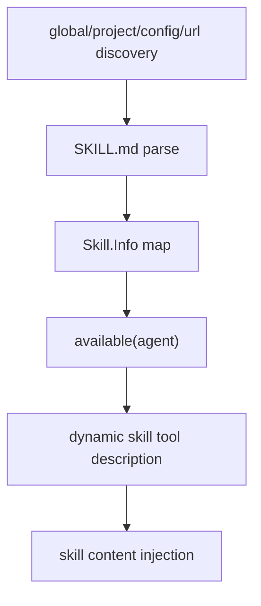

# 16장: 스킬을 지식 계층으로 다루기

> **포지셔닝**: 이 장은 OpenCode의 스킬 시스템을 기능 플러그인과 구분되는 지식 자산 레이어로 본다. 대상 독자: 모델에게 실행 코드를 더 주는 대신 읽기 규칙과 도메인 워크플로를 주입하고 싶은 빌더.

## 왜 중요한가

플러그인은 시스템 동작을 바꾼다. 스킬은 시스템이 읽는 지식을 바꾼다. 이 둘을 분리하지 않으면, 작은 사용법 문서 하나도 플러그인 배포를 거쳐야 하고, 반대로 런타임 훅 하나도 단순 Markdown 파일처럼 취급하게 된다. OpenCode는 이 둘을 명확히 갈랐다.

스킬 계층이 중요한 이유는 코딩 에이전트의 실제 품질이 종종 모델 능력보다도 "어떤 로컬 규칙과 작업법을 읽었는가"에 더 크게 좌우되기 때문이다.

## 소스 앵커

- `packages/opencode/src/skill/index.ts`
- `packages/opencode/src/tool/skill.ts`
- `packages/web/src/content/docs/skills.mdx`
- `.claude/**/SKILL.md`
- `.agents/**/SKILL.md`

## 핵심 메커니즘

### 스킬은 파일 스캔으로 수집된다

`skill/index.ts`의 상수만 봐도 의도가 분명하다.

- `EXTERNAL_DIRS = [".claude", ".agents"]`
- `EXTERNAL_SKILL_PATTERN = "skills/**/SKILL.md"`
- `OPENCODE_SKILL_PATTERN = "{skill,skills}/**/SKILL.md"`

즉 OpenCode는 스킬을 레지스트리 데이터베이스에서 가져오는 것이 아니라, 작업 디렉터리와 외부 경로를 스캔해 조립한다. 이 방식은 거칠지만 강력하다. 로컬 저장소에 있는 규칙을 바로 지식 자산으로 끌어올릴 수 있기 때문이다.

### 이름과 본문을 느슨하게 두지 않는다

`InvalidError`, `NameMismatchError`, duplicate skill warning이 따로 있는 이유는 명확하다. 스킬은 그냥 Markdown 파일이 아니라, 최소한의 메타데이터와 정합성을 갖춘 런타임 자산이기 때문이다. 이름 중복이나 스펙 파싱 실패를 묵인하면 모델이 어떤 스킬을 읽었다고 가정하는지 불명확해진다.

### config에서 로컬 경로와 URL을 함께 받을 수 있다

`cfg.skills?.paths`, `cfg.skills?.urls`를 보면 스킬 시스템은 로컬 디렉터리뿐 아니라 원격 출처까지 수용한다. 하지만 최종적으로는 모두 같은 `State.skills` 맵에 모인다. 이 말은 곧 스킬의 정체성이 출처가 아니라 `name`이라는 뜻이다.

### 에이전트 권한이 스킬 가시성까지 통제한다

`list(agent)` 경로를 보면 스킬은 agent permission을 통과해 필터링된다. `Permission.evaluate("skill", skill.name, agent.permission)`가 `deny`면 그 스킬은 현재 agent에게 보이지 않는다. 이것은 스킬이 단지 읽기 자산이 아니라, 권한 모델 안에 들어 있는 capability라는 뜻이다.

즉 OpenCode는 "지식 읽기"조차 런타임 권한 바깥에 두지 않는다.

### 출력 포맷도 기계 친화적으로 설계됐다

`fmt(...)` 함수는 verbose일 때 XML 비슷한 구조를, 일반 모드에서는 bullet 목록을 출력한다. 이 선택은 사소해 보여도 중요하다. 스킬 목록도 결국 모델이 읽는 텍스트이기 때문에, 사람이 보기에 예쁜 형식보다 모델이 안정적으로 파싱하기 쉬운 형식을 우선한 흔적이다.

## 플러그인과의 차이

| 항목 | 스킬 | 플러그인 |
| --- | --- | --- |
| 핵심 자산 | `SKILL.md` | JS/TS 모듈 |
| 목적 | 지식/워크플로 주입 | 런타임 동작 확장 |
| 로딩 방식 | 파일 스캔, config path/url | 로더, install, module import |
| 권한 모델 | `skill` permission으로 통제 | plugin config/loader 수준 관리 |
| 실패 성격 | 파싱 실패, 이름 충돌 | 설치/엔트리/훅 실패 |

## 트레이드오프

- 장점: 저장소 규칙을 아주 빠르게 지식 계층으로 올릴 수 있다.
- 단점: 파일 기반 규약이 느슨해지면 중복과 품질 저하가 쉽게 생긴다.
- 장점: 권한 모델과 연결되어 있어 안전하다.
- 단점: 지식 자산도 capability처럼 다뤄야 하므로 관리 지점이 늘어난다.

## 빌더에게 남는 것

- 지식 확장과 코드 확장을 같은 시스템에 억지로 넣지 않는 편이 낫다.
- 스킬은 "문서"가 아니라 런타임이 읽는 자산이므로 이름, 파싱, 권한이 필요하다.
- 팀별 작업 규칙을 코드에 하드코딩하지 말고, 별도 지식 레이어로 유지하면 훨씬 유연하다.

다음 장에서는 외부 도구 생태계를 끌어오는 또 다른 채널, 즉 MCP 서버 통합을 본다.

<!-- opencode-book-expansion -->
## 소스 그라운딩 확장

### 참조 강좌에서 가져올 렌즈

Claude Skills 관점은 OpenCode에도 잘 맞는다. Skill은 실행 도구라기보다 필요할 때 로드되는 지식 패키지이며, OpenCode는 이를 skill tool과 discovery service로 다룬다.

이 관점은 Claude 하니스의 구현을 그대로 복사하자는 뜻이 아니다. 같은 시스템 질문을 OpenCode 소스에 던지고, 다른 답이 나오는 지점을 분명히 하자는 뜻이다. 따라서 아래 흐름은 OpenCode의 실제 파일, 서비스, 상태 객체를 기준으로 다시 세운 읽기 지도다.

### 실제 OpenCode 흐름

### 확인해야 할 소스

- `packages/opencode/src/skill/index.ts`
- `packages/opencode/src/skill/discovery.ts`
- `packages/opencode/src/tool/skill.ts`
- `packages/opencode/src/tool/skill.txt`
- `packages/opencode/src/config/skills.ts`

### 구현에서 읽어야 할 메커니즘

- 홈의 .claude/.agents, 프로젝트 상위 디렉터리, config directories, paths, urls가 모두 discovery 입력이다.
- SKILL.md frontmatter의 name과 description이 최소 계약이다.
- Permission.evaluate('skill', name, agent.permission)이 현재 agent에게 보일 skill을 결정한다.

### 실패 모드와 설계 압력

- 모든 skill을 항상 system prompt에 넣으면 context 예산이 낭비된다.
- skill을 permission 밖에 두면 특정 agent에 금지해야 할 지식이 노출된다.
- 경로 기반 식별자는 skill 이동과 공유를 어렵게 한다.

### 빌더에게 남는 질문

- Skill을 lazy-loaded knowledge로 설계했는가?
- name/description 최소 계약이 있는가?
- agent permission으로 skill availability를 필터링하는가?

이 장의 핵심은 파일 이름을 외우는 것이 아니라 경계를 읽는 것이다. 어떤 상태가 어느 계층에서 만들어지고, 어떤 계약을 통과하며, 실패했을 때 어디서 관측되는지까지 따라가야 실제 하니스 설계로 옮길 수 있다.
