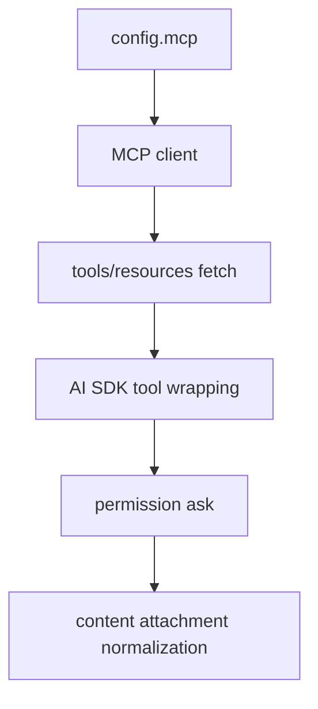

# 17장: MCP 서버 통합과 인증 흐름

> **포지셔닝**: 이 장은 OpenCode가 Model Context Protocol 서버를 로컬/원격/OAuth 시나리오까지 포함해 하나의 서비스로 통합하는 방식을 분석한다. 대상 독자: 외부 도구 생태계를 에이전트 런타임 안으로 안전하게 끌어오고 싶은 빌더.

## 왜 중요한가

MCP는 단지 "외부 툴을 더 붙인다"는 말로 끝나지 않는다. 실제 구현에서는 transport 선택, 서버 상태 추적, tool 목록 변화 감지, prompt/resource 동시 노출, OAuth 인증, timeout 관리까지 한꺼번에 들어온다. OpenCode의 `mcp/index.ts`가 큰 이유는 기능 욕심 때문이 아니라, 그 복잡도를 한 서비스로 가두고 있기 때문이다.

## 소스 앵커

- `packages/opencode/src/mcp/index.ts`
- `packages/opencode/src/mcp/oauth-provider.ts`
- `packages/opencode/src/mcp/oauth-callback.ts`
- `packages/opencode/src/server/routes/instance/mcp.ts`
- `packages/web/src/content/docs/mcp-servers.mdx`

## 연결 상태 모델

`Status` 타입은 MCP가 단순 boolean 연결 상태가 아니라 여러 준비 단계를 가진 서비스임을 보여 준다.

- `connected`
- `needs_auth`
- `needs_client_registration`
- `failed`

이 상태 구분이 필요한 이유는 원격 MCP가 항상 즉시 usable하지 않기 때문이다. 어떤 서버는 401을 돌려주고, 어떤 서버는 동적 클라이언트 등록을 지원하지 않으며, 어떤 서버는 도구 목록만 가져오다 timeout이 날 수 있다.

## 핵심 메커니즘

### local과 remote가 같은 서비스에서 합류한다

`mcp/index.ts`는 `StdioClientTransport`, `SSEClientTransport`, `StreamableHTTPClientTransport`를 모두 import한다. 즉 로컬 프로세스 기반 MCP와 원격 HTTP/SSE 기반 MCP가 같은 서비스 안에서 수렴한다.

이때 핵심은 transport가 아니라 결과다. 최종적으로는 모두 `MCPClient`와 `defs` 목록을 만들어 OpenCode tool surface로 변환해야 한다.

### MCP 도구는 내부 도구 표면으로 다시 감싸진다

`convertMcpTool(...)`을 보면 MCP 도구는 그대로 노출되지 않는다. OpenCode의 `Tool` 형식으로 다시 포장돼 입력 스키마, 설명, timeout, 실행 호출을 가진 내부 도구처럼 동작한다. 이 덕분에 상위 계층은 built-in tool과 MCP tool을 거의 같은 방식으로 다룰 수 있다.

즉 MCP는 외부 도구를 "직결"하는 것이 아니라, 내부 capability 표면으로 재번역하는 작업이다.

### resources와 prompts도 같은 이름공간에 들어온다

서비스 인터페이스를 보면 `tools`뿐 아니라 `prompts()`, `resources()`가 있다. 또한 `fetchFromClient(...)`는 이름을 sanitize하고 `client:name` 형태로 네임스페이스를 붙인다. 이 설계는 여러 MCP 서버가 동시에 연결될 때 이름 충돌과 출처 모호성을 막는다.

### OAuth는 부가 기능이 아니라 중심 경로다

문서에서는 자동 OAuth를 비교적 간단히 설명하지만, 구현은 꽤 공들여져 있다. 원격 연결 실패 시 `UnauthorizedError`를 감지하고, `needs_auth` 혹은 `needs_client_registration` 상태로 명시적으로 전환한다. 또한 `startAuth`, `authenticate`, `finishAuth`, `removeAuth`, `supportsOAuth` 같은 메서드가 인터페이스에 직접 들어 있다.

이 말은 곧 OAuth가 helper 함수가 아니라 MCP 서비스의 정식 책임이라는 뜻이다.

### 도구 목록 변경도 이벤트로 처리된다

`watch(...)` 함수는 `ToolListChangedNotificationSchema`를 구독해 서버 도구 목록이 바뀌면 `defs`를 다시 불러오고 `mcp.tools.changed` 이벤트를 발행한다. 여기서 중요한 점은 MCP 연결이 정적 부트스트랩이 아니라, 런타임 중에도 바뀔 수 있는 살아 있는 연결이라는 사실이다.

## 문서와 구현의 차이

`mcp-servers.mdx`는 설정 문법과 OAuth의 큰 흐름을 설명하는 데 충분하다. 하지만 코드까지 내려오면 다음 사실이 더 중요해진다.

- remote/local transport마다 실패 양상이 다르다.
- 401은 단순 실패가 아니라 auth flow 진입 신호다.
- 연결이 끝나도 tool list refresh가 계속 필요하다.
- tool뿐 아니라 prompt, resource도 함께 관리해야 한다.

즉 MCP 통합의 어려움은 "서버를 하나 더 붙인다"가 아니라 "살아 있는 외부 capability 집합을 내 런타임 규칙 안으로 번역한다"에 있다.

## 트레이드오프

- 장점: 외부 생태계를 빠르게 capability surface로 끌어들일 수 있다.
- 단점: context 비용, auth 비용, 상태 관리 비용이 커진다.
- 장점: local/remote를 같은 서비스로 묶어 UX를 단순화한다.
- 단점: 서비스 자체는 두꺼워진다.

## 빌더에게 남는 것

- 외부 툴 통합의 핵심은 transport보다 내부 표면으로의 재번역이다.
- 인증 상태를 숨기지 말고 명시적 상태 모델로 드러내는 편이 좋다.
- 도구 목록이 바뀌는 외부 시스템은 이벤트 기반 refresh 없이는 오래 못 버틴다.
- MCP는 capability 확장 채널이지, 무제한으로 붙여도 되는 공짜 기능이 아니다.

다음 장에서는 외부 서버가 아니라 워크스페이스 전체를 원격/동기화 가능한 대상으로 끌어올리는 control plane을 본다.

<!-- opencode-book-expansion -->
## 소스 그라운딩 확장

### 참조 강좌에서 가져올 렌즈

MCP는 외부 도구 서버지만 OpenCode 하니스 밖에 있지 않다. Claude 책의 외부 도구 관점은 여기서 permission, truncation, attachment 정규화로 다시 표현된다.

이 관점은 Claude 하니스의 구현을 그대로 복사하자는 뜻이 아니다. 같은 시스템 질문을 OpenCode 소스에 던지고, 다른 답이 나오는 지점을 분명히 하자는 뜻이다. 따라서 아래 흐름은 OpenCode의 실제 파일, 서비스, 상태 객체를 기준으로 다시 세운 읽기 지도다.

### 실제 OpenCode 흐름

### 확인해야 할 소스

- `packages/opencode/src/mcp/index.ts`
- `packages/opencode/src/mcp/auth.ts`
- `packages/opencode/src/mcp/oauth-provider.ts`
- `packages/opencode/src/mcp/oauth-callback.ts`
- `packages/opencode/src/config/mcp.ts`

### 구현에서 읽어야 할 메커니즘

- MCP tool execute도 SessionPrompt.resolveTools에서 ctx.ask를 거친다.
- MCP text, image, resource blob은 MessageV2 text와 file attachment로 정규화된다.
- OAuth provider/callback은 redirect uri, local callback server, token persistence를 별도 lifecycle로 다룬다.

### 실패 모드와 설계 압력

- MCP tool을 raw execute로 붙이면 built-in tool과 permission 의미가 달라진다.
- OAuth callback을 정리하지 않으면 pending auth가 남는다.
- 도구 목록 변경 이벤트가 없으면 모델이 사용할 수 없는 tool을 보게 된다.

### 빌더에게 남는 질문

- 외부 도구도 내부 tool contract로 정규화되는가?
- MCP auth를 tool call이 아니라 connection lifecycle로 다루는가?
- tool list 변화가 UI와 모델 표면에 반영되는가?

이 장의 핵심은 파일 이름을 외우는 것이 아니라 경계를 읽는 것이다. 어떤 상태가 어느 계층에서 만들어지고, 어떤 계약을 통과하며, 실패했을 때 어디서 관측되는지까지 따라가야 실제 하니스 설계로 옮길 수 있다.
