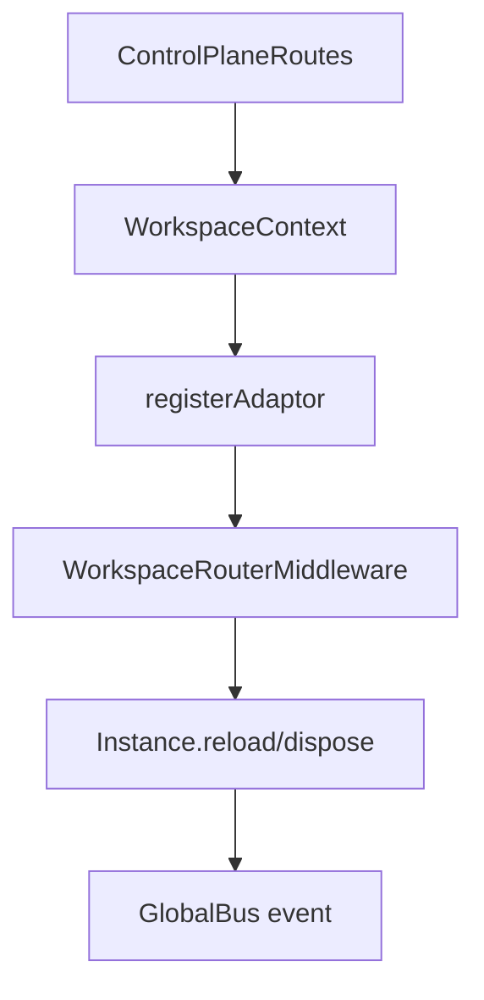

# 18장: 워크스페이스 어댑터와 컨트롤 플레인

> **포지셔닝**: 이 장은 OpenCode가 로컬 작업 디렉터리를 넘어, 연결 가능한 워크스페이스와 동기화 루프를 가진 control plane을 어떻게 구성하는지 분석한다. 대상 독자: 세션을 특정 로컬 프로세스가 아니라 이동 가능한 작업 공간에 붙이고 싶은 빌더.

## 왜 중요한가

기본적인 코딩 에이전트는 "현재 디렉터리 하나"만 알면 된다. 하지만 제품이 커지면 세션을 다른 워크스페이스에 복원하거나, 원격 공간과 동기화하거나, 연결 상태를 UI에 보여 줘야 한다. 그 순간 작업 디렉터리는 더 이상 충분한 개념이 아니다. OpenCode의 `control-plane/workspace.ts`는 바로 그 지점을 담당한다.

## 소스 앵커

- `packages/opencode/src/control-plane/workspace.ts`
- `packages/opencode/src/control-plane/workspace-context.ts`
- `packages/opencode/src/control-plane/workspace.sql.ts`
- `packages/opencode/src/server/routes/control/workspace.ts`
- `packages/opencode/src/control-plane/adaptors/worktree.ts`

## 상태 모델

`ConnectionStatus`는 워크스페이스 연결을 네 가지 상태로 모델링한다.

- `connecting`
- `connected`
- `disconnected`
- `error`

여기에 더해 이벤트도 별도로 정의되어 있다.

- `workspace.ready`
- `workspace.failed`
- `workspace.restore`
- `workspace.status`

즉 워크스페이스는 단순 DB row가 아니라, 연결 상태와 이벤트를 가진 장수하는 운영 객체다.

## 핵심 메커니즘

### create와 sessionRestore가 서로 다른 책임을 가진다

`create(...)`는 워크스페이스 엔트리를 만들고 연결을 준비하는 책임을 가진다. 반면 `sessionRestore(...)`는 이미 있는 세션을 특정 워크스페이스로 재생성하는 경로다. 이 둘을 분리한 이유는 명확하다. 워크스페이스의 생애주기와 세션의 생애주기는 같지 않기 때문이다.

### SSE 기반 sync loop가 핵심이다

`syncWorkspaceLoop(...)`를 보면 워크스페이스 동기화는 정적 pull이 아니라 SSE 연결을 중심으로 돌아간다. 연결이 성공하면 `connected`, 실패하면 `disconnected` 혹은 `error`, 그리고 재연결은 backoff를 두고 계속 시도된다.

즉 control plane은 CRUD API만으로는 설명되지 않는다. 연결 유지와 재접속이 시스템 절반이다.

### 세션 복원은 실제로 재생(replay)이다

`sessionRestore(...)` 주변 로직을 보면 복원은 "sessionID만 바꿔 끼운다"가 아니다. 새 워크스페이스에 세션을 replay해야 하고, 실패하면 HTTP 상태와 body까지 포함해 오류를 남긴다. 이건 세션을 DB row 집합이 아니라 실행 가능한 히스토리로 보기 때문에 가능한 설계다.

### sync 상태를 기다리는 API가 따로 있다

`isSyncing(...)`, `waitForSync(...)`, 내부 `aborts` 맵 같은 요소는 워크스페이스 sync가 fire-and-forget가 아님을 보여 준다. 상위 UI나 제어면이 "아직 동기화 중인지"를 알고 기다릴 수 있어야 하기 때문이다.

## 로컬 worktree와의 관계

`worktree` 계층과 `workspace` 계층은 이름이 비슷하지만 책임이 다르다.

| 계층 | 중심 문제 |
| --- | --- |
| `worktree/index.ts` | 로컬 git worktree 생성, 삭제, 리셋 |
| `control-plane/workspace.ts` | 연결 상태, 복원, 원격 sync, 운영 상태 |

즉 worktree가 로컬 파일 시스템과 git의 문제라면, workspace는 제품 차원의 세션 이동성과 동기화 문제다.

## 트레이드오프

- 장점: 세션을 더 유연한 작업 공간 개념에 붙일 수 있다.
- 단점: 연결 상태와 sync 실패를 다루는 운영 코드가 많이 늘어난다.
- 장점: 원격/분산 작업 흐름으로 확장하기 쉽다.
- 단점: 단순 로컬 도구보다 디버깅 표면이 넓어진다.

## 빌더에게 남는 것

- 디렉터리와 워크스페이스를 같은 개념으로 오래 끌고 가면 언젠가 막힌다.
- 복원은 데이터 복사보다 실행 히스토리 replay에 가깝다.
- 연결형 control plane에는 CRUD 외에 상태 이벤트와 대기 API가 반드시 필요하다.

다음 부에서는 OpenCode의 안전성과 상태 관리, 즉 permission, 지속성, 이벤트, 공유 시스템을 본다.

<!-- opencode-book-expansion -->
## 소스 그라운딩 확장

### 참조 강좌에서 가져올 렌즈

Claude 책의 remote/control plane 시야는 OpenCode에서 workspace adaptor와 router로 읽힌다. 여러 workspace를 하나의 server가 다루려면 route handler만으로는 부족하다.

이 관점은 Claude 하니스의 구현을 그대로 복사하자는 뜻이 아니다. 같은 시스템 질문을 OpenCode 소스에 던지고, 다른 답이 나오는 지점을 분명히 하자는 뜻이다. 따라서 아래 흐름은 OpenCode의 실제 파일, 서비스, 상태 객체를 기준으로 다시 세운 읽기 지도다.

### 실제 OpenCode 흐름

### 확인해야 할 소스

- `packages/opencode/src/control-plane/workspace.ts`
- `packages/opencode/src/control-plane/workspace-context.ts`
- `packages/opencode/src/control-plane/adaptors.ts`
- `packages/opencode/src/server/routes/control/workspace.ts`
- `packages/opencode/src/server/workspace.ts`

### 구현에서 읽어야 할 메커니즘

- control plane은 특정 세션 실행보다 workspace 선택과 lifecycle을 다룬다.
- WorkspaceContext는 비동기 경계를 넘어 현재 workspace id를 보존한다.
- plugin은 experimental_workspace.register로 외부 workspace backend를 adaptor 계약에 붙일 수 있다.

### 실패 모드와 설계 압력

- workspace 선택을 UI state로만 두면 server route가 어느 project를 조작하는지 불명확해진다.
- adaptor 없이 plugin이 workspace를 직접 만들면 lifecycle과 auth를 통제하기 어렵다.
- instance reload/dispose event가 없으면 클라이언트가 stale workspace를 잡는다.

### 빌더에게 남는 질문

- 작업 실행면과 workspace control plane을 분리했는가?
- workspace id가 async context로 보존되는가?
- 외부 workspace backend가 adaptor contract로 들어오는가?

이 장의 핵심은 파일 이름을 외우는 것이 아니라 경계를 읽는 것이다. 어떤 상태가 어느 계층에서 만들어지고, 어떤 계약을 통과하며, 실패했을 때 어디서 관측되는지까지 따라가야 실제 하니스 설계로 옮길 수 있다.
