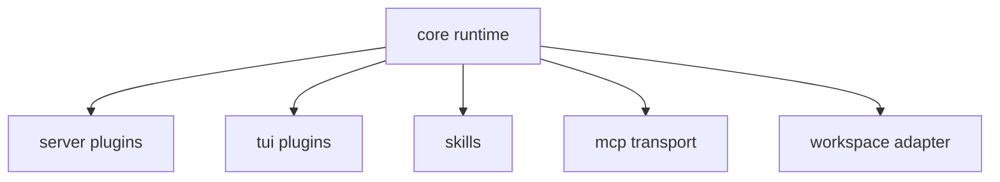

# 제4부: 확장을 어떻게 계약으로 나누는가

확장이 하나의 만능 인터페이스로 모이면 처음에는 단순해 보인다. 하지만 시간이 갈수록 계약이 흐려지고, 권한과 생명주기와 UI 책임이 한곳에 섞인다. 제4부는 OpenCode가 이 문제를 어떻게 피하려 했는지 읽는다. 서버 플러그인, TUI 플러그인, 스킬, MCP, 워크스페이스 어댑터는 모두 "확장"이지만, 같은 계약으로 다루지 않는다.

이 파트의 질문은 "확장을 왜 여러 채널로 갈라야 하는가"다. 답은 각 확장이 건드리는 계층이 다르기 때문이다. 런타임 훅과 UI 확장은 다르고, 지식 자산과 외부 capability 연결도 다르다. 저장소/디렉터리 경계 위에 앉는 workspace adapter는 더더욱 별도다.

이 파트를 읽을 때는 아래 세 점이 핵심이다.

- 확장 포인트마다 무엇이 입력이고 무엇이 출력인가
- 권한, 생명주기, 로딩 방식은 어디서 통제되는가
- 어떤 확장이 코어를 오염시키지 않도록 어떤 중간 계층을 두는가

14장은 서버 플러그인이 런타임 훅으로서 어떤 확장 책임을 지는지 본다. 15장은 TUI 플러그인이 같은 "플러그인"이라는 이름 아래서도 전혀 다른 UI 계약을 가진다는 점을 보여 준다. 16장은 스킬을 실행 코드가 아니라 지식 계층으로 읽는다. 17장은 MCP가 외부 capability를 들여오는 프로토콜 채널임을 설명한다. 18장은 workspace adapter가 다중 프로젝트와 제어면을 잇는 경계층이라는 점을 정리한다.

이 파트를 다 읽고 나면 독자는 확장성을 "플러그인 지원 여부"로 판단하지 않게 된다. 대신 어떤 종류의 확장을 어떤 계약과 생명주기로 분리했는지를 보게 된다.

<!-- opencode-book-expansion -->
## 확장된 읽기 관점

이 부는 확장을 하나의 plugin이라는 말로 뭉개지 않는다. server plugin, TUI plugin, skill, MCP, workspace adaptor는 서로 다른 신뢰 경계와 lifecycle을 가진다.

### 핵심 소스

- `packages/opencode/src/plugin`
- `packages/opencode/src/skill`
- `packages/opencode/src/mcp`
- `packages/opencode/src/control-plane`
