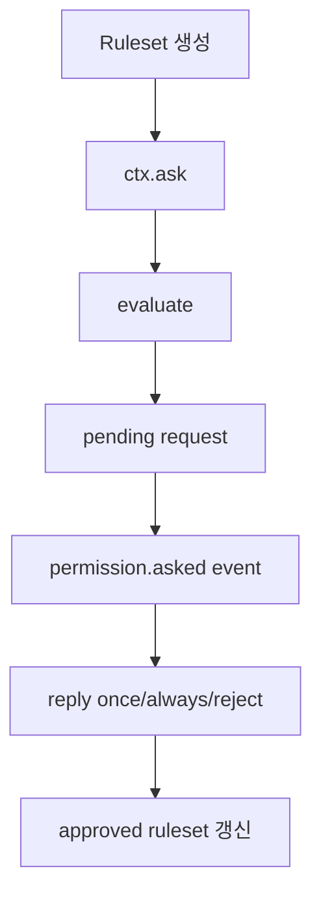

# 19장: 권한 시스템 아키텍처

> **포지셔닝**: 이 장은 OpenCode의 permission 계층을 단순 allow/deny 판정기가 아니라, 세션 중 ask queue와 승인 규칙 누적을 가진 상태 서비스로 해부한다. 대상 독자: 대화형 코딩 에이전트의 권한 모델을 직접 설계하려는 빌더.

## 왜 중요한가

에이전트 시스템에서 권한은 보안 기능이면서 동시에 UX 기능이다. 너무 느슨하면 위험하고, 너무 빡빡하면 모델이 매 동작마다 멈춘다. OpenCode는 이 문제를 `allow`, `ask`, `deny`의 세 상태와 `once`, `always`, `reject`의 응답 모델로 푼다. 핵심은 `ask`를 일급 상태로 두었다는 점이다.

## 소스 앵커

- `packages/opencode/src/permission/index.ts`
- `packages/opencode/src/permission/evaluate.ts`
- `packages/opencode/src/permission/schema.ts`
- `packages/opencode/src/agent/agent.ts`
- `packages/web/src/content/docs/permissions.mdx`

## 핵심 코드

권한 판정의 핵심은 의외로 작다. 마지막으로 매칭되는 규칙이 이기고, 아무 규칙도 없으면 기본은 `ask`다.

```ts
// packages/opencode/src/permission/evaluate.ts
export function evaluate(permission: string, pattern: string, ...rulesets: Rule[][]): Rule {
  const rules = rulesets.flat()
  const match = rules.findLast(
    (rule) => Wildcard.match(permission, rule.permission) && Wildcard.match(pattern, rule.pattern),
  )
  return match ?? { action: "ask", permission, pattern: "*" }
}
```

`ask(...)`는 단순 boolean 함수가 아니다. pending map에 요청을 넣고, bus event를 발행한 뒤, 사용자의 reply가 Deferred를 풀 때까지 기다린다.

```ts
// packages/opencode/src/permission/index.ts
const ask = Effect.fn("Permission.ask")(function* (input: AskInput) {
  const { approved, pending } = yield* InstanceState.get(state)
  const { ruleset, ...request } = input
  let needsAsk = false

  for (const pattern of request.patterns) {
    const rule = evaluate(request.permission, pattern, ruleset, approved)
    log.info("evaluated", { permission: request.permission, pattern, action: rule })
    if (rule.action === "deny") {
      return yield* new DeniedError({
        ruleset: ruleset.filter((rule) => Wildcard.match(request.permission, rule.permission)),
      })
    }
    if (rule.action === "allow") continue
    needsAsk = true
  }

  if (!needsAsk) return

  const id = request.id ?? PermissionID.ascending()
  const info = Schema.decodeUnknownSync(Request)({
    id,
    ...request,
  })
  log.info("asking", { id, permission: info.permission, patterns: info.patterns })

  const deferred = yield* Deferred.make<void, RejectedError | CorrectedError>()
  pending.set(id, { info, deferred })
  yield* bus.publish(Event.Asked, info)
  return yield* Effect.ensuring(
    Deferred.await(deferred),
    Effect.sync(() => {
      pending.delete(id)
    }),
  )
})
```

`always` 응답은 현재 요청만 통과시키지 않는다. 승인 패턴을 세션 상태에 누적하고, 같은 세션에서 이미 pending 중인 요청도 다시 평가한다.

```ts
// packages/opencode/src/permission/index.ts
yield* Deferred.succeed(existing.deferred, undefined)
if (input.reply === "once") return

for (const pattern of existing.info.always) {
  approved.push({
    permission: existing.info.permission,
    pattern,
    action: "allow",
  })
}

for (const [id, item] of pending.entries()) {
  if (item.info.sessionID !== existing.info.sessionID) continue
  const ok = item.info.patterns.every(
    (pattern) => evaluate(item.info.permission, pattern, approved).action === "allow",
  )
  if (!ok) continue
  pending.delete(id)
  yield* bus.publish(Event.Replied, {
    sessionID: item.info.sessionID,
    requestID: item.info.id,
    reply: "always",
  })
  yield* Deferred.succeed(item.deferred, undefined)
}
```

## 상태와 타입

`permission/index.ts`는 이 계층이 생각보다 풍부한 타입을 가진다는 점을 바로 보여 준다.

- `Action`: `allow | deny | ask`
- `Rule`: `permission`, `pattern`, `action`
- `Request`: 실제 승인 요청 객체
- `Reply`: `once | always | reject`
- `Approval`: 승인 이력 표현

여기서 중요한 것은 규칙과 요청이 분리되어 있다는 점이다. 정적 설정 규칙만으로는 대화형 승인 흐름을 설명할 수 없기 때문이다.

## 핵심 메커니즘

### evaluate는 작지만 시스템의 중심이다

`evaluate(permission, pattern, ...rulesets)`는 구현만 보면 매우 짧다. `Wildcard.match`를 사용해 마지막 매칭 규칙을 고르고, 없으면 `{ action: "ask" }`를 기본으로 돌려준다. 그러나 이 짧은 함수가 중요한 이유는 모든 규칙 해석이 결국 이 한 점으로 수렴하기 때문이다.

즉 권한 시스템의 대부분은 사실 "어떤 ruleset을 어떤 순서로 evaluate에 넘길 것인가"의 문제다.

### ask는 단순 팝업이 아니라 비동기 상태 머신이다

`Permission.ask()` 흐름을 보면 pending 요청을 `Map`에 넣고, `Deferred` 스타일로 응답을 기다리며, 동시에 `permission.asked` 이벤트를 bus에 발행한다. 사용자의 응답은 `reply(...)`를 통해 다시 들어오고, `always`면 승인 규칙이 누적된다.

이 구조 덕분에 권한 시스템은 UI와 분리되어 있으면서도, UI가 반드시 참여하는 대화형 경로를 가진다.

### `always`는 세션 중 규칙 누적이다

`always` 응답이 중요한 이유는 사용자가 "이번만 허용"과 "이 패턴은 앞으로도 허용"을 구분할 수 있기 때문이다. 코드에서는 기존 요청의 `always` 패턴들을 다시 평가해 approved 규칙 집합에 합친다. 이 말은 곧 권한 시스템이 정적 config만 보는 것이 아니라, 현재 세션이 학습한 임시 규칙도 본다는 뜻이다.

### config 해석도 의도적으로 정렬된다

`fromConfig(...)`는 top-level permission key를 정렬해 wildcard 규칙과 구체 규칙의 의미가 직관적으로 유지되도록 한다. 주석이 직접 설명하듯, 이 정렬은 "specific tool rules override `*` fallback"이라는 사용자 기대를 깨지 않기 위한 것이다.

즉 설정 파서는 단순 변환기가 아니라 UX 보호층이다.

### agent는 권한 껍질을 통해 서로 달라진다

`agent/agent.ts`를 보면 `build`, `plan`, `general`, `explore`의 차이는 프롬프트 문구만이 아니다. `Permission.merge(...)`로 어떤 규칙이 합쳐지는지가 실제 operating envelope를 만든다. `plan`이 읽기/분석용 agent처럼 보이는 이유도 결국 permission이 그 역할을 강제하기 때문이다.

## 문서와 구현의 차이

문서 `permissions.mdx`는 설정 문법, wildcard, external_directory, defaults를 잘 설명한다. 하지만 구현까지 내려오면 더 중요한 사실이 드러난다.

- `ask`는 일급 상태다.
- 승인 응답은 `once/always/reject`의 세 갈래다.
- 세션 중 승인된 규칙이 누적된다.
- bus 이벤트를 통해 UI와 운영 계층이 분리된다.

즉 문서가 "무엇을 설정할 수 있는가"를 설명한다면, 구현은 "어떻게 대화형 권한 UX가 유지되는가"를 보여 준다.

## 트레이드오프

- 장점: 보안과 UX를 둘 다 잡기 쉽다.
- 단점: 상태가 있는 만큼 구현이 단순 규칙 엔진보다 훨씬 복잡하다.
- 장점: `always` 덕분에 반복 작업 흐름이 부드럽다.
- 단점: 세션 상태와 정적 설정을 함께 추적해야 한다.

## 빌더에게 남는 것

- 코딩 에이전트의 권한 모델은 `allow/deny` 이분법만으로는 부족하다.
- `ask`를 일급 상태로 두면 UX와 안전성을 함께 설계할 수 있다.
- 설정 파서도 사용자 기대를 지키는 UX 계층으로 봐야 한다.
- agent 역할 차이는 프롬프트보다 permission envelope에서 더 선명하게 드러난다.

다음 장에서는 이 권한 모델이 세분화 규칙, 외부 디렉터리, 반복 호출 브레이크 같은 안전 브레이크와 어떻게 결합되는지 본다.

<!-- opencode-book-expansion -->
## 소스 그라운딩 확장

### 참조 강좌에서 가져올 렌즈

Claude 권한 시스템 관점은 OpenCode에서 pending request와 Deferred를 가진 상태 머신으로 구현된다. 핵심은 deny/allow 표가 아니라 tool 실행 중 사용자 결정을 기다리는 방식이다.

이 관점은 Claude 하니스의 구현을 그대로 복사하자는 뜻이 아니다. 같은 시스템 질문을 OpenCode 소스에 던지고, 다른 답이 나오는 지점을 분명히 하자는 뜻이다. 따라서 아래 흐름은 OpenCode의 실제 파일, 서비스, 상태 객체를 기준으로 다시 세운 읽기 지도다.

### 실제 OpenCode 흐름



### 확인해야 할 소스

- `packages/opencode/src/permission/index.ts`
- `packages/opencode/src/permission/evaluate.ts`
- `packages/opencode/src/permission/arity.ts`
- `packages/opencode/src/config/permission.ts`
- `packages/opencode/src/server/routes/instance/permission.ts`

### 구현에서 읽어야 할 메커니즘

- evaluate는 wildcard match와 findLast로 specific rule override 의미를 만든다.
- ask는 pending map에 request/deferred를 넣고 permission.asked event를 발행한다.
- always reply는 approved ruleset에 pattern을 추가하고 같은 세션의 다른 pending request도 해소할 수 있다.

### 실패 모드와 설계 압력

- match 순서가 불명확하면 wildcard와 specific rule 우선순위가 예측 불가능하다.
- pending request를 이벤트로 내보내지 않으면 UI가 사용자 결정을 받을 수 없다.
- always 승인 범위를 너무 넓히면 한 번의 클릭이 세션 전체 안전성을 바꾼다.

### 빌더에게 남는 질문

- 권한 판정 함수가 작고 테스트 가능한가?
- ask가 비동기 UI 결정을 기다릴 수 있는가?
- once/always/reject 의미가 명확한가?

이 장의 핵심은 파일 이름을 외우는 것이 아니라 경계를 읽는 것이다. 어떤 상태가 어느 계층에서 만들어지고, 어떤 계약을 통과하며, 실패했을 때 어디서 관측되는지까지 따라가야 실제 하니스 설계로 옮길 수 있다.
