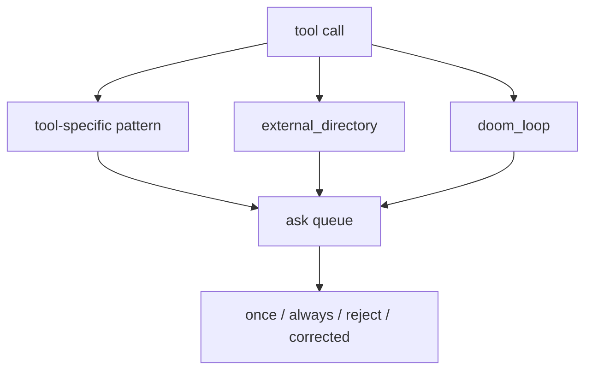
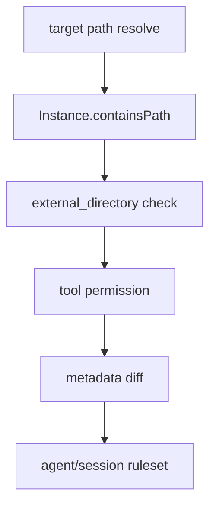

# 20장: 세분화 규칙, 외부 디렉터리, 브레이크

> **포지셔닝**: 이 장은 OpenCode 권한 시스템의 세부 규칙과 `external_directory`, `doom_loop`, reject/corrected feedback 같은 안전 브레이크를 분석한다. 대상 독자: 단순 allow/deny를 넘어, "어떤 상황에서 자동 허용이 멈춰야 하는가"를 설계하려는 빌더.

## 왜 중요한가

19장에서 본 permission 아키텍처가 권한 시스템의 골격이라면, 이 장은 그 골격 위에 붙는 미세한 안전 seam을 다룬다. 실제 위험은 종종 도구 이름보다 구체적인 패턴에서 발생한다.

- 같은 `bash`라도 어떤 명령인지
- 같은 `read`라도 어디를 읽는지
- 같은 `edit`라도 작업 루트 밖 파일인지
- 같은 호출이 계속 반복되는지
- 사용자가 "아니오"만 했는지, 아니면 수정 방향까지 줬는지

OpenCode는 이런 위험 신호를 도구별 세부 패턴과 별도 safety permission으로 끌어올린다. 그래서 이 장은 권한 모델의 세부 구현이 아니라, "위험을 어떤 축으로 분해하는가"에 대한 장이다.

## 소스 앵커

- `packages/opencode/src/permission/index.ts`
- `packages/opencode/src/permission/evaluate.ts`
- `packages/opencode/src/tool/external-directory.ts`
- `packages/opencode/src/tool/bash.ts`
- `packages/web/src/content/docs/permissions.mdx`
- `packages/opencode/src/agent/agent.ts`

## 안전 seam 지도

이 그림이 말하는 바는 단순하다. OpenCode는 위험을 한 개의 boolean 판정으로 보지 않는다. 서로 다른 원인들이 같은 ask queue로 모이되, 원인은 별도 seam으로 유지한다.

## 핵심 메커니즘

### pattern의 의미는 도구마다 다르다

문서 `permissions.mdx`만 보면 pattern은 단순 wildcard 문자열처럼 보인다. 하지만 구현 관점에서 pattern은 "각 도구가 무엇을 대표 문자열로 permission 엔진에 올리느냐"에 따라 의미가 달라진다.

- `bash`: 명령 문자열
- `read`, `edit`: 파일 경로 패턴
- `task`: subagent 이름
- `skill`: skill 이름

즉 permission 엔진은 공통인데, pattern의 실질 의미는 각 도구의 surface area에 종속된다. 이 점을 이해하지 못하면 세분화 규칙이 과하게 단순해 보인다.

### last-match-wins는 세밀한 예외 규칙을 쉽게 만든다

`evaluate(...)` 자체는 짧지만, OpenCode의 규칙 해석은 결국 last-match-wins에 기대고 있다. 이 선택 덕분에 다음 같은 구성 패턴이 자연스러워진다.

- 먼저 `"*": "ask"`
- 뒤에서 특정 명령/경로만 `allow`
- 더 뒤에서 더 위험한 하위 패턴만 다시 `deny` 혹은 `ask`

이 방식은 설정 문법을 복잡하게 만들지 않고도 예외를 점진적으로 덧붙일 수 있게 해 준다. 사용자 입장에서도 비교적 직관적이다.

### `external_directory`는 도구 규칙 바깥의 별도 안전 경계다

`packages/opencode/src/tool/external-directory.ts`는 이 장의 핵심 파일이다. `assertExternalDirectoryEffect(...)`는 특정 target path가 현재 인스턴스의 작업 범위 바깥이면, 해당 파일이나 부모 디렉터리를 기준으로 glob을 만들고 `ctx.ask({ permission: "external_directory", ... })`를 호출한다.

이 설계가 좋은 이유는 명확하다.

- 읽기/쓰기/명령 실행 도중 발생하는 "작업 루트 밖 접근"을 같은 의미로 묶을 수 있다.
- 각 도구가 따로 외부 경로 정책을 재구현하지 않아도 된다.
- 사용자는 "이 도구를 쓰면 위험"이 아니라 "작업 루트 밖으로 나가면 위험"이라는 더 정확한 모델을 얻게 된다.

즉 `external_directory`는 특정 도구의 세부 규칙이 아니라, 시스템 전체가 공유하는 안전 seam이다.

### `bash`는 외부 디렉터리 ask를 별도 경로로 올린다

`packages/opencode/src/tool/bash.ts`의 `ctx.ask({ permission: "external_directory", ... })` 호출은 이 seam이 추상 규칙이 아니라 실제 도구 구현에서 살아 있음을 보여 준다. bash는 명령 자체 permission과 별도로, 명령이 작업 루트 밖 파일 시스템을 건드리는 순간 추가 ask를 걸 수 있다.

즉 OpenCode는 "명령이 허용되었으니 됐다"로 끝내지 않는다. 같은 bash라도 경로 맥락이 바뀌면 위험도가 달라진다고 본다.

### `doom_loop`는 호출 패턴 자체를 위험 신호로 본다

`agent.ts` 기본 permission에도 `doom_loop: "ask"`가 들어 있다. 이 키의 존재는 OpenCode가 위험을 파일 경로나 명령 종류뿐 아니라, 실행 패턴에서도 찾는다는 뜻이다. 같은 호출이 비슷한 입력으로 반복되면, 그것만으로도 모델이 실패 상태에 갇혔을 가능성이 크다.

이건 LLM 시스템에서 매우 현실적인 판단이다. 모델은 실패한 접근을 집요하게 반복하는 경향이 있기 때문이다. OpenCode는 이를 permission vocabulary 안으로 끌어들인다.

### reject와 corrected feedback를 분리한 것은 UX 결정이다

`packages/opencode/src/permission/index.ts`에는 `RejectedError`, `CorrectedError`, `DeniedError`가 따로 있다.

- `DeniedError`: 규칙상 금지
- `RejectedError`: 사용자가 거부
- `CorrectedError`: 사용자가 거부하면서 수정 방향을 제공

이 차이는 중요하다. 모든 거절을 같은 실패로 보면 런타임은 "멈춘다"밖에 할 수 없다. 하지만 corrected feedback가 있으면 모델은 수정된 방향으로 다시 시도할 수 있다. 즉 OpenCode는 권한 거절을 단순 차단 장치가 아니라, 대화형 교정 인터페이스로 본다.

### `permission.asked` 이벤트는 브레이크를 UI로 승격한다

19장에서 본 ask queue와 연결해서 보면, `permission.asked` 이벤트의 의미가 더 커진다. 브레이크는 내부 if문으로 끝나지 않고, UI와 운영 표면이 이해할 수 있는 이벤트가 된다. 그래서 사용자는 "무엇이, 왜, 어떤 패턴 때문에 멈췄는지"를 볼 수 있다.

즉 브레이크도 하나의 제품 surface다.

### agent envelope와 safety seam은 별개지만 결합된다

`agent.ts`를 보면 plan/build/general/explore는 각자 다른 permission envelope를 가진다. 하지만 `external_directory`, `doom_loop`, `.env` read ask 같은 seam은 그 위에 겹쳐진다. 이 구조는 중요하다.

- agent envelope: 역할에 따라 달라지는 운영 범위
- safety seam: 역할과 상관없이 공통으로 지켜야 하는 위험 경계

OpenCode는 둘을 섞지 않는다. 그래서 역할 정책과 안전 정책을 따로 진화시킬 수 있다.

## 이 장의 핵심 논지

OpenCode의 안전성은 "툴별 on/off"가 아니다. 더 정확히는, 도구 규칙을 넘는 몇 가지 공통 위험 seam을 세우고, 그것을 ask queue와 correction UX로 연결하는 구조다.

이게 중요한 이유는 단순하다. 실제 위험은 도구 이름보다 경로, 반복 패턴, 사용자 피드백에서 더 자주 발생하기 때문이다.

## 트레이드오프

- 장점: 위험 신호를 도구 이름 밖까지 넓게 포착할 수 있다.
- 장점: 외부 경로 접근과 반복 실패를 별도 안전 seam으로 설명하기 쉽다.
- 장점: corrected feedback 덕분에 브레이크가 대화형 교정 UX가 될 수 있다.
- 단점: 사용자가 이해해야 할 permission key와 패턴 수가 늘어난다.
- 단점: pattern 의미가 도구별 대표 문자열에 의존하므로 문서화가 중요해진다.

## 빌더에게 남는 것

- 권한 모델은 도구 이름만 보기 시작하는 순간 곧 한계에 부딪힌다.
- 외부 디렉터리, 반복 호출, 사용자 교정 같은 축은 별도 safety seam으로 세우는 편이 낫다.
- 거절은 단순 차단보다, 수정 방향까지 담을 수 있는 UX가 되어야 한다.
- 역할 정책과 안전 seam을 분리하면 시스템을 훨씬 오래 진화시킬 수 있다.

다음 장에서는 이런 안전 경계들이 실제 저장과 복구 시스템 안에서 어떻게 지속되는지 본다.

<!-- opencode-book-expansion -->
## 소스 그라운딩 확장

### 참조 강좌에서 가져올 렌즈

OpenCode는 OS sandbox보다 제품 레벨 협상에 더 많이 의존한다. Claude 책의 sandbox/permission 관점을 가져오면 external_directory permission의 의미가 뚜렷해진다.

이 관점은 Claude 하니스의 구현을 그대로 복사하자는 뜻이 아니다. 같은 시스템 질문을 OpenCode 소스에 던지고, 다른 답이 나오는 지점을 분명히 하자는 뜻이다. 따라서 아래 흐름은 OpenCode의 실제 파일, 서비스, 상태 객체를 기준으로 다시 세운 읽기 지도다.

### 실제 OpenCode 흐름

### 확인해야 할 소스

- `packages/opencode/src/tool/external-directory.ts`
- `packages/opencode/src/project/instance.ts`
- `packages/opencode/src/tool/bash.ts`
- `packages/opencode/src/tool/read.ts`
- `packages/opencode/src/tool/edit.ts`
- `packages/opencode/src/agent/agent.ts`

### 구현에서 읽어야 할 메커니즘

- Instance.containsPath는 directory와 worktree를 모두 보되 non-git worktree '/' 예외를 처리한다.
- 파일 read/edit permission과 external_directory permission은 다른 위험 차원이다.
- edit/write/apply_patch는 diff와 filepath metadata를 permission request에 넣어 사용자가 실제 변경을 보고 판단하게 한다.

### 실패 모드와 설계 압력

- 외부 디렉터리를 read/edit permission에만 묶으면 project 밖 파일이 조용히 접근될 수 있다.
- diff metadata 없이 edit 허용을 묻는 UX는 판단 불가능하다.
- agent별 permission 차이를 UI가 설명하지 않으면 plan/explore 기대가 깨진다.

### 빌더에게 남는 질문

- 경로 경계 permission과 도구 종류 permission이 분리되어 있는가?
- 위험한 변경은 적용 전 diff로 설명되는가?
- agent mode별 안전성 차이가 코드와 UX에 함께 반영되는가?

이 장의 핵심은 파일 이름을 외우는 것이 아니라 경계를 읽는 것이다. 어떤 상태가 어느 계층에서 만들어지고, 어떤 계약을 통과하며, 실패했을 때 어디서 관측되는지까지 따라가야 실제 하니스 설계로 옮길 수 있다.
