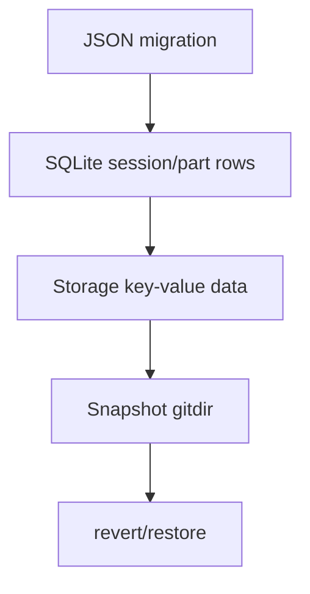

# 21장: 저장소, 세션 지속성, 복구

> **포지셔닝**: 이 장은 OpenCode의 세션과 관련 상태가 어떤 저장층에 남고, 어떻게 되돌리기와 복구 흐름으로 이어지는지 설명한다. 대상 독자: 긴 대화형 작업을 디스크에 안전하게 남기고 되돌릴 수 있어야 하는 빌더.

## 왜 중요한가

에이전트가 진짜 생산 도구가 되려면 두 가지가 필요하다. 대화를 저장해야 하고, 잘못된 변경을 되돌릴 수 있어야 한다. 이 둘 중 하나라도 빠지면 시스템은 데모로는 그럴듯해도 실전에서는 오래 못 버틴다. OpenCode는 DB, 파일 저장층, snapshot, revert 서비스, run-state를 조합해 이 문제를 푼다.

## 소스 앵커

- `packages/opencode/src/storage/db.ts`
- `packages/opencode/src/storage/storage.ts`
- `packages/opencode/src/storage/schema.ts`
- `packages/opencode/src/session/session.ts`
- `packages/opencode/src/session/revert.ts`
- `packages/opencode/src/session/run-state.ts`

## 핵심 코드

세션 row가 단순 chat title만 갖고 있지 않다는 점을 먼저 봐야 한다. summary, share, revert, permission이 같은 세션 정체성 안에 들어간다.

```ts
// packages/opencode/src/session/session.sql.ts
export const SessionTable = sqliteTable(
  "session",
  {
    id: text().$type<SessionID>().primaryKey(),
    project_id: text()
      .$type<ProjectID>()
      .notNull()
      .references(() => ProjectTable.id, { onDelete: "cascade" }),
    workspace_id: text().$type<WorkspaceID>(),
    parent_id: text().$type<SessionID>(),
    slug: text().notNull(),
    directory: text().notNull(),
    title: text().notNull(),
    version: text().notNull(),
    share_url: text(),
    summary_additions: integer(),
    summary_deletions: integer(),
    summary_files: integer(),
    summary_diffs: text({ mode: "json" }).$type<Snapshot.FileDiff[]>(),
    revert: text({ mode: "json" }).$type<{ messageID: MessageID; partID?: PartID; snapshot?: string; diff?: string }>(),
    permission: text({ mode: "json" }).$type<Permission.Ruleset>(),
    ...Timestamps,
    time_compacting: integer(),
    time_archived: integer(),
  },
  (table) => [
    index("session_project_idx").on(table.project_id),
    index("session_workspace_idx").on(table.workspace_id),
    index("session_parent_idx").on(table.parent_id),
  ],
)
```

메시지와 part는 JSON data를 가지지만 id, session, message 관계는 테이블로 고정한다. 이게 "구조화된 대화 타임라인"의 저장 형태다.

```ts
// packages/opencode/src/session/session.sql.ts
export const MessageTable = sqliteTable(
  "message",
  {
    id: text().$type<MessageID>().primaryKey(),
    session_id: text()
      .$type<SessionID>()
      .notNull()
      .references(() => SessionTable.id, { onDelete: "cascade" }),
    ...Timestamps,
    data: text({ mode: "json" }).notNull().$type<InfoData>(),
  },
  (table) => [index("message_session_time_created_id_idx").on(table.session_id, table.time_created, table.id)],
)

export const PartTable = sqliteTable(
  "part",
  {
    id: text().$type<PartID>().primaryKey(),
    message_id: text()
      .$type<MessageID>()
      .notNull()
      .references(() => MessageTable.id, { onDelete: "cascade" }),
    session_id: text().$type<SessionID>().notNull(),
    ...Timestamps,
    data: text({ mode: "json" }).notNull().$type<PartData>(),
  },
  (table) => [
    index("part_message_id_id_idx").on(table.message_id, table.id),
    index("part_session_idx").on(table.session_id),
  ],
)
```

되돌리기는 파일만 되돌리지 않는다. busy 상태를 확인하고, timeline에서 되돌릴 지점을 찾고, snapshot patch를 되감고, diff와 session revert 상태를 다시 저장한다.

```ts
// packages/opencode/src/session/revert.ts
const revert = Effect.fn("SessionRevert.revert")(function* (input: RevertInput) {
  yield* state.assertNotBusy(input.sessionID)
  const all = yield* sessions.messages({ sessionID: input.sessionID })
  let lastUser: MessageV2.User | undefined
  const session = yield* sessions.get(input.sessionID)

  let rev: Session.Info["revert"]
  const patches: Snapshot.Patch[] = []
  for (const msg of all) {
    if (msg.info.role === "user") lastUser = msg.info
    const remaining = []
    for (const part of msg.parts) {
      if (rev) {
        if (part.type === "patch") patches.push(part)
        continue
      }

      if (!rev) {
        if ((msg.info.id === input.messageID && !input.partID) || part.id === input.partID) {
          const partID = remaining.some((item) => ["text", "tool"].includes(item.type)) ? input.partID : undefined
          rev = {
            messageID: !partID && lastUser ? lastUser.id : msg.info.id,
            partID,
          }
        }
        remaining.push(part)
      }
    }
  }

  if (!rev) return session

  rev.snapshot = session.revert?.snapshot ?? (yield* snap.track())
  if (session.revert?.snapshot) yield* snap.restore(session.revert.snapshot)
  yield* snap.revert(patches)
  if (rev.snapshot) rev.diff = yield* snap.diff(rev.snapshot as string)
  const range = all.filter((msg) => msg.info.id >= rev!.messageID)
  const diffs = yield* summary.computeDiff({ messages: range })
  yield* storage.write(["session_diff", input.sessionID], diffs).pipe(Effect.ignore)
  yield* bus.publish(Session.Event.Diff, { sessionID: input.sessionID, diff: diffs })
  yield* sessions.setRevert({
    sessionID: input.sessionID,
    revert: rev,
    summary: {
      additions: diffs.reduce((sum, x) => sum + x.additions, 0),
      deletions: diffs.reduce((sum, x) => sum + x.deletions, 0),
      files: diffs.length,
    },
  })
  return yield* sessions.get(input.sessionID)
})
```

## 저장층을 두 겹으로 본다

OpenCode를 읽다 보면 저장이 한 군데에만 있지 않다는 점이 보인다.

1. **SQLite/Drizzle 계층**: 계정, 프로젝트, 세션, 메시지, 파트, permission, workspace, share 같은 정형 상태
2. **파일 기반 storage 계층**: session diff 같은 JSON 자산, 마이그레이션성 데이터, 보조 저장물

이 이중 구조는 복잡해 보이지만 현실적이다. 모든 것을 관계형 구조로 밀어 넣지도 않고, 모든 것을 JSON 폴더로 흩뿌리지도 않는다.

## 핵심 메커니즘

### DB는 장기 정체성을 맡는다

`storage/db.ts`를 보면 데이터베이스는 WAL 모드, foreign key, migration journal, 채널별 DB 경로 같은 운영 옵션을 갖는다. 이 파일이 중요한 이유는 단순 연결 코드가 아니라, 제품 전체의 장기 상태를 품는 저장 커널이기 때문이다.

`schema.ts`가 `SessionTable`, `MessageTable`, `PartTable`, `TodoTable`, `PermissionTable`, `SessionShareTable`, `WorkspaceTable`을 다시 export하는 것도 같은 맥락이다. 세션과 주변 상태가 이미 일급 데이터 모델로 승격되어 있다.

### 파일 storage는 유연한 보조 상태를 맡는다

`storage/storage.ts`는 JSON 파일 기반 저장 서비스를 제공한다. 여기에는 migration 코드도 들어 있고, 키 배열을 파일 경로로 바꾸는 단순하지만 유연한 추상화가 있다. session diff나 일부 보조 메타데이터를 이 층으로 넘기면 DB schema를 지나치게 자주 흔들지 않아도 된다.

### run-state가 "지금 복구 가능한가"를 통제한다

`session/run-state.ts`는 busy 세션을 추적하고 `assertNotBusy`, `cancel`, `ensureRunning`, `startShell`을 제공한다. 복구나 삭제 같은 파괴적 작업 전에 이 계층을 확인하는 이유는 명확하다. 실행 중인 세션과 저장 상태를 동시에 건드리면 무결성이 쉽게 깨지기 때문이다.

### revert는 snapshot과 session timeline을 함께 다룬다

`session/revert.ts`는 되돌리기를 단순 git reset 같은 작업으로 구현하지 않는다. 메시지와 파트의 timeline을 훑어 되돌릴 지점을 찾고, snapshot을 복원하고, patch 목록을 되돌리고, session diff를 다시 계산한 뒤, session의 `revert` 상태를 갱신한다.

즉 revert는 파일 시스템 복구와 대화 기록 복구를 함께 다루는 서비스다.

### cleanup은 되돌림 이후의 대화 정리까지 포함한다

`cleanup(session)`은 이미 revert된 세션에서 뒤쪽 메시지나 파트를 제거하고, 관련 sync event도 함께 발행한다. 이 점이 중요하다. 복구는 파일만 원래대로 돌리는 것으로 끝나지 않는다. 대화 타임라인도 그 복구 사실과 일관되게 다시 정리돼야 한다.

## persistence가 왜 어려운가

세션 저장은 문자열 로그 저장보다 훨씬 어렵다. OpenCode는 아래 상태를 함께 유지해야 한다.

- 메시지와 파트
- todo와 status
- permission 승인 상태
- diff 요약
- share 링크
- workspace 연결 상태
- revert/snapshot 기록

즉 "대화 저장"이 아니라 "작업 상태 저장"을 하고 있기 때문에 저장층이 두꺼워질 수밖에 없다.

## 빌더에게 남는 것

- 에이전트 시스템의 persistence는 chat history 저장보다 훨씬 넓은 문제다.
- 장기 정체성과 보조 산출물을 같은 저장 방식으로 강제할 필요는 없다.
- 복구는 파일 복원만이 아니라 대화 timeline 정리까지 포함해야 한다.
- busy 상태를 별도 서비스로 두면 파괴적 조작 전 검증이 쉬워진다.

다음 장에서는 이런 상태 변화가 시스템 안에서 어떻게 이벤트와 운영 가시성으로 흘러가는지 본다.

<!-- opencode-book-expansion -->
## 소스 그라운딩 확장

### 참조 강좌에서 가져올 렌즈

Claude의 transcript persistence 관점은 OpenCode에서 SQLite와 snapshot gitdir의 결합으로 나타난다. 대화 복구와 파일 복구는 연결되지만 같은 저장 계층은 아니다.

이 관점은 Claude 하니스의 구현을 그대로 복사하자는 뜻이 아니다. 같은 시스템 질문을 OpenCode 소스에 던지고, 다른 답이 나오는 지점을 분명히 하자는 뜻이다. 따라서 아래 흐름은 OpenCode의 실제 파일, 서비스, 상태 객체를 기준으로 다시 세운 읽기 지도다.

### 실제 OpenCode 흐름



### 확인해야 할 소스

- `packages/opencode/src/storage/db.ts`
- `packages/opencode/src/storage/schema.sql.ts`
- `packages/opencode/src/session/session.sql.ts`
- `packages/opencode/src/storage/json-migration.ts`
- `packages/opencode/src/session/revert.ts`
- `packages/opencode/src/snapshot/index.ts`

### 구현에서 읽어야 할 메커니즘

- 세션 row에는 summary, share, revert, permission이 같이 들어간다.
- message/part row는 streaming 상태와 tool result를 복구 가능한 형태로 보존한다.
- snapshot은 파일 상태를 별도 gitdir에 저장하고 session revert 정보와 연결된다.

### 실패 모드와 설계 압력

- 채팅 로그만 저장하면 파일 변경을 복구할 수 없다.
- 파일 snapshot만 저장하면 어떤 사용자 요청의 결과인지 설명할 수 없다.
- migration UX를 숨기면 오래된 데이터가 깨질 때 원인을 찾기 어렵다.

### 빌더에게 남는 질문

- 대화 상태와 파일 상태를 분리 저장하되 연결 id를 남겼는가?
- migration progress와 실패를 설명하는가?
- revert 기능이 schema에 반영되어 있는가?

이 장의 핵심은 파일 이름을 외우는 것이 아니라 경계를 읽는 것이다. 어떤 상태가 어느 계층에서 만들어지고, 어떤 계약을 통과하며, 실패했을 때 어디서 관측되는지까지 따라가야 실제 하니스 설계로 옮길 수 있다.
