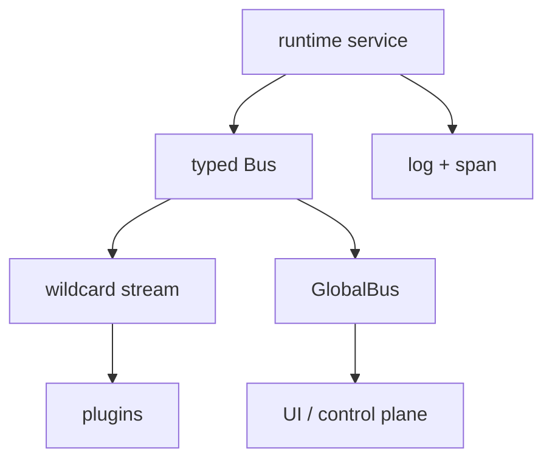
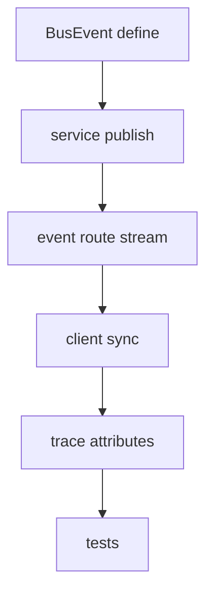

# 22장: 이벤트, trace, 운영 가시성

> **포지셔닝**: 이 장은 OpenCode가 상태 변화를 typed event bus, global event 복제, session status, 국소적 span과 logger로 어떻게 가시화하는지 읽는다. 대상 독자: 에이전트 런타임을 디버그 가능하고 운영 가능한 시스템으로 만들고 싶은 빌더.

## 왜 중요한가

에이전트 시스템은 내부 상태가 많고 비동기 흐름이 길다. 모델 호출, 도구 실행, 세션 상태, worktree, snapshot, plugin, LSP가 동시에 움직이면 "무슨 기능이 있나"보다 "지금 무슨 일이 일어나고 있나"가 더 중요해진다. 운영 가시성이 없으면 시스템은 금방 검은 상자가 된다.

OpenCode는 이를 거대한 observability 플랫폼으로 풀지 않는다. 대신 typed event bus, GlobalBus 복제, 세션 status 서비스, 서비스별 logger, 일부 핵심 경계의 Effect span을 조합한다. 이 선택은 화려하지 않지만 실전적이다.

## 소스 앵커

- `packages/opencode/src/bus/index.ts`
- `packages/opencode/src/bus/bus-event.ts`
- `packages/opencode/src/bus/global.ts`
- `packages/opencode/src/session/status.ts`
- `packages/opencode/src/session/run-state.ts`
- `packages/opencode/src/project/bootstrap.ts`
- `packages/opencode/src/worktree/index.ts`
- `packages/web/src/content/docs/plugins.mdx`

## 관찰 계층의 구조

이 그림에서 중요한 것은 OpenCode가 관찰을 한 가지 방식으로 통일하지 않는다는 점이다. 이벤트는 event bus로, 긴 경계는 span으로, 개별 서비스 흐름은 logger로 드러낸다.

## 핵심 메커니즘

### Bus는 typed channel과 wildcard channel을 동시에 가진다

`packages/opencode/src/bus/index.ts`의 상태는 간단하다.

- `wildcard: PubSub<Payload>`
- `typed: Map<string, PubSub<Payload>>`

그리고 `publish(def, properties)`는 특정 이벤트 타입용 pubsub와 wildcard pubsub 양쪽에 payload를 넣는다.

이 구조가 좋은 이유는 두 가지다.

- 특정 이벤트만 듣는 소비자는 type-specific 구독을 쓸 수 있다.
- 전체 흐름을 보고 싶은 관찰자는 wildcard 구독을 쓸 수 있다.

즉 OpenCode는 "모든 이벤트를 한 채널에 쏟아붓는 단순함"과 "타입별 채널만 있는 경직성" 사이에서 중간 지점을 택한다.

### publish는 instance-local 이벤트를 global 관찰 표면으로 복제한다

`Bus.publish(...)`는 local pubsub에 이벤트를 넣는 것으로 끝나지 않는다. 이어서 `GlobalBus.emit("event", { directory, project, workspace, payload })`를 호출한다.

이건 이 시스템의 중요한 특징이다. 이벤트는 단일 인스턴스 내부 신호일 뿐 아니라, 프로젝트/워크스페이스 문맥을 가진 전역 관찰 데이터가 된다. 그래서 UI, control plane, 외부 표면이 "어느 인스턴스에서 일어난 어떤 사건인가"를 함께 볼 수 있다.

즉 OpenCode는 이벤트를 함수 호출 체인 안에만 가두지 않는다. 운영 관찰 가능한 사실로 승격한다.

### subscribe 경로는 정리(cleanup)를 런타임이 책임진다

`subscribe`, `subscribeAll`, `subscribeCallback`, `subscribeAllCallback`을 보면 모두 unsubscribe와 scope 정리를 의식한다. 특히 내부 `on(...)` 헬퍼는 `EffectBridge`, `Scope`, `PubSub.subscribe`, `Stream.runForEach`를 묶어 callback 구독을 만들고, 종료 시 scope를 닫는다.

이게 왜 중요하냐면, 에이전트 런타임은 장수 구독이 많기 때문이다. 구독 수명 관리를 설계하지 않으면 이벤트 시스템은 금방 중복 구독과 누수로 망가진다.

### 인스턴스 종료 자체도 이벤트다

버스 초기화 finalizer를 보면 `InstanceDisposed` 이벤트를 wildcard 채널에 발행한 뒤 pubsub를 shutdown한다. 이 디테일은 좋다. 인스턴스 종료는 "조용한 cleanup"이 아니라, 구독자들이 알아야 하는 상태 변화이기 때문이다.

OpenCode는 lifecycle 끝점까지 이벤트의 일부로 다룬다.

### session status는 UI가 소비할 수 있는 운영 상태 모델이다

`packages/opencode/src/session/status.ts`는 `idle`, `busy`, `retry` 세 상태를 `SessionStatus.Info`로 정의하고, `session.status` 이벤트를 발행한다. `idle`일 때는 예전 호환성을 위한 `session.idle` 이벤트도 추가로 쏜다.

여기서 중요한 것은 세션 상태가 단순 boolean이 아니라는 점이다.

- `busy`
- `idle`
- `retry { attempt, message, next }`

즉 OpenCode는 "돌고 있나/아닌가"를 넘어서 재시도 중인 상태까지 운영 상태로 승격한다. 사용자 경험과 디버깅 모두에 유리한 선택이다.

### run-state가 실제 실행기와 status를 연결한다

`packages/opencode/src/session/run-state.ts`를 보면 `SessionRunState`는 session별 `Runner`를 보관한다. 새 runner를 만들 때 `onBusy`, `onIdle`, `onInterrupt` 훅을 연결해 `SessionStatus.set(...)`을 호출한다.

이 구조의 장점은 분명하다.

- 세션 실행 동시성 제어는 `Runner`가 담당
- UI에 노출할 상태 변화는 `SessionStatus`가 담당
- 둘 사이 연결은 `SessionRunState`가 담당

즉 OpenCode는 실행 제어와 상태 가시화를 분리하되, 연결 지점은 명시적으로 둔다.

### 부트스트랩 같은 긴 경계는 span으로 드러난다

`packages/opencode/src/project/bootstrap.ts`의 `InstanceBootstrap`를 보면 `Effect.withSpan("InstanceBootstrap")`, `Effect.withSpan("InstanceBootstrap.init")`가 붙어 있다. 이 파일은 config 로드, plugin init, LSP, ShareNext, Format, FileWatcher, Vcs, Snapshot 초기화를 동시에 일으키는 무거운 경계다.

OpenCode는 모든 함수에 span을 남기지 않는다. 대신 시스템 경계가 선명한 부트스트랩 지점에만 span을 둔다. 이건 좋은 절충이다. 과도한 tracing은 잡음이 되고, 전혀 없으면 경계를 잃는다.

### 서비스별 logger가 이벤트 bus를 보완한다

`Log.create({ service: "bus" })`, `service: "lsp"`, `service: "worktree"`, `service: "snapshot"` 같은 패턴은 OpenCode 관찰 전략의 나머지 절반이다. 이벤트는 "무슨 사건이 일어났나"를 말해 주고, logger는 "왜 여기까지 왔나"를 더 잘 보여 준다.

예를 들어 worktree reset 실패, snapshot add 실패, LSP initialize error는 모두 bus만으로는 부족하고 서비스별 logger가 필요하다. OpenCode는 두 계층을 함께 쓴다.

### 플러그인도 같은 이벤트 backbone을 소비한다

문서 `plugins.mdx`와 bus 구조를 함께 보면 event bus는 내부 디버그 채널만이 아니다. plugin이 permission, session, message, LSP 같은 사건을 읽는 공식 경로이기도 하다. 이 점이 중요하다. 확장을 따로 위해 별도 관찰 인터페이스를 만들지 않고, 내부 가시성과 외부 확장이 같은 backbone을 공유한다.

이런 설계는 인터페이스 수를 줄여 준다. 물론 이벤트 계약 설계는 더 엄격해져야 한다.

## 이 장의 핵심 논지

OpenCode의 운영 가시성은 거대한 tracing stack에 있지 않다. 대신 아래 조합에 있다.

- typed event bus
- wildcard/global event 복제
- 세션 상태 모델
- 서비스별 logger
- 핵심 경계에만 둔 span

즉 이 시스템은 "모든 것을 관찰하자"보다 "어떤 상태가 제품 표면과 운영 표면에 보여야 하는가"를 먼저 고른다.

## 트레이드오프

- 장점: 상태 변화가 UI, plugin, control plane으로 자연스럽게 흐른다.
- 장점: typed event 덕분에 이벤트 계약이 비교적 명확하다.
- 장점: run-state와 status 분리로 실행 제어와 표시 상태가 정리된다.
- 단점: 이벤트 종류가 늘수록 흐름 추적이 어려워질 수 있다.
- 단점: 서비스별 logger와 bus와 span을 함께 보려면 관찰 습관이 필요하다.

## 빌더에게 남는 것

- 에이전트 런타임은 기능만큼 운영 가시성이 중요하다.
- typed event bus 하나를 잘 설계하면 UI, 확장, 관찰을 동시에 떠받칠 수 있다.
- busy/idle 같은 상태도 별도 서비스와 이벤트로 승격하는 편이 낫다.
- tracing은 전면 도입보다 부트스트랩, reset, long-running loop 같은 핵심 경계에만 두는 편이 유지보수에 유리하다.

다음 장에서는 이런 이벤트와 상태 모델이 외부 공유와 동기화 계층으로 어떻게 확장되는지 본다.

<!-- opencode-book-expansion -->
## 소스 그라운딩 확장

### 참조 강좌에서 가져올 렌즈

Claude 책의 logEvent 관점은 OpenCode에서 BusEvent, SyncEvent, trace attribute로 구체화된다. 로그 문자열보다 타입 있는 이벤트가 중요하다.

이 관점은 Claude 하니스의 구현을 그대로 복사하자는 뜻이 아니다. 같은 시스템 질문을 OpenCode 소스에 던지고, 다른 답이 나오는 지점을 분명히 하자는 뜻이다. 따라서 아래 흐름은 OpenCode의 실제 파일, 서비스, 상태 객체를 기준으로 다시 세운 읽기 지도다.

### 실제 OpenCode 흐름

### 확인해야 할 소스

- `packages/opencode/src/bus/index.ts`
- `packages/opencode/src/bus/bus-event.ts`
- `packages/opencode/src/server/routes/instance/event.ts`
- `packages/opencode/src/server/routes/instance/trace.ts`
- `packages/opencode/src/effect/observability.ts`

### 구현에서 읽어야 할 메커니즘

- BusEvent는 event type과 zod payload schema를 묶는다.
- SyncEvent는 aggregate/version을 가진 재생 가능한 상태 변화에 가깝다.
- trace route와 Effect span은 request, session, model, tool 같은 운영 속성을 붙이는 지점이다.

### 실패 모드와 설계 압력

- console log만으로는 UI sync와 replay를 만들 수 없다.
- 이벤트 payload schema가 없으면 클라이언트가 암묵적 필드에 의존한다.
- trace에 session/provider/model 속성이 없으면 비용과 실패 원인 분석이 어렵다.

### 빌더에게 남는 질문

- 로그, event, sync event, trace span의 역할을 나눴는가?
- 이벤트 payload가 schema로 정의되는가?
- tool/LLM 호출에 관측 속성이 붙는가?

이 장의 핵심은 파일 이름을 외우는 것이 아니라 경계를 읽는 것이다. 어떤 상태가 어느 계층에서 만들어지고, 어떤 계약을 통과하며, 실패했을 때 어디서 관측되는지까지 따라가야 실제 하니스 설계로 옮길 수 있다.
