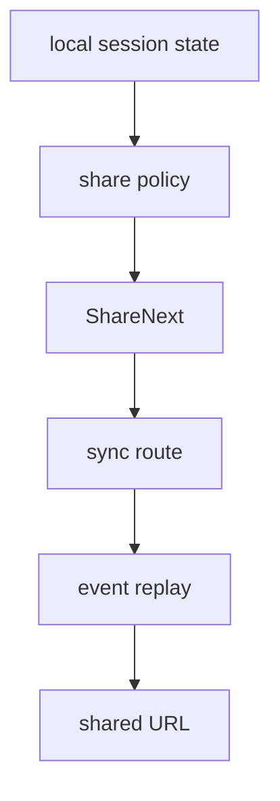

# 23장: 공유와 동기화

> **포지셔닝**: 이 장은 OpenCode가 세션 공유 링크를 만들고, 이후 세션/메시지/파츠/diff/model 변화를 어떻게 외부로 동기화하는지 분석한다. 대상 독자: 대화형 작업 결과를 외부 뷰어나 협업 표면으로 안전하게 복제하고 싶은 빌더.

## 왜 중요한가

대화를 공유하는 기능은 단순히 URL 하나를 만드는 문제가 아니다. 공유 이후에도 세션 정보, 새 메시지, 파트 업데이트, diff 요약, 모델 정보가 계속 변할 수 있다. 즉 공유는 export가 아니라 live sync 문제에 더 가깝다. OpenCode의 `share-next.ts`는 이 사실을 꽤 정직하게 드러낸다.

## 소스 앵커

- `packages/opencode/src/share/session.ts`
- `packages/opencode/src/share/share-next.ts`
- `packages/opencode/src/share/share.sql.ts`
- `packages/opencode/src/session/message-v2.ts`
- `packages/opencode/src/session/summary.ts`

## 핵심 메커니즘

### share와 unshare는 SessionShare 서비스가 감싼다

`share/session.ts`는 상위 표면에 보이는 공유 인터페이스를 정리한다.

- `create(...)`
- `share(sessionID)`
- `unshare(sessionID)`

여기서 중요한 점은 루트 세션 생성 시 자동 공유까지 이 서비스가 맡는다는 점이다. 즉 공유는 세션 서비스 바깥의 부가 유틸이 아니라, 세션 생애주기 옆에 붙은 정식 운영 계층이다.

### 실제 sync 엔진은 `share-next.ts`에 있다

`share-next.ts`를 보면 공유는 아래 데이터 타입들을 개별 항목으로 다룬다.

- `session`
- `message`
- `part`
- `session_diff`
- `model`

이 설계가 중요한 이유는 공유가 "렌더된 HTML 한 장"이 아니라, 세션을 구성하는 여러 종류의 상태를 스트리밍 가능한 데이터 조각으로 본다는 뜻이기 때문이다.

### 변경은 queue에 모였다가 flush된다

`State` 안에는 `queue: Map<SessionID, Map<string, Data>>`가 있다. `sync(sessionID, data)`는 공유된 세션에 변화가 생길 때 즉시 전송하지 않고, 키별로 dedupe된 큐에 모아 둔 뒤 `flush(sessionID)`를 지연 실행한다. 이건 운영적으로 매우 현실적인 선택이다. 메시지/파츠 이벤트를 그대로 매번 밀어 보내면 네트워크와 원격 뷰가 너무 시끄러워진다.

### bus 구독이 공유 동기화의 중심이다

상태 생성 시 `watch(...)`를 통해 아래 이벤트들을 구독한다.

- `Session.Event.Updated`
- `MessageV2.Event.Updated`
- `MessageV2.Event.PartUpdated`
- `Session.Event.Diff`
- `Session.Event.Deleted`

즉 공유 시스템은 세션을 직접 폴링하지 않는다. 내부 event bus를 subscribe해서 외부 동기화로 번역한다. 이 점은 22장과 강하게 연결된다.

### 모델 정보도 공유한다

사용자 메시지가 업데이트될 때, 관련 model 정보를 provider에서 가져와 함께 sync한다. 이 설계는 보기보다 중요하다. 공유 뷰어가 "어떤 모델이 이 메시지를 처리했는가" 같은 문맥까지 재현할 수 있게 해 주기 때문이다.

### share row는 별도 테이블에 남는다

`share.sql.ts`의 `SessionShareTable`은 `session_id`, `id`, `secret`, `url`을 별도 테이블로 유지한다. 세션 본문에 공유 정보를 모두 박아 넣지 않고, 공유 자체를 별도 정체성으로 본다는 뜻이다. 공개 URL과 비밀값이 이런 식으로 분리되는 편이 운영상 더 명확하다.

## auto share의 의미

`SessionShare.create(...)`는 루트 세션 생성 뒤 `conf.share === "auto"` 혹은 플래그가 켜져 있으면 공유를 백그라운드로 시작한다. 이 설계는 공유를 사용자가 수동으로 누를 기능이 아니라, 환경에 따라 기본 동작으로 승격할 수 있게 한다.

즉 OpenCode는 공유를 "있으면 좋은 export"가 아니라 협업 표면으로 볼 준비가 되어 있다.

## 트레이드오프

- 장점: 세션 공유가 정적 내보내기보다 살아 있는 뷰에 가깝다.
- 단점: 이벤트 구독, 큐, 원격 API, 인증까지 관리해야 해 구현이 두꺼워진다.
- 장점: message/part/diff/model을 분리해 동기화하므로 유연하다.
- 단점: 공유 뷰도 내부 데이터 모델 변화를 따라가야 한다.

## 빌더에게 남는 것

- 공유는 대개 export가 아니라 sync 문제다.
- 내부 이벤트 버스를 외부 동기화 엔진의 입력으로 쓰면 구조가 깔끔해진다.
- 공유 데이터를 큰 blob 하나로 보내기보다, 세션을 구성하는 타입별 조각으로 나누는 편이 확장에 강하다.

다음 부에서는 LSP, patch, worktree, snapshot, provider transform처럼 OpenCode의 고급 서브시스템을 본다.

<!-- opencode-book-expansion -->
## 소스 그라운딩 확장

### 참조 강좌에서 가져올 렌즈

OpenCode의 기본 진실은 로컬 세션이다. Claude 책의 공유/remote 관점을 가져오면 공유는 원천이 아니라 로컬 상태의 외부 투사라는 점이 중요하다.

이 관점은 Claude 하니스의 구현을 그대로 복사하자는 뜻이 아니다. 같은 시스템 질문을 OpenCode 소스에 던지고, 다른 답이 나오는 지점을 분명히 하자는 뜻이다. 따라서 아래 흐름은 OpenCode의 실제 파일, 서비스, 상태 객체를 기준으로 다시 세운 읽기 지도다.

### 실제 OpenCode 흐름

### 확인해야 할 소스

- `packages/opencode/src/share/index.ts`
- `packages/opencode/src/share/session.ts`
- `packages/opencode/src/share/share-next.ts`
- `packages/opencode/src/share/share.sql.ts`
- `packages/opencode/src/sync/index.ts`
- `packages/opencode/src/server/routes/instance/sync.ts`

### 구현에서 읽어야 할 메커니즘

- config의 share는 manual, auto, disabled 정책을 가진다.
- 공유 품질은 transcript뿐 아니라 SessionSummary diff와 파일 변경 요약에 달려 있다.
- sync route는 클라이언트 재접속 후 event replay와 현재 상태 동기화를 담당한다.

### 실패 모드와 설계 압력

- 자동 공유 기본값을 잘못 두면 로컬 작업물이 의도치 않게 외부화된다.
- sync replay가 없으면 중간 tool 상태가 사라진다.
- diff 없이 공유하면 코딩 세션의 핵심 결과가 설명되지 않는다.

### 빌더에게 남는 질문

- 공유 정책이 config schema에 명시되어 있는가?
- 공유 payload에 diff/summary가 들어가는가?
- sync는 stream과 replay를 모두 고려하는가?

이 장의 핵심은 파일 이름을 외우는 것이 아니라 경계를 읽는 것이다. 어떤 상태가 어느 계층에서 만들어지고, 어떤 계약을 통과하며, 실패했을 때 어디서 관측되는지까지 따라가야 실제 하니스 설계로 옮길 수 있다.
