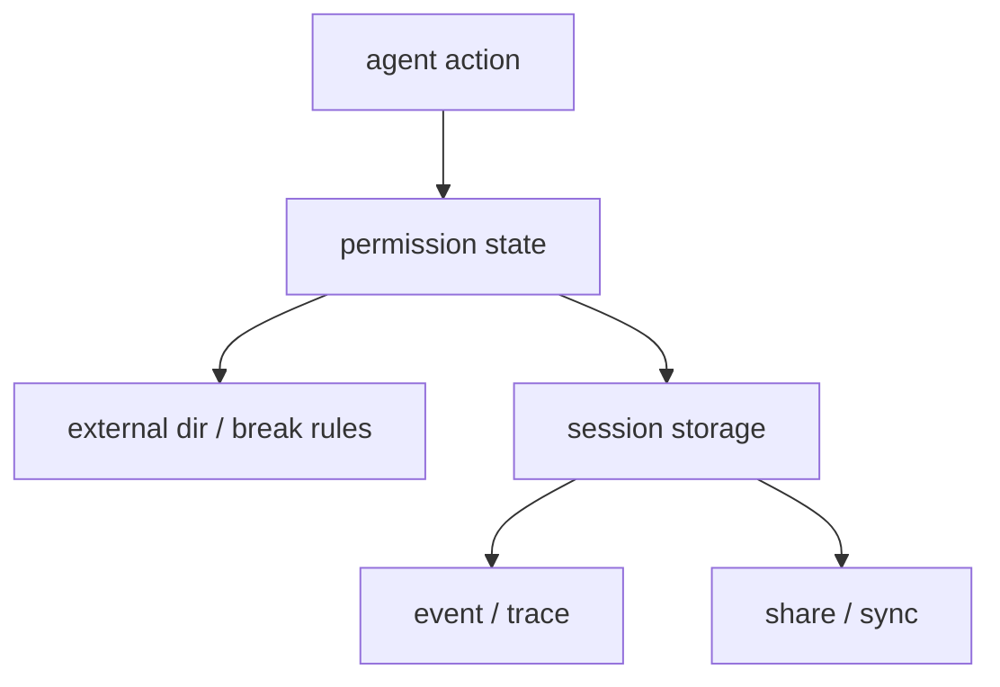

# 제5부: 위험한 행동을 어떻게 협상 가능한 UX로 바꾸는가

권한과 안전성은 에이전트 시스템에서 늘 도덕 문장으로 설명되기 쉽다. 하지만 실제 구현으로 내려가면 문제는 더 구체적이다. 언제 멈춰야 하는가, 누가 응답해야 하는가, 한 번의 허용과 이후의 허용을 어떻게 구분할 것인가, 외부 디렉터리와 반복 호출과 장기 세션 상태를 어디에 저장할 것인가. 제5부는 그 문제를 읽는다.

이 파트의 질문은 "위험한 행동을 어떻게 사용자가 협상 가능한 상태 모델로 바꾸는가"다. OpenCode에서 permission은 단순 boolean 설정이 아니다. `ask`는 일급 상태이고, `once`와 `always`는 서로 다른 UX 약속이며, 외부 디렉터리와 break 규칙은 운영 사고를 줄이기 위한 브레이크다. 저장소 지속성, 이벤트, 공유 역시 모두 안전성과 운영성을 구성하는 일부다.

이 파트를 읽을 때는 다음을 놓치지 말아야 한다.

- 보안 규칙이 아니라 대화형 승인 흐름으로 볼 것
- 세션 중 누적되는 규칙과 정적 설정을 분리해서 볼 것
- 저장, 복구, 공유, 이벤트가 모두 운영 안전성의 일부라는 점을 볼 것

19장은 permission 계층의 구조와 ask queue를, 20장은 세분화 규칙과 브레이크를, 21장은 저장소와 복구를, 22장은 이벤트와 운영 가시성을, 23장은 공유와 동기화를 다룬다.

이 파트를 다 읽고 나면 독자는 안전성이 보안 부록이 아니라 런타임 한가운데 놓인 UX 문제라는 점을 보게 된다. 좋은 하니스는 위험을 숨기지 않는다. 대신 위험을 협상 가능한 상태로 만든다.

<!-- opencode-book-expansion -->
## 확장된 읽기 관점

이 부는 안전성을 규칙표가 아니라 사용자와 협상되는 상태 모델로 읽는다. permission ask, external directory, diff metadata, event stream이 함께 위험한 행동을 설명한다.

### 핵심 소스

- `packages/opencode/src/permission`
- `packages/opencode/src/tool/external-directory.ts`
- `packages/opencode/src/session/session.sql.ts`
- `packages/opencode/src/share`
