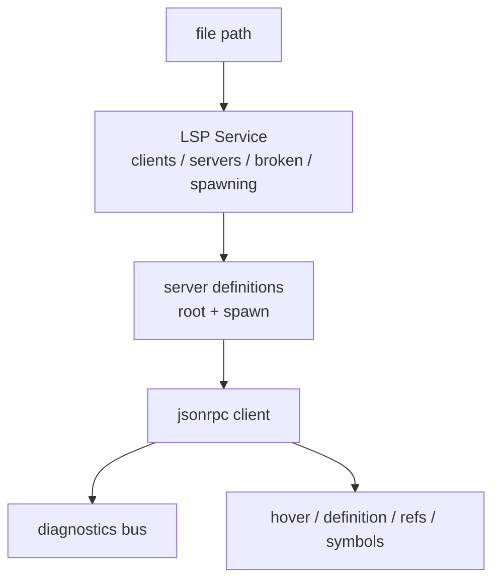
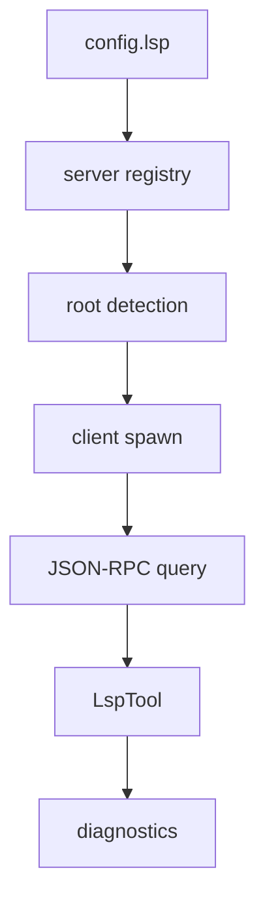

# 24장: LSP와 코드 인텔리전스

> **포지셔닝**: 이 장은 OpenCode의 LSP 계층을 "언어 서버 목록"이 아니라, 파일 터치, 루트 판별, 진단 수집, 심볼 질의를 지속적으로 제공하는 상태 서비스로 읽는다. 대상 독자: 에이전트 런타임에 정의 찾기, 참조 찾기, 진단 정보를 붙이고 싶은 빌더.

## 왜 중요한가

코딩 에이전트는 `read`, `grep`, `glob`만으로도 돌아간다. 하지만 실전 생산성은 금방 한계에 부딪힌다. "이 심볼의 정의가 어디인가", "이 파일이 이미 깨져 있나", "수정 후 진단이 사라졌나" 같은 질문은 문자열 검색만으로는 안정적으로 답하기 어렵다. 이 지점에서 LSP는 사치가 아니라 품질 계층이 된다.

OpenCode가 흥미로운 이유는 LSP를 IDE 전체 복제로 만들지 않는다는 점이다. 대신 언어 서버 정의, root 계산, spawn/재시도, diagnostics bus, 질의 fan-out을 묶은 별도 서비스로 만든다. 즉 LSP는 부가 기능이 아니라 코어 런타임 옆에 붙은 코드 인텔리전스 서브시스템이다.

## 소스 앵커

- `packages/opencode/src/lsp/lsp.ts`
- `packages/opencode/src/lsp/client.ts`
- `packages/opencode/src/lsp/server.ts`
- `packages/opencode/src/lsp/language.ts`
- `packages/opencode/src/lsp/launch.ts`
- `packages/opencode/src/lsp/diagnostic.ts`
- `packages/web/src/content/docs/lsp.mdx`

## LSP 계층의 형태

핵심은 `LSP Service`가 "요청이 올 때마다 서버를 하나 띄우는 함수"가 아니라는 점이다. 클라이언트 집합과 실패 상태와 진행 중인 spawn을 함께 가진 장수 서비스다.

## 핵심 메커니즘

### 서비스 상태는 네 개의 맵으로 요약된다

`packages/opencode/src/lsp/lsp.ts`의 `State`는 이 계층의 성격을 정확히 보여 준다.

- `clients`: 현재 연결된 LSP 클라이언트 목록
- `servers`: 활성화된 서버 정의 레지스트리
- `broken`: 실패한 root/server 조합
- `spawning`: 진행 중인 root/server 조합의 Promise

이 네 개가 중요한 이유는 LSP 품질의 대부분이 "서버를 잘 띄우는가"보다 "중복 spawn과 실패 재시도를 얼마나 잘 다루는가"에 있기 때문이다. 같은 루트에 같은 서버를 두 번 붙이면 낭비이고, 계속 실패하는 조합을 매번 다시 시도하면 느리다. OpenCode는 이를 명시적 상태로 끌어올린다.

### 언어 서버 정의는 선언형 레지스트리다

`packages/opencode/src/lsp/server.ts`는 `Deno`, `Typescript`, `Vue`, `ESLint`, `Oxlint` 같은 서버를 `Info` 객체로 정의한다. 각 항목은 아래를 가진다.

- `id`
- `extensions`
- `root(file, ctx)` 함수
- `spawn(root, ctx)` 함수

이 방식의 장점은 크다. 상속 프레임워크 없이도 언어 서버를 계속 추가할 수 있고, 각 서버의 설치/루트/실행 예외를 같은 형태로 수용할 수 있다. LSP를 거대한 IDE 아키텍처로 확장하지 않고도 실전적인 범위를 확보하는 방법이다.

### root detection이 실제 체감 품질을 결정한다

`NearestRoot(...)` 헬퍼는 이 장의 중요한 디테일이다. 특정 lockfile이나 설정 파일을 기준으로 가장 가까운 루트를 찾고, 필요하면 `deno.json` 같은 exclude 패턴으로 다른 서버를 배제한다.

이게 중요한 이유는 잘못된 루트가 거의 모든 품질 문제의 출발점이기 때문이다.

- 잘못된 diagnostics
- 과도한 workspace 범위
- 엉뚱한 symbol resolution
- 중복 서버 연결

OpenCode는 root detection을 보조 유틸이 아니라 언어 서버 정의의 핵심으로 둔다. 이 판단은 맞다. 많은 LSP 통합은 query API보다 root detection에서 무너진다.

### 런타임은 "설치되지 않은 서버" 문제도 일부 떠안는다

`server.ts`를 더 읽으면 OpenCode가 단순히 PATH에 있는 바이너리만 쓰지 않는다는 점이 보인다. 예를 들어 ESLint 서버는 없으면 GitHub에서 압축 파일을 받아 `Global.Path.bin` 아래에 풀고 `npm install`, `npm run compile`까지 수행한다. Vue, Oxlint 등도 로컬/상위 디렉터리/node_modules/PATH를 단계적으로 탐색한다.

즉 OpenCode는 LSP를 "사용자가 이미 완벽하게 설치해 둔 환경에서만 동작하는 선택 기능"으로 취급하지 않는다. 제품 품질을 위해 런타임이 일정 부분 설치/해결 책임을 함께 진다.

이건 중요하다. 코드 인텔리전스를 제품 기능으로 제공하려면 launch 안정성을 사용자 우연에만 맡길 수 없기 때문이다.

### JSON-RPC 클라이언트는 진단 스트림을 버스로 승격한다

`packages/opencode/src/lsp/client.ts`에서 `create(...)`는 `StreamMessageReader/Writer`로 JSON-RPC 연결을 만들고, `textDocument/publishDiagnostics`를 받아 `Map<string, Diagnostic[]>`에 저장한 뒤 `lsp.client.diagnostics` 이벤트를 bus로 발행한다.

여기서 두 가지가 중요하다.

1. diagnostics는 조회 함수의 반환값이 아니라 지속적으로 갱신되는 상태다.
2. 업데이트는 파일 path와 serverID를 포함한 bus 이벤트로 승격되어 UI나 다른 서비스가 구독할 수 있다.

특히 `waitForDiagnostics(...)`의 debounce는 사소해 보이지만 좋다. syntax diagnostics 뒤에 semantic diagnostics가 따라오는 패턴을 고려해 150ms 완충을 둔다. 작은 디테일이지만 사용자 체감 품질은 이런 데서 갈린다.

### `touchFile`은 파일 변경을 LSP에게 "살아 있는 사실"로 알린다

`lsp.ts`의 `touchFile(...)`은 이 계층이 단발성 query engine이 아님을 보여 준다. 이 함수는 관련 클라이언트를 찾아 `client.notify.open(...)`을 호출하고, 필요하면 diagnostics가 다시 올 때까지 기다린다.

`client.notify.open(...)`은 내부에서 두 갈래로 동작한다.

- 이미 열려 있던 파일이면 `workspace/didChangeWatchedFiles`와 `textDocument/didChange`
- 처음 보는 파일이면 `workspace/didChangeWatchedFiles`와 `textDocument/didOpen`

즉 OpenCode는 파일 수정 뒤 LSP가 새 상태를 보도록 적극적으로 자극한다. 단순히 나중에 쿼리할 때 결과가 좋아지길 기대하지 않는다.

### 질의는 다중 클라이언트 fan-out으로 처리된다

`hover`, `definition`, `references`, `documentSymbol`, `workspaceSymbol`, `incomingCalls`, `outgoingCalls` 등은 모두 `run(...)` 혹은 `runAll(...)` 위에 쌓인다. 즉 하나의 파일에 대해 관련 있는 모든 LSP 클라이언트로 요청을 fan-out하고, 결과를 합친다.

이건 한편으로는 단순하고, 다른 한편으로는 실전적이다. 프로젝트마다 TypeScript와 ESLint, Vue LSP가 동시에 관련될 수 있기 때문이다. OpenCode는 이를 하나의 "최고 권위 서버"로 억지 통일하기보다, 가능한 여러 클라이언트에서 결과를 모으는 전략을 택한다.

### 구성 가능성과 실패 격리도 서비스 안에 있다

`Config.lsp`를 읽는 초기화 코드와 `filterExperimentalServers(...)`는 LSP가 고정 불변 목록이 아니라 사용자/플래그/실험 기능에 따라 조정되는 서비스임을 보여 준다. 반대로 실패한 조합은 `broken` 집합에 기록해 계속 spawn 시도하지 않는다.

즉 이 계층은 "가능하면 다 붙인다"가 아니라 "붙일 수 있는 것만 안정적으로 붙인다"에 가깝다. 좋은 런타임 냄새다.

## 문서와 구현의 차이

문서 `lsp.mdx`는 어떤 서버를 쓸 수 있는지, 어떤 경험이 제공되는지 설명한다. 하지만 구현까지 내려오면 더 중요한 사실이 드러난다.

- LSP는 장수 상태 서비스다.
- diagnostics는 bus 이벤트다.
- root detection이 핵심 품질 포인트다.
- launch 실패와 중복 spawn을 피하기 위한 상태가 따로 있다.
- 파일 변경을 LSP에 알리는 `touchFile` 같은 적극적 동기화 경로가 있다.

즉 LSP를 제대로 붙이는 일은 "언어 서버 지원"을 선언하는 것보다 훨씬 운영적이다.

## 트레이드오프

- 장점: 언어 서버 정의가 선언형 레지스트리라 확장하기 쉽다.
- 장점: root/server 단위의 실패 격리와 spawn dedupe가 있다.
- 장점: diagnostics와 심볼 정보가 UI와 다른 서비스로 흘러갈 수 있다.
- 단점: 설치/실행 예외를 런타임이 꽤 많이 떠안아야 한다.
- 단점: root detection이 틀리면 전체 체감 품질이 한꺼번에 무너진다.

## 빌더에게 남는 것

- 코드 인텔리전스 계층의 핵심은 query API보다 root detection과 launch 안정성이다.
- LSP는 "도구 하나"가 아니라 상태 서비스로 설계해야 한다.
- diagnostics는 함수 반환값보다 이벤트 스트림으로 다루는 편이 유리하다.
- 언어 서버를 붙일 때는 중복 spawn, 실패 재시도, 설치 부재를 먼저 설계해야 한다.

다음 장에서는 코드 이해와는 다른 문제, 즉 실제 파일 수정이 어떤 편집 의미론 위에서 운영되는지 본다.

<!-- opencode-book-expansion -->
## 소스 그라운딩 확장

### 참조 강좌에서 가져올 렌즈

Claude의 코드 인텔리전스 관점은 OpenCode에서 LSP service로 구현된다. grep은 텍스트 검색이고 LSP는 정의, 참조, hover, symbol, call hierarchy를 제공한다.

이 관점은 Claude 하니스의 구현을 그대로 복사하자는 뜻이 아니다. 같은 시스템 질문을 OpenCode 소스에 던지고, 다른 답이 나오는 지점을 분명히 하자는 뜻이다. 따라서 아래 흐름은 OpenCode의 실제 파일, 서비스, 상태 객체를 기준으로 다시 세운 읽기 지도다.

### 실제 OpenCode 흐름

### 확인해야 할 소스

- `packages/opencode/src/lsp/lsp.ts`
- `packages/opencode/src/lsp/client.ts`
- `packages/opencode/src/lsp/server.ts`
- `packages/opencode/src/lsp/diagnostic.ts`
- `packages/opencode/src/tool/lsp.ts`

### 구현에서 읽어야 할 메커니즘

- LSP state는 clients, servers, broken, spawning으로 lifecycle을 관리한다.
- root detection과 extension mapping이 실제 응답 품질을 결정한다.
- edit/write 후 touchFile과 diagnostics report가 모델 feedback으로 돌아간다.

### 실패 모드와 설계 압력

- spawn 실패를 반복하면 파일 열 때마다 지연이 누적된다.
- 파일 수정 후 diagnostics를 갱신하지 않으면 깨진 코드를 성공으로 오판한다.
- LSP tool을 permission 없이 열면 project 밖 구조 질의가 가능해진다.

### 빌더에게 남는 질문

- LSP lifecycle이 별도 service로 격리되어 있는가?
- 검색 도구와 구조 질의 도구를 구분하는가?
- 파일 mutation 뒤 diagnostics feedback을 제공하는가?

이 장의 핵심은 파일 이름을 외우는 것이 아니라 경계를 읽는 것이다. 어떤 상태가 어느 계층에서 만들어지고, 어떤 계약을 통과하며, 실패했을 때 어디서 관측되는지까지 따라가야 실제 하니스 설계로 옮길 수 있다.
