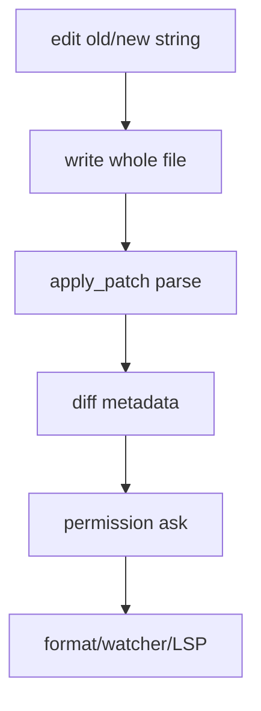

# 25장: Patch, Edit, Write의 파일 수정 의미론

> **포지셔닝**: 이 장은 OpenCode가 파일 수정 행위를 왜 여러 도구와 별도 patch 엔진으로 분해했는지 설명한다. 대상 독자: LLM 기반 코드 수정을 더 예측 가능한 의미론 위에 올리고 싶은 빌더.

## 왜 중요한가

LLM에게 "파일을 수정해"라고 말하는 것은 사람에게는 자연스럽지만, 런타임 입장에서는 여러 다른 연산을 한 문장에 뭉개는 일이다. 전체 덮어쓰기, 특정 구간 편집, 구조화된 patch 적용은 실패 모드가 다르고, 복구 가능성도 다르고, permission 모델도 다르다. OpenCode는 이 차이를 숨기지 않고 도구와 patch 계층으로 분리한다.

## 소스 앵커

- `packages/opencode/src/tool/edit.ts`
- `packages/opencode/src/tool/write.ts`
- `packages/opencode/src/tool/apply_patch.ts`
- `packages/opencode/src/patch/index.ts`
- `packages/opencode/specs/effect/tools.md`

## 핵심 코드

patch 엔진은 문자열을 바로 파일에 쓰지 않는다. 먼저 hunk 타입으로 파싱해 add/delete/update/move를 구분한다.

```ts
// packages/opencode/src/patch/index.ts
export type Hunk =
  | { type: "add"; path: string; contents: string }
  | { type: "delete"; path: string }
  | { type: "update"; path: string; move_path?: string; chunks: UpdateFileChunk[] }

export interface UpdateFileChunk {
  old_lines: string[]
  new_lines: string[]
  change_context?: string
  is_end_of_file?: boolean
}

export type ApplyPatchFileChange =
  | { type: "add"; content: string }
  | { type: "delete"; content: string }
  | { type: "update"; unified_diff: string; move_path?: string; new_content: string }
```

parser는 `Begin/End` marker를 찾고, 그 사이의 header를 hunk로 바꾼다. 이 부분이 있어야 모델이 낸 patch 텍스트를 검증 가능한 구조로 바꿀 수 있다.

```ts
// packages/opencode/src/patch/index.ts
export function parsePatch(patchText: string): { hunks: Hunk[] } {
  const cleaned = stripHeredoc(patchText.trim())
  const lines = cleaned.split("\n")
  const hunks: Hunk[] = []
  let i = 0

  const beginMarker = "*** Begin Patch"
  const endMarker = "*** End Patch"

  const beginIdx = lines.findIndex((line) => line.trim() === beginMarker)
  const endIdx = lines.findIndex((line) => line.trim() === endMarker)

  if (beginIdx === -1 || endIdx === -1 || beginIdx >= endIdx) {
    throw new Error("Invalid patch format: missing Begin/End markers")
  }

  i = beginIdx + 1

  while (i < endIdx) {
    const header = parsePatchHeader(lines, i)
    if (!header) {
      i++
      continue
    }

    if (lines[i].startsWith("*** Add File:")) {
      const { content, nextIdx } = parseAddFileContent(lines, header.nextIdx)
      hunks.push({
        type: "add",
        path: header.filePath,
        contents: content,
      })
      i = nextIdx
    } else if (lines[i].startsWith("*** Delete File:")) {
      hunks.push({
        type: "delete",
        path: header.filePath,
      })
      i = header.nextIdx
    } else if (lines[i].startsWith("*** Update File:")) {
      const { chunks, nextIdx } = parseUpdateFileChunks(lines, header.nextIdx)
      hunks.push({
        type: "update",
        path: header.filePath,
        move_path: header.movePath,
        chunks,
      })
      i = nextIdx
    } else {
      i++
    }
  }

  return { hunks }
}
```

실제 update는 기존 파일에서 chunk의 old lines를 찾아 replacement를 계산한다. 못 찾으면 조용히 덮어쓰지 않고 실패한다.

```ts
// packages/opencode/src/patch/index.ts
function computeReplacements(
  originalLines: string[],
  filePath: string,
  chunks: UpdateFileChunk[],
): Array<[number, number, string[]]> {
  const replacements: Array<[number, number, string[]]> = []
  let lineIndex = 0

  for (const chunk of chunks) {
    if (chunk.change_context) {
      const contextIdx = seekSequence(originalLines, [chunk.change_context], lineIndex)
      if (contextIdx === -1) {
        throw new Error(`Failed to find context '${chunk.change_context}' in ${filePath}`)
      }
      lineIndex = contextIdx + 1
    }

    if (chunk.old_lines.length === 0) {
      const insertionIdx =
        originalLines.length > 0 && originalLines[originalLines.length - 1] === ""
          ? originalLines.length - 1
          : originalLines.length
      replacements.push([insertionIdx, 0, chunk.new_lines])
      continue
    }

    let pattern = chunk.old_lines
    let newSlice = chunk.new_lines
    let found = seekSequence(originalLines, pattern, lineIndex, chunk.is_end_of_file)

    if (found === -1 && pattern.length > 0 && pattern[pattern.length - 1] === "") {
      pattern = pattern.slice(0, -1)
      if (newSlice.length > 0 && newSlice[newSlice.length - 1] === "") {
        newSlice = newSlice.slice(0, -1)
      }
      found = seekSequence(originalLines, pattern, lineIndex, chunk.is_end_of_file)
    }

    if (found !== -1) {
      replacements.push([found, pattern.length, newSlice])
      lineIndex = found + pattern.length
    } else {
      throw new Error(`Failed to find expected lines in ${filePath}:\n${chunk.old_lines.join("\n")}`)
    }
  }

  replacements.sort((a, b) => a[0] - b[0])

  return replacements
}
```

적용 전 검증 단계는 permission UI에 보여 줄 변경 map을 만든다. 즉 patch는 적용하기 전에 add/delete/update diff로 협상 가능해야 한다.

```ts
// packages/opencode/src/patch/index.ts
case "update":
  const updatePath = path.resolve(effectiveCwd, hunk.path)
  try {
    const fileUpdate = deriveNewContentsFromChunks(updatePath, hunk.chunks)
    changes.set(resolvedPath, {
      type: "update",
      unified_diff: fileUpdate.unified_diff,
      move_path: hunk.move_path ? path.resolve(effectiveCwd, hunk.move_path) : undefined,
      new_content: fileUpdate.content,
    })
  } catch (error) {
    return {
      type: MaybeApplyPatchVerified.CorrectnessError,
      error: error as Error,
    }
  }
  break
```

## 핵심 메커니즘

### patch는 독립 문법을 가진 작은 언어다

`patch/index.ts`는 OpenCode의 patch 시스템이 단순 unified diff parser가 아니라, 별도 제약 문법을 가진 편집 언어라는 점을 보여 준다.

- `*** Begin Patch`
- `*** Add File:`
- `*** Delete File:`
- `*** Update File:`
- `*** Move to:`
- `*** End Patch`

이 문법은 사람이 보기엔 다소 장황하지만, 모델이 안정적으로 생성하기에는 오히려 유리하다. 경계가 명확하고, add/delete/update가 구분되며, 문서 끝 표시도 별도다.

### 파서는 heredoc와 update chunk를 직접 다룬다

`stripHeredoc(...)`, `parsePatchHeader(...)`, `parseUpdateFileChunks(...)`가 따로 있는 이유는 patch가 다양한 호출 형태에서 들어오기 때문이다. 특히 update chunk는 기존 줄과 새 줄, context, EOF 여부를 따로 기록한다. 즉 patch 엔진은 문자열 치환기가 아니라, "어떤 맥락에서 어떤 줄 집합이 어떻게 바뀌는가"를 이해하는 최소 AST를 만든다.

### `edit`, `write`, `apply_patch`는 책임이 다르다

이 세 도구를 하나로 합치지 않은 이유는 분명하다.

| 도구 | 강점 | 약점 |
| --- | --- | --- |
| `write` | 새 파일 생성, 전체 덮어쓰기, 최종 산출물 쓰기 | 작은 변경에는 과하다 |
| `edit` | 특정 위치 주변의 국소 수정 | 문맥이 조금만 달라져도 실패하거나 오판할 수 있다 |
| `apply_patch` | 변경 의도를 구조화해서 표현, diff와 복구에 유리 | 문법을 알아야 하고 상대적으로 장황하다 |

이 구분은 단지 API 미학이 아니라, 모델 실패 모드를 분리하는 설계다.

### BOM과 파일 내용 보존까지 고려한다

patch 엔진은 BOM 처리 유틸을 쓰고, 파일 읽기/쓰기 세부를 직접 챙긴다. 이런 부분은 흔히 사소해 보이지만 실제 편집 엔진에서는 매우 중요하다. 인코딩이나 줄 경계가 불안정하면 모델이 바꾼 코드가 논리적으로 맞아도 파일이 망가질 수 있다.

### permission 모델과도 맞물린다

`permission/index.ts`의 `EDIT_TOOLS = ["edit", "write", "apply_patch"]`는 이 세 도구가 사용자 입장에서는 다른 API라도, 안전성 관점에서는 하나의 상위 capability라는 점을 보여 준다. OpenCode는 세부 편집 의미론은 분리하되, 권한 계층에서는 다시 묶는다.

이 균형이 중요하다. 너무 잘게 쪼개면 정책 작성이 어려워지고, 너무 크게 묶으면 런타임 의미론이 흐려진다.

## specs가 말해 주는 것

`specs/effect/tools.md`는 현재 도구 migration을 정리하면서 `patch/index.ts`를 raw fs usage가 남아 있는 인접 과제로 적는다. 이 점은 흥미롭다. patch 엔진은 기능적으로는 중요하지만, 런타임 성숙도 면에서는 아직 더 다듬을 여지가 있는 구간이라는 뜻이다.

즉 OpenCode는 이 계층을 핵심으로 여기면서도, 여전히 개선 대상으로 본다.

## 빌더에게 남는 것

- "파일 수정"을 하나의 도구로 뭉개지 말고 의미론별로 분리하는 편이 좋다.
- LLM에게는 자유로운 diff보다 제약된 patch 언어가 종종 더 강하다.
- 편집 의미론은 권한 모델과도 연결되어야 한다.
- BOM, EOF, context 같은 세부가 결국 편집 엔진 품질을 결정한다.

다음 장에서는 파일 하나를 넘어 저장소 단위 격리 전략인 `worktree`를 본다.

<!-- opencode-book-expansion -->
## 소스 그라운딩 확장

### 참조 강좌에서 가져올 렌즈

Claude 책의 Edit/Write/Bash 분석을 OpenCode에 가져오면 파일 수정 도구를 하나로 몰면 안 된다는 점이 보인다. 부분 치환, 전체 쓰기, patch 언어는 실패 모드가 다르다.

이 관점은 Claude 하니스의 구현을 그대로 복사하자는 뜻이 아니다. 같은 시스템 질문을 OpenCode 소스에 던지고, 다른 답이 나오는 지점을 분명히 하자는 뜻이다. 따라서 아래 흐름은 OpenCode의 실제 파일, 서비스, 상태 객체를 기준으로 다시 세운 읽기 지도다.

### 실제 OpenCode 흐름



### 확인해야 할 소스

- `packages/opencode/src/tool/edit.ts`
- `packages/opencode/src/tool/write.ts`
- `packages/opencode/src/tool/apply_patch.ts`
- `packages/opencode/src/patch/index.ts`
- `packages/opencode/src/util/bom.ts`

### 구현에서 읽어야 할 메커니즘

- edit는 line ending, BOM, fuzzy fallback을 고려한 anchor 기반 치환이다.
- write는 전체 파일 교체와 생성에 적합하며 적용 전 diff를 permission metadata로 제공한다.
- apply_patch는 add/update/delete/move hunk를 parse하고 실제 적용 전에 파일별 diff와 type을 계산한다.

### 실패 모드와 설계 압력

- 부분 치환으로 전체 파일을 재작성하면 anchor 충돌이 늘어난다.
- diff 없는 write permission은 사용자가 변경 규모를 판단할 수 없게 한다.
- BOM과 line ending을 무시하면 불필요한 포맷 churn이 생긴다.

### 빌더에게 남는 질문

- 파일 수정 도구를 의미론별로 분리했는가?
- 모든 변경이 적용 전 diff로 협상되는가?
- 쓰기 후 formatter, watcher, LSP가 갱신되는가?

이 장의 핵심은 파일 이름을 외우는 것이 아니라 경계를 읽는 것이다. 어떤 상태가 어느 계층에서 만들어지고, 어떤 계약을 통과하며, 실패했을 때 어디서 관측되는지까지 따라가야 실제 하니스 설계로 옮길 수 있다.
