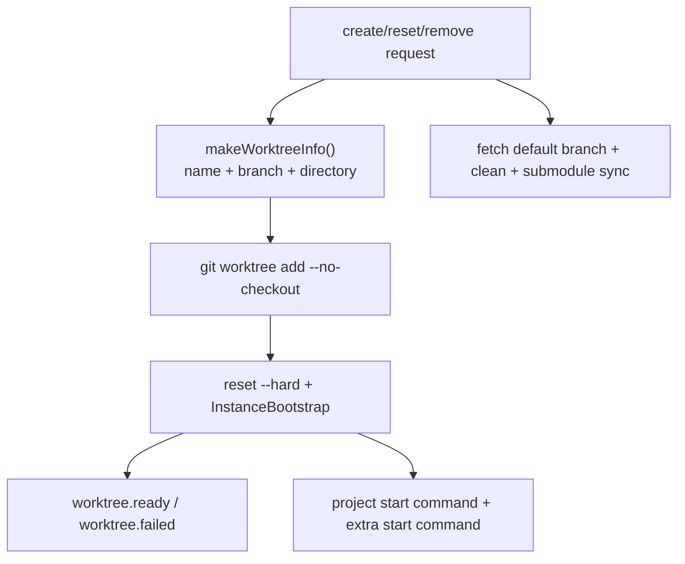
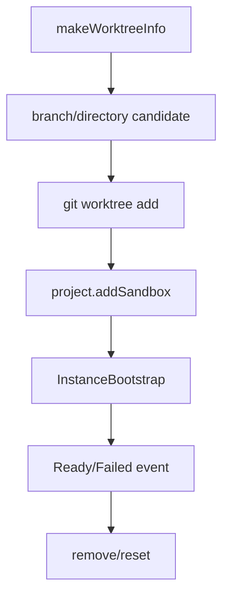

# 26장: Worktree와 프로젝트 격리

> **포지셔닝**: 이 장은 OpenCode가 git worktree를 단순 편의 기능이 아니라, 별도 디렉터리, 별도 브랜치, 별도 부트스트랩, 별도 이벤트를 가진 격리 서비스로 다루는 방식을 해부한다. 대상 독자: 하나의 저장소에서 병렬 작업, 실험 분기, 에이전트 격리를 안전하게 제공하려는 빌더.

## 왜 중요한가

에이전트가 실전에 들어가면 격리 문제는 빨리 터진다. 같은 저장소에서 여러 작업을 병렬로 수행하면 변경이 충돌하고, 장기 세션은 기준 브랜치에서 멀어지고, 복구와 정리가 귀찮아진다. 브랜치만으로는 충분하지 않을 때가 많다. 실제 파일 시스템 수준의 격리가 필요하다.

OpenCode는 이 문제를 `git worktree`로 해결한다. 중요한 점은 worktree를 셸 스크립트 몇 줄로 감싸지 않는다는 것이다. 이름 생성, 브랜치 충돌 회피, 부트스트랩, start command 실행, remove/reset 정리, ready/failed 이벤트까지 전부 하나의 서비스 안에 둔다.

## 소스 앵커

- `packages/opencode/src/worktree/index.ts`
- `packages/opencode/src/control-plane/adaptors/worktree.ts`
- `packages/opencode/src/project/bootstrap.ts`
- `packages/opencode/src/project/instance.ts`
- `packages/opencode/src/project/project.sql.ts`
- `packages/opencode/src/git/index.ts`
- `packages/opencode/src/cli/cmd/tui/component/dialog-workspace-create.tsx`

## 격리 흐름

핵심은 create가 단순 디렉터리 생성이 아니라는 점이다. 새 worktree는 생성되자마자 bootstrap과 이벤트 흐름 안으로 들어온다.

## 핵심 메커니즘

### worktree는 util이 아니라 정식 서비스다

`packages/opencode/src/worktree/index.ts`는 `makeWorktreeInfo`, `createFromInfo`, `create`, `remove`, `reset`을 한 서비스로 노출한다. 에러 타입도 `NotGitError`, `CreateFailedError`, `StartCommandFailedError`, `RemoveFailedError`, `ResetFailedError`처럼 명시적으로 나뉜다. 버스 이벤트도 `worktree.ready`, `worktree.failed`가 따로 있다.

이 구조는 중요하다. 격리는 내부 유틸이 아니라 UI, control plane, 상위 orchestration이 직접 소비하는 제품 기능이기 때문이다.

### 이름 생성의 핵심은 디렉터리보다 브랜치 충돌 회피다

`makeWorktreeInfo(...)`와 내부 `candidate(...)` 흐름은 이 기능의 현실을 잘 보여 준다. 이름은 단순 슬러그가 아니다.

- `slugify(...)`로 기본 이름 정규화
- `Global.Path.data/worktree/<project.id>/...` 아래 디렉터리 후보 생성
- `refs/heads/opencode/<name>` 브랜치 존재 여부 검사
- 충돌 시 `Slug.create()`를 붙여 재시도
- 최대 `MAX_NAME_ATTEMPTS = 26`

이 설계에서 중요한 것은 충돌을 디렉터리 수준에서만 보지 않는다는 점이다. worktree는 결국 브랜치와 디렉터리의 결합물이므로 둘 다 충돌 검사해야 한다. 격리 기능의 실제 품질은 이런 지루한 충돌 회피에서 나온다.

### 생성 직후 바로 부트스트랩한다

`setup(info)`는 `git worktree add --no-checkout -b <branch> <directory>`로 새 worktree를 만든 뒤, `project.addSandbox(...)`로 프로젝트의 sandbox 경로에 등록한다. 하지만 진짜 중요한 부분은 `boot(info, startCommand?)`다.

이 함수는 다음을 수행한다.

1. 새 디렉터리에서 `git reset --hard`로 worktree를 채운다.
2. `Instance.provide(...)`와 `BootstrapRuntime.runPromise(InstanceBootstrap)`로 새 인스턴스를 부트스트랩한다.
3. 성공하면 `worktree.ready` 이벤트를 발행한다.
4. 실패하면 `worktree.failed` 이벤트를 발행한다.
5. 마지막으로 프로젝트 start command와 추가 start command를 실행한다.

즉 worktree는 "git이 디렉터리를 하나 더 만든 상태"가 아니라, OpenCode가 이해하는 새 작업 공간으로 즉시 승격된다.

### start command까지 포함하는 이유는 worktree를 제품 기능으로 보기 때문이다

`CreateInput`에 `startCommand`가 있고, `runStartScripts(...)`는 DB의 `ProjectTable`에서 프로젝트의 기본 `commands.start`를 읽어 추가 명령과 함께 실행한다. 이건 매우 실전적인 설계다. 새 worktree가 생겼다고 끝나는 프로젝트는 많지 않다. 개발 서버, 초기 설치, 코드 생성기 같은 후속 준비가 붙는다.

OpenCode는 이를 사용자가 따로 기억할 셸 의식으로 남기지 않고, 격리 기능 안에 포함시킨다.

### remove는 파일 삭제보다 "stale state 정리"에 가깝다

`remove(...)`를 보면 일이 훨씬 많다.

- `git worktree list --porcelain` 파싱
- canonical path 비교
- `fsmonitor--daemon stop`
- `git worktree remove --force`
- 남은 stale entry 재확인
- 디렉터리 제거
- 관련 브랜치 `git branch -D`

`failedRemoves(...)`나 `cleanDirectory(...)`가 따로 있는 이유도 여기에 있다. 격리 기능은 생성보다 정리 UX가 더 어렵다. 사용자가 가장 싫어하는 worktree는 "잘 만들어지지만 깨끗하게 지워지지 않는 worktree"다.

### reset은 단순 hard reset이 아니라 기준 브랜치 재동기화 절차다

`reset(...)`은 더 인상적이다. 이 함수는 단순히 `git reset --hard` 한 번으로 끝나지 않는다.

- primary workspace는 reset 금지
- 현재 project의 default branch 계산
- 필요하면 remote/branch fetch
- 대상 worktree를 기준 ref로 hard reset
- `git clean -ffdx`와 `failedRemoves(...)` 기반 재시도
- submodule update/reset/clean
- 최종 `git status --porcelain=v1` 검증
- 이후 start scripts를 다시 실행

이 흐름은 중요한 교훈을 준다. 격리 기능의 핵심은 "새 공간 만들기"보다 "기준 상태로 안전하게 되돌리기"다. 실전에서는 reset이 create만큼 자주 쓰인다.

### 이벤트가 있다는 것은 UI와 제어면이 이 기능을 직접 소비한다는 뜻이다

`GlobalBus.emit(...)`로 `worktree.ready`와 `worktree.failed`를 보내는 부분은 이 장의 핵심 단서다. worktree는 내부 상태만 바꾸고 끝나지 않는다. 상위 제품 표면이 이를 보고 진행 상황과 실패를 표현할 수 있어야 한다.

즉 OpenCode의 worktree는 git wrapper가 아니라 운영 이벤트를 가진 제품 서브시스템이다.

## workspace와 worktree는 같은 말이 아니다

18장에서 본 workspace와 이 장의 worktree는 자주 함께 등장하지만 다른 문제를 푼다.

| 개념 | 중심 문제 |
| --- | --- |
| worktree | git 브랜치와 파일 시스템 격리 |
| workspace | 세션 연결, 제어면, 복구, 제품 차원의 작업 공간 이동 |

OpenCode가 둘을 분리한 것은 좋은 선택이다. 로컬 격리 전략과 제품 차원의 작업 공간 전략은 진화 속도가 다르기 때문이다.

## 트레이드오프

- 장점: 병렬 작업을 실제 디렉터리 수준에서 안전하게 분리할 수 있다.
- 장점: 생성뿐 아니라 bootstrap, ready/failed 이벤트, start command까지 포함해 제품 기능이 된다.
- 장점: reset이 기준 브랜치 재동기화 절차로 설계되어 장기 세션 정리에 강하다.
- 단점: git 의존성이 강하며, 비-git 프로젝트에는 그대로 확장되지 않는다.
- 단점: remove/reset 코드가 길어지고 OS/filesystem 예외를 많이 떠안게 된다.

## 빌더에게 남는 것

- 병렬 작업 지원을 진지하게 하려면 브랜치보다 강한 격리 단위가 필요하다.
- 격리 기능의 품질은 create보다 remove/reset 경로에서 판가름 난다.
- 새 작업 공간은 디렉터리 생성만으로 끝나지 않는다. bootstrap과 이벤트와 후속 start task까지 연결해야 제품 기능이 된다.
- git 특화 capability라면 억지로 일반화하지 말고 전제 조건을 드러내는 편이 낫다.

다음 장에서는 같은 작업 공간 안에서 더 세밀한 상태 보존을 담당하는 snapshot 계층을 본다.

<!-- opencode-book-expansion -->
## 소스 그라운딩 확장

### 참조 강좌에서 가져올 렌즈

Claude의 멀티 에이전트 격리 관점은 OpenCode에서 git worktree service로 구체화된다. worktree는 편의 기능이 아니라 병렬 작업과 복구 가능한 상태의 기반이다.

이 관점은 Claude 하니스의 구현을 그대로 복사하자는 뜻이 아니다. 같은 시스템 질문을 OpenCode 소스에 던지고, 다른 답이 나오는 지점을 분명히 하자는 뜻이다. 따라서 아래 흐름은 OpenCode의 실제 파일, 서비스, 상태 객체를 기준으로 다시 세운 읽기 지도다.

### 실제 OpenCode 흐름

### 확인해야 할 소스

- `packages/opencode/src/worktree/index.ts`
- `packages/opencode/src/project/project.ts`
- `packages/opencode/src/project/vcs.ts`
- `packages/opencode/src/git/index.ts`
- `packages/app/src/utils/worktree.ts`

### 구현에서 읽어야 할 메커니즘

- candidate는 directory 존재와 refs/heads/opencode branch 충돌을 모두 확인한다.
- 새 worktree는 reset --hard 후 InstanceBootstrap을 거쳐 core service가 준비된 runtime이 된다.
- reset은 primary workspace를 보호하고 fetch, hard reset, clean, submodule update, status check를 수행한다.

### 실패 모드와 설계 압력

- 디렉터리 복사로 격리하면 git branch와 submodule 상태를 통제하기 어렵다.
- 생성 후 bootstrap하지 않으면 UI가 준비된 workspace를 구분할 수 없다.
- primary workspace reset을 허용하면 사용자 작업이 날아갈 수 있다.

### 빌더에게 남는 질문

- 격리를 branch, directory, runtime bootstrap까지 포함해 설계했는가?
- worktree lifecycle event가 UI에 전달되는가?
- reset/remove가 stale state를 정리하는가?

이 장의 핵심은 파일 이름을 외우는 것이 아니라 경계를 읽는 것이다. 어떤 상태가 어느 계층에서 만들어지고, 어떤 계약을 통과하며, 실패했을 때 어디서 관측되는지까지 따라가야 실제 하니스 설계로 옮길 수 있다.
