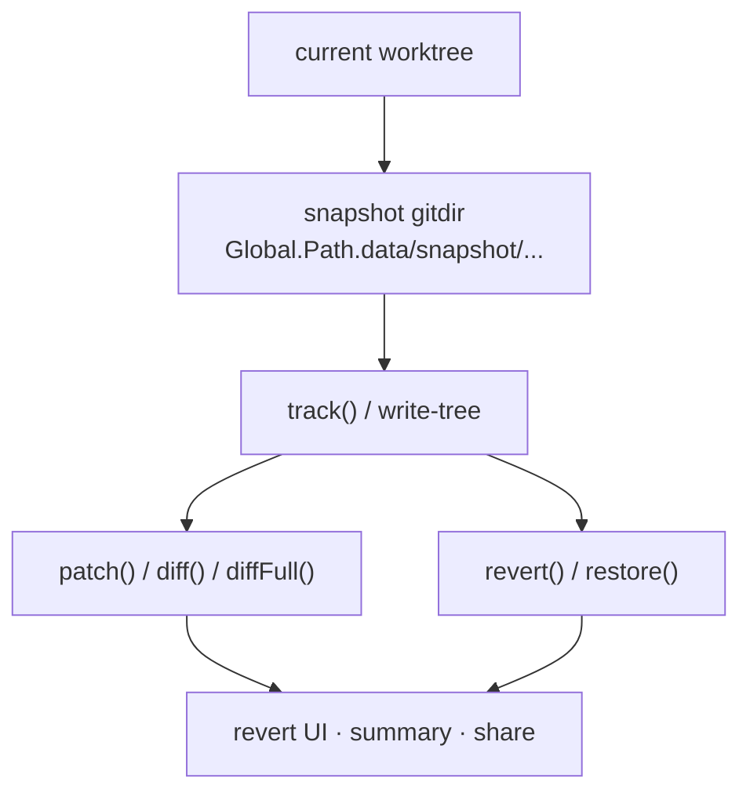
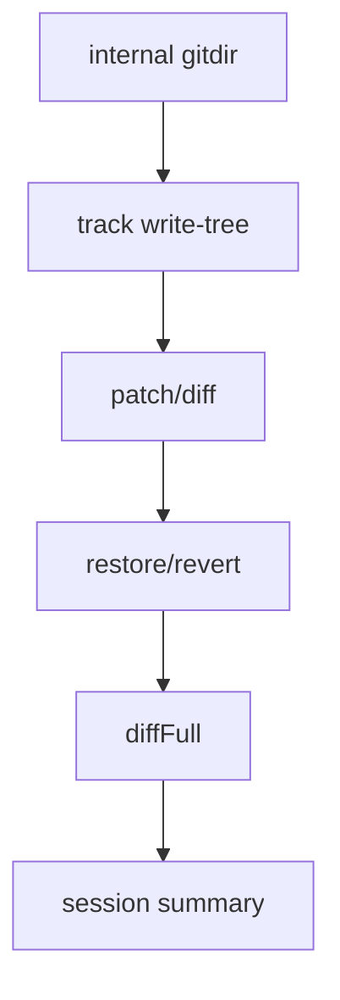

# 27장: Snapshot과 재현 가능한 상태

> **포지셔닝**: 이 장은 OpenCode snapshot 서비스가 원본 저장소 바깥에 별도 gitdir를 만들고, 그 위에서 track, patch, diff, revert, restore를 제공하는 방식을 해부한다. 대상 독자: 에이전트가 바꾼 파일 상태를 재현 가능하게 저장하고, 되돌리고, 제품 기능으로 재사용하려는 빌더.

## 왜 중요한가

에이전트가 파일을 수정하기 시작하면 사용자는 세 가지를 원한다. 무엇이 바뀌었는지 알고 싶고, 필요하면 되돌리고 싶고, 그 변경을 공유하거나 요약에 재사용하고 싶다. 이 요구를 단순한 patch 문자열만으로 오래 감당하기는 어렵다. 변경 전후 상태를 일관되게 저장하는 별도 계층이 필요하다.

OpenCode는 이 문제를 자체 데이터베이스나 custom diff 포맷으로 풀지 않는다. 대신 git를 상태 엔진으로 재배치한다. 원본 저장소와는 분리된 별도 `gitdir`를 만들어 현재 worktree를 추적하고, 그 위에 `track`, `patch`, `restore`, `revert`, `diffFull`을 쌓는다. 이 선택이 좋은 이유는 git의 강점을 가져오면서도 원본 저장소의 history를 더럽히지 않기 때문이다.

## 소스 앵커

- `packages/opencode/src/snapshot/index.ts`
- `packages/opencode/src/session/revert.ts`
- `packages/opencode/src/session/summary.ts`
- `packages/opencode/src/server/routes/instance/session.ts`
- `packages/opencode/src/share/index.ts`
- `packages/opencode/src/global/index.ts`

## 상태 보존 흐름

중요한 점은 snapshot이 보조 캐시가 아니라는 것이다. revert와 diff와 summary가 모두 이 계층 위에 선다.

## 핵심 메커니즘

### snapshot은 원본 저장소와 분리된 gitdir를 가진다

`packages/opencode/src/snapshot/index.ts`의 `InstanceState.make(...)`를 보면 상태는 대략 이렇게 구성된다.

- `directory`: 현재 작업 디렉터리
- `worktree`: 실제 프로젝트 worktree
- `gitdir`: `Global.Path.data/snapshot/<project.id>/<Hash.fast(worktree)>`
- `vcs`: 프로젝트의 VCS 종류

그리고 모든 git 명령은 `--git-dir <snapshot.gitdir> --work-tree <state.worktree>` 조합으로 실행된다.

이 구조의 장점은 매우 크다.

- 원본 저장소의 커밋 그래프를 건드리지 않는다.
- git의 add/diff/checkout/read-tree 능력을 그대로 쓴다.
- project별, worktree별 snapshot 상태를 분리할 수 있다.

즉 OpenCode는 "별도 상태 저장소를 설계한다"보다 "git를 다른 자리에 심는다"를 택한다.

### 동시성 제어가 서비스 안에 내장돼 있다

코드 초반의 `locks: Map<string, Semaphore>`와 `locked(...)`는 snapshot이 보기보다 훨씬 운영적인 기능임을 보여 준다. 같은 worktree에 대해 동시에 `track`, `diff`, `revert`, `restore`가 겹칠 수 있기 때문이다. 세션 요약, 공유, 되돌리기 UI가 동시에 붙으면 race condition이 생기기 쉽다.

OpenCode는 이를 기능별 잠금이 아니라 `gitdir` 단위 잠금으로 해결한다. 상태 저장소가 있으면 결국 serialize해야 하는 순간이 온다. 이 사실을 코드에 드러내는 편이 낫다.

### `track()`은 그냥 저장이 아니라 snapshot 저장소 초기화와 staged view 갱신이다

`track()`은 snapshot 서비스의 중심이다.

1. snapshot 기능이 켜져 있는지 확인
2. `gitdir`가 없으면 `git init`으로 별도 저장소 초기화
3. `core.autocrlf`, `core.longpaths`, `core.symlinks`, `core.fsmonitor` 같은 git 설정 조정
4. `add()`로 현재 worktree 상태를 staged view로 반영
5. `write-tree`로 tree hash 생성

여기서 핵심은 커밋을 만드는 것이 아니라 tree hash를 만드는 점이다. OpenCode가 필요한 것은 사용자 저장소의 또 다른 history가 아니라, 특정 시점의 재현 가능한 파일 상태다.

### `add()`는 실제로는 ignore, size limit, exclude 동기화가 얽힌 복합 절차다

이 장에서 가장 과소평가되기 쉬운 부분이 `add()`다. 이 함수는 단순히 `git add -A`를 하지 않는다.

- 원본 저장소 기준 tracked/untracked 파일 수집
- `check-ignore --no-index`로 정확한 ignore 판정
- 새롭게 ignored된 파일은 snapshot index에서 `rm --cached`
- 큰 파일은 제외 집합에 넣고 `info/exclude` 동기화
- 허용된 파일만 stage

특히 `limit = 2 * 1024 * 1024`와 `sync(...)`는 중요한 운영 디테일이다. snapshot 기능은 만들기는 쉬워도, 시간이 지나면 저장공간과 성능 문제로 되돌아온다. OpenCode는 이 문제를 초기에라도 반영해 둔다.

### `patch()`와 `diff()`는 "사용자에게 보여 줄 변화"를 만든다

`patch(hash)`는 특정 snapshot 이후 바뀐 파일 목록을 계산하되, ignored file removal 같은 내부 정리는 다시 숨긴다. `diff(hash)`는 현재 staged 변화의 unified diff를 돌려준다.

즉 snapshot 계층은 단순 내부 bookkeeping이 아니다. 사용자에게 보여 줄 patch와 diff를 가공하는 표현층이기도 하다. 내부 저장소의 진실과 사용자에게 보여 줄 변경 설명이 완전히 같지 않을 수 있다는 점을 코드가 이미 인정하고 있다.

### `restore()`는 저장소 전체 복원, `revert()`는 파일 단위 되감기다

이 둘의 차이를 분리한 점이 좋다.

- `restore(snapshot)`은 `read-tree`와 `checkout-index -a -f`로 worktree 전체를 특정 tree 상태로 복원한다.
- `revert(patches)`는 patch 목록에 들어 있던 파일만 골라 되감는다.

`revert()`의 구현은 특히 실전적이다.

- 여러 patch에서 파일 목록을 모으고 중복 제거
- 같은 경로/상하위 경로 충돌 여부 검사
- 안전한 파일 묶음만 batched checkout
- 실패 시 single-file revert로 폴백
- snapshot에 없던 파일이면 삭제

즉 OpenCode는 revert를 단순 `git checkout <hash> -- <file>` 반복문으로 끝내지 않는다. 배치 최적화와 경로 충돌 회피와 폴백이 모두 들어 있다.

### `diffFull()`은 사람 친화적 비교 결과를 만들기 위한 별도 공정이다

`diffFull(from, to)`는 단순 diff 문자열이 아니라 `FileDiff[]`를 만든다. 코드에서 보이는 핵심은 다음과 같다.

- 변경 행(row)을 먼저 계산
- 가능하면 `git cat-file --batch`로 before/after 내용을 일괄 로드
- 실패하면 파일별 `git show`로 폴백
- 이후 patch/additions/deletions/status를 구성

이 흐름이 중요한 이유는 제품 기능이 종종 "원시 diff 문자열"보다 "파일별 변경 레코드"를 원하기 때문이다. share, session UI, revert 설명은 보통 후자가 더 쓰기 쉽다.

### `cleanup()`과 `prune`은 상태 기능이 오래 버티게 하는 최소 장치다

`cleanup()`은 `git gc --prune=7.days`를 호출한다. 이 한 줄은 사소해 보이지만 중요하다. 상태 보존 기능을 만들 때 많은 시스템이 저장은 잘하지만 수명 주기를 설계하지 않는다. 그러면 디스크 사용량이 계속 커지고, 어느 순간 기능 자체가 꺼져야 한다.

OpenCode는 완벽하진 않아도, snapshot을 쌓는 기능이 아니라 관리되는 기능으로 보려 한다.

## 제품 기능과의 연결

이 계층이 진짜 중요한 이유는 여러 상위 기능이 여기에 기대기 때문이다.

- `session/revert.ts`는 snapshot을 undo 엔진처럼 쓴다.
- `session/summary.ts`는 변경 설명과 세션 요약을 만들 때 snapshot diff를 활용한다.
- 서버 라우트와 공유 계층은 이 변경 레코드를 UI나 동기화 표현으로 다시 쓸 수 있다.

즉 snapshot은 "있으면 좋은 디버그 기능"이 아니라, 대화형 코드 수정의 가역성과 설명 가능성을 떠받치는 기반이다.

## 트레이드오프

- 장점: 원본 저장소를 더럽히지 않고도 git의 상태 관리 능력을 재사용할 수 있다.
- 장점: revert, summary, share 같은 여러 기능이 같은 상태 기반을 재사용한다.
- 장점: semaphore, exclude, gc 같은 운영 장치가 포함되어 장기 사용에 더 강하다.
- 단점: 별도 gitdir와 staged view를 관리해야 하므로 구현이 복잡해진다.
- 단점: 상태 저장소와 사용자 저장소의 차이를 항상 조율해야 한다.

## 빌더에게 남는 것

- 상태 보존 기능은 원본 저장소와 분리하는 편이 훨씬 안전하다.
- snapshot은 diff 유틸이 아니라 undo와 설명 가능성을 위한 기반 계층으로 보는 편이 맞다.
- 대규모 파일, ignore, 동시성, GC를 초기에 고려하지 않으면 snapshot 기능은 오래 가지 못한다.
- 전체 복원과 파일 단위 되감기는 의미론이 다르므로 분리하는 편이 낫다.

다음 장에서는 provider 계층의 마지막 핵심, 즉 모델별 메시지와 옵션 차이를 어디에 가두는지 본다.

<!-- opencode-book-expansion -->
## 소스 그라운딩 확장

### 참조 강좌에서 가져올 렌즈

Claude 책의 파일 상태 보존 관점은 OpenCode에서 별도 gitdir snapshot으로 구현된다. 사용자 repository history를 더럽히지 않고도 작업 전후를 비교하고 되돌린다.

이 관점은 Claude 하니스의 구현을 그대로 복사하자는 뜻이 아니다. 같은 시스템 질문을 OpenCode 소스에 던지고, 다른 답이 나오는 지점을 분명히 하자는 뜻이다. 따라서 아래 흐름은 OpenCode의 실제 파일, 서비스, 상태 객체를 기준으로 다시 세운 읽기 지도다.

### 실제 OpenCode 흐름

### 확인해야 할 소스

- `packages/opencode/src/snapshot/index.ts`
- `packages/opencode/src/session/summary.ts`
- `packages/opencode/src/session/revert.ts`
- `packages/opencode/src/tool/edit.ts`
- `packages/opencode/test/snapshot/snapshot.test.ts`

### 구현에서 읽어야 할 메커니즘

- Global.Path.data 아래 project/worktree별 별도 gitdir를 만들고 worktree를 실제 작업 디렉터리로 둔다.
- Semaphore lock으로 snapshot git 작업을 serialize한다.
- check-ignore와 size limit으로 snapshot에 넣지 않을 파일을 관리한다.
- revert는 snapshot에 없던 파일을 삭제하고 있던 파일은 checkout한다.

### 실패 모드와 설계 압력

- 원본 git index를 snapshot으로 쓰면 사용자 작업 상태가 오염된다.
- 동시 tool call 중 lock이 없으면 diff와 revert 기준이 흔들린다.
- 큰 파일을 무조건 snapshot하면 성능과 저장소가 악화된다.

### 빌더에게 남는 질문

- 사용자 repo와 분리된 snapshot store가 있는가?
- snapshot 작업이 lock으로 보호되는가?
- ignore와 size limit을 상태 보존 정책에 넣었는가?

이 장의 핵심은 파일 이름을 외우는 것이 아니라 경계를 읽는 것이다. 어떤 상태가 어느 계층에서 만들어지고, 어떤 계약을 통과하며, 실패했을 때 어디서 관측되는지까지 따라가야 실제 하니스 설계로 옮길 수 있다.
