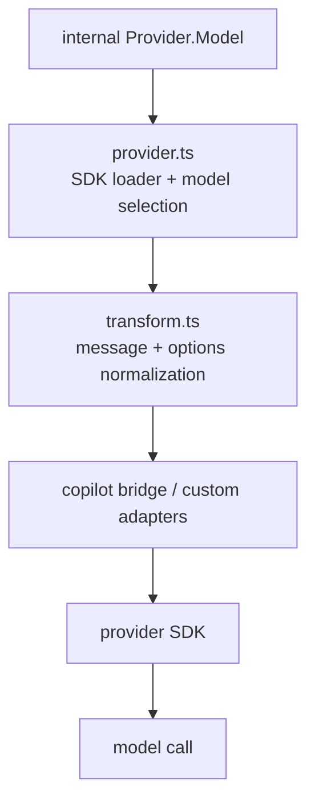
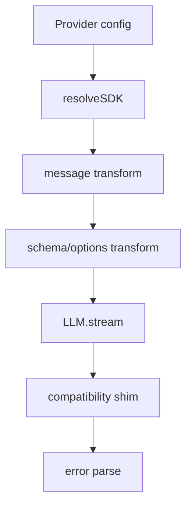

# 28장: Provider SDK bridge와 변환 계층

> **포지셔닝**: 이 장은 OpenCode의 multi-provider 구조를 "공통 인터페이스 하나"로 미화하지 않고, provider SDK 로더와 transform 계층과 Copilot 전용 bridge가 어떻게 분업하는지 해부한다. 대상 독자: 여러 모델 공급자를 한 런타임 아래서 운영하면서도 예외를 상위 계층에 흩뿌리고 싶지 않은 빌더.

## 왜 중요한가

multi-provider 지원의 어려움은 인증 폼에 있지 않다. 진짜 문제는 더 아래에 있다. 같은 모델 호출이라도 provider마다 메시지 제약이 다르고, 지원 modality가 다르고, cache key 이름이 다르고, reasoning effort 표기가 다르고, SDK가 기대하는 `providerOptions` 키까지 다르다. 이 차이를 억지 공통분모로 덮으면 기능이 약해지고, 차이를 상위 계층에 퍼뜨리면 런타임 전체가 provider별 분기로 찢어진다.

OpenCode는 이 문제를 두 층으로 푼다.

1. `provider/provider.ts`: 어떤 SDK를 어떻게 로드하고 어떤 모델 객체를 얻을지 결정
2. `provider/transform.ts`: 메시지, 옵션, 스키마, providerOptions를 각 SDK가 먹을 수 있는 형태로 정규화

그리고 Copilot처럼 예외가 큰 공급자는 다시 `provider/sdk/copilot/*` 아래 별도 bridge에 가둔다. 이것이 이 장의 핵심이다.

## 소스 앵커

- `packages/opencode/src/provider/provider.ts`
- `packages/opencode/src/provider/transform.ts`
- `packages/opencode/src/provider/models.ts`
- `packages/opencode/src/provider/schema.ts`
- `packages/opencode/src/provider/sdk/copilot/index.ts`
- `packages/opencode/src/provider/sdk/copilot/copilot-provider.ts`
- `packages/opencode/src/provider/sdk/copilot/chat/openai-compatible-chat-language-model.ts`
- `packages/opencode/src/provider/sdk/copilot/responses/openai-responses-language-model.ts`

## 계층 분해

이 구조에서 중요한 것은 예외가 없다는 환상을 버리는 일이다. OpenCode는 차이를 인정하되, 차이가 새는 위치를 제한하려 한다.

## 핵심 메커니즘

### `provider.ts`는 단순 registry가 아니라 동적 SDK 선택기다

`packages/opencode/src/provider/provider.ts`의 `BUNDLED_PROVIDERS`는 이 계층의 첫 번째 성격을 보여 준다. OpenAI, Anthropic, Azure, Vertex, OpenRouter, Copilot 등 공급자별 SDK 팩토리를 동적으로 import한다.

이 파일은 단순히 npm 패키지를 map 하는 데서 끝나지 않는다.

- `shouldUseCopilotResponsesApi(...)`로 Copilot에서 chat/responses API 갈림길 결정
- `wrapSSE(...)`로 SSE read timeout 제어
- `custom(...)` loader로 provider별 auth, autoload, env, baseURL, custom getModel 결정
- `useLanguageModel(...)`로 SDK shape가 `languageModel` 기반인지 chat/responses 분리형인지 판별

즉 `provider.ts`는 "어느 provider가 있나"를 적는 파일이 아니라 "이 provider는 어떤 방식으로 모델 객체를 만들고 어떤 예외를 갖는가"를 한곳에 모으는 파일이다.

### provider별 예외는 공통분모 제거가 아니라 조건부 적응으로 처리한다

`custom(...)` 내부를 보면 설계 방향이 분명하다.

- `openai`, `xai`는 responses API 사용
- `github-copilot`은 모델 ID에 따라 `responses()`와 `chat()`를 갈라 씀
- `azure`는 resource name, completion URL 여부에 따라 다른 코드 경로 사용
- `opencode`는 키 유무에 따라 public/free model만 노출
- `amazon-bedrock`은 region/profile/auth 조합을 별도로 처리

이건 좋은 냄새다. 모든 provider를 하나의 만능 인터페이스로 우겨 넣지 않고, "어디까지 공통화하고 어디서 provider별 적응을 허용할지"를 명시한다.

### `transform.ts`의 핵심은 공통 입력을 여러 단계로 접는 것이다

`message(msgs, model, options)`는 OpenCode provider bridge의 실제 입구다. 이 함수는 바로 SDK 호출로 가지 않고 아래 순서로 메시지를 접는다.

1. `unsupportedParts(...)`
2. `normalizeMessages(...)`
3. 필요 시 `applyCaching(...)`
4. providerOptions key remap

이 순서가 중요한 이유는 문제를 한 덩어리로 처리하지 않기 때문이다.

- 먼저 모델이 지원하지 않는 입력을 걸러 내고
- 그 다음 메시지 배열 모양을 공급자 제약에 맞추고
- 그 다음 캐시 힌트를 주고
- 마지막에 SDK가 기대하는 키 이름으로 바꾼다

좋은 normalization layer는 "한 번에 다 고친다"보다 "문제를 층으로 분해한다"에 가깝다.

### 미지원 modality는 조용히 버리지 않고 오류 텍스트로 승격한다

`unsupportedParts(...)`는 이미지나 파일이 모델 capability에 맞지 않으면 해당 part를 버리지 않고 명시적 오류 텍스트로 바꾼다. 예를 들어 모델이 image/pdf를 지원하지 않으면, 모델에게도 사용자에게도 "이 입력을 읽을 수 없다"는 사실이 전달된다.

이 설계는 매우 중요하다. 멀티모달 입력이 묵묵히 사라지면 시스템은 조용히 거짓말을 하게 된다. OpenCode는 미지원 상황을 no-op가 아니라 표현 가능한 오류 상태로 바꾼다.

### `normalizeMessages(...)`는 provider 제약을 실제 메시지 배열까지 내려가 해결한다

`normalizeMessages(...)`가 처리하는 내용은 생각보다 많다.

- Anthropic/Bedrock의 empty content 제거
- Claude 계열의 `toolCallId` scrub
- Anthropic의 `tool_use` 뒤에 text가 오면 메시지를 둘로 쪼개 재정렬
- Mistral 계열의 짧은 toolCallId 생성과 user-after-tool 시퀀스 보정
- reasoning part를 interleaved field로 옮기는 provider별 처리

이것이 중요한 이유는 provider 차이가 옵션 한두 개로 끝나지 않기 때문이다. 어떤 제약은 메시지 배열 shape 자체를 바꿔야만 해결된다. OpenCode는 그 수선을 transform 계층으로 밀어 넣는다.

### 캐싱과 reasoning도 provider마다 다른 문법을 가진다

`applyCaching(...)`, `variants(...)`, `options(...)`, `smallOptions(...)`는 "temperature/topP만 바꾸면 된다"는 환상을 깨 준다.

- Anthropic/OpenRouter/Bedrock/Alibaba는 서로 다른 cache hint 문법 사용
- GPT-5 계열은 `reasoningEffort`, `reasoningSummary`, `textVerbosity`를 상황별로 조정
- Gemini는 `thinkingConfig`
- OpenRouter/Gateway는 별도의 reasoning shape
- Kimi/Alibaba-cn은 `enable_thinking`이나 budget token 류의 별도 옵션 필요

이 말은 곧 multi-provider 추상화가 공통분모만 제공해서는 실전 품질이 나오지 않는다는 뜻이다. provider별 강점을 살리려면 결국 option transform 층이 두꺼워질 수밖에 없다.

### `providerOptions()`는 라우팅 규칙까지 담당한다

`providerOptions(model, options)`는 SDK마다 서로 다른 namespacing 규칙을 맞춘다.

- Gateway는 `gateway`와 upstream slug를 분리
- Azure는 `openai`와 `azure` 양쪽 키에 동시에 싣는다
- 나머지는 `sdkKey(...)` 혹은 `providerID` 아래로 내려 보낸다

이 설계는 중요하다. 상위 계층이 "이 provider는 key를 어디에 넣더라"를 알기 시작하면 추상화가 무너진다. key routing은 transform 계층이 끝까지 떠안아야 한다.

### Copilot은 예외가 크기 때문에 아예 별도 bridge 폴더로 격리한다

`packages/opencode/src/provider/sdk/copilot/*`를 보면 OpenCode가 예외를 퍼뜨리지 않으려는 의지가 더 선명하다.

- `chat/*`는 OpenAI-compatible chat language model 적응
- `responses/*`는 Responses API 적응
- finish reason mapping, tool preparation, metadata extraction도 분리

그리고 `provider.ts`의 `github-copilot` loader는 모델 ID에 따라 `responses(modelID)` 혹은 `chat(modelID)`를 고른다. 즉 Copilot은 provider 목록의 한 항목이지만, 내부적으로는 사실상 자체 bridge를 가진 별도 세계다.

이게 좋은 이유는 명확하다. 예외가 불가피하면 예외를 한곳에 몰아야 한다. 상위 서비스에 얇게 흩뿌리면 나중에는 모든 호출부가 Copilot 사정을 알게 된다.

## 이 장의 핵심 논지

OpenCode가 하는 일은 provider 차이를 없애는 것이 아니다. 없앨 수 없는 차이를 상위 계층이 덜 알게 만드는 것이다. 이 차이는 크다.

- 나쁜 추상화: 공통분모만 남겨 기능을 약하게 만든다
- 더 나쁜 추상화: 예외를 상위 계층에 흩뿌린다
- OpenCode의 선택: transform/bridge 계층을 두껍게 만들고 상위 세션/도구 계층은 상대적으로 얇게 유지한다

이 선택은 파일 하나가 커지는 대가를 치르지만, 전체 런타임이 provider별 분기로 오염되는 것을 막아 준다.

## 트레이드오프

- 장점: 상위 세션/도구 계층은 provider별 메시지 제약을 직접 알 필요가 없다.
- 장점: provider 고유 기능을 완전히 버리지 않고도 공통 런타임을 유지할 수 있다.
- 장점: Copilot 같은 큰 예외를 별도 bridge로 격리해 누수를 줄인다.
- 단점: `transform.ts`와 `provider.ts`가 빠르게 두꺼워진다.
- 단점: 새 provider를 붙일 때 이해해야 할 규칙이 많다.

## 빌더에게 남는 것

- multi-provider 추상화의 핵심은 auth 화면이 아니라 normalization layer다.
- 공통분모만 남기면 품질이 약해지고, 예외를 흩뿌리면 시스템이 금방 깨진다.
- 메시지 배열 shape, cache key, reasoning 옵션, providerOptions key routing까지 한곳에서 다뤄야 한다.
- 큰 예외는 "provider 하나"로 취급하지 말고 전용 bridge 계층으로 가두는 편이 낫다.

이제 고급 서브시스템 분석을 마친다. 다음 부에서는 이런 구조를 종합해 OpenCode가 어떤 하니스 패턴을 실제로 잘 구현하는지 추출한다.

<!-- opencode-book-expansion -->
## 소스 그라운딩 확장

### 참조 강좌에서 가져올 렌즈

Claude 책의 API 통신 계층 관점은 OpenCode에서 provider bridge와 transform으로 나타난다. provider별 예외는 사라지지 않으므로 한 계층에 가둬야 한다.

이 관점은 Claude 하니스의 구현을 그대로 복사하자는 뜻이 아니다. 같은 시스템 질문을 OpenCode 소스에 던지고, 다른 답이 나오는 지점을 분명히 하자는 뜻이다. 따라서 아래 흐름은 OpenCode의 실제 파일, 서비스, 상태 객체를 기준으로 다시 세운 읽기 지도다.

### 실제 OpenCode 흐름

### 확인해야 할 소스

- `packages/opencode/src/provider/provider.ts`
- `packages/opencode/src/provider/transform.ts`
- `packages/opencode/src/provider/sdk/copilot`
- `packages/opencode/src/session/llm.ts`
- `packages/opencode/src/provider/error.ts`

### 구현에서 읽어야 할 메커니즘

- resolveSDK는 bundled, custom, Copilot, GitLab workflow 같은 SDK 차이를 흡수한다.
- ProviderTransform은 unsupported modality를 조용히 버리지 않고 설명 가능한 텍스트로 바꾼다.
- LLM 계층은 LiteLLM/Bedrock/Copilot proxy tool compatibility 문제를 _noop tool 등으로 처리한다.

### 실패 모드와 설계 압력

- provider 예외가 session loop로 새면 새 provider마다 루프가 복잡해진다.
- unsupported modality를 버리면 답변 품질 저하 원인을 설명할 수 없다.
- tool compatibility shim이 없으면 hidden agent 호출도 특정 proxy에서 실패할 수 있다.

### 빌더에게 남는 질문

- provider bridge와 transform 계층이 분리되어 있는가?
- 지원하지 않는 입력을 설명 가능한 형태로 처리하는가?
- provider 오류를 하니스 오류 타입으로 정규화하는가?

이 장의 핵심은 파일 이름을 외우는 것이 아니라 경계를 읽는 것이다. 어떤 상태가 어느 계층에서 만들어지고, 어떤 계약을 통과하며, 실패했을 때 어디서 관측되는지까지 따라가야 실제 하니스 설계로 옮길 수 있다.
