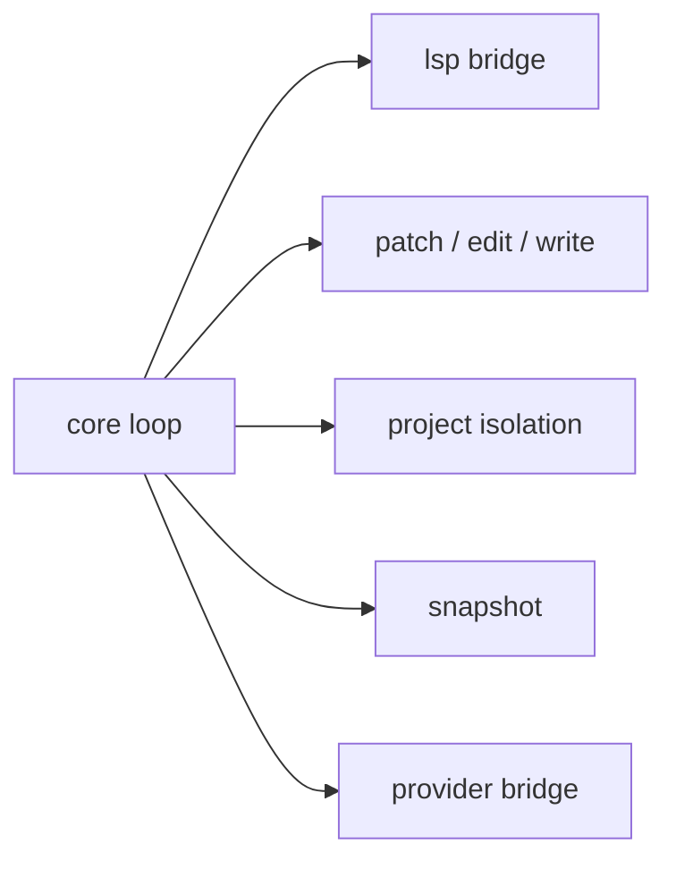

# 제6부: 복잡한 서브시스템을 어디에 가두는가

모든 실전 시스템에는 "없으면 안 되지만, 코어 한복판에 퍼지면 전체를 오염시키는" 서브시스템이 있다. LSP, 파일 수정 의미론, worktree, snapshot, provider bridge가 딱 그런 부류다. 제6부는 OpenCode가 이런 복잡성을 어떤 보조 계층과 전용 의미론으로 감쌌는지 읽는다.

이 파트의 질문은 "복잡성을 없애지 못할 때, 최소한 어디에 가둘 것인가"다. 좋은 시스템은 예외를 없애지 못해도, 예외가 새는 범위를 줄일 수는 있다. OpenCode의 patch parser, provider transform, workspace/worktree 계층은 대체로 그 방향을 택한다.

이 파트를 읽을 때는 다음을 보자.

- 어떤 예외가 별도 브리지나 파서 계층으로 밀려났는가
- 어떤 상태가 재현 가능성과 격리를 위해 독립된 저장 형식을 갖는가
- 파일 수정이 왜 하나의 만능 편집 함수가 아니라 여러 의미론으로 나뉘는가

24장은 코드 인텔리전스를, 25장은 파일 수정 의미론을, 26장은 worktree와 프로젝트 격리를, 27장은 snapshot과 재현 가능한 상태를, 28장은 provider SDK bridge와 변환 계층을 다룬다.

이 파트를 다 읽고 나면 독자는 복잡한 하위 시스템을 "있으면 좋은 기능"이 아니라 "코어가 붕괴하지 않게 하기 위해 따로 가둔 영역"으로 읽게 된다.

<!-- opencode-book-expansion -->
## 확장된 읽기 관점

이 부는 복잡한 예외를 어디에 가두는지 본다. LSP, file mutation, worktree, snapshot, provider transform은 session loop를 더럽히지 않기 위한 격리 계층이다.

### 핵심 소스

- `packages/opencode/src/lsp`
- `packages/opencode/src/tool/edit.ts`
- `packages/opencode/src/worktree`
- `packages/opencode/src/snapshot`
- `packages/opencode/src/provider/transform.ts`
