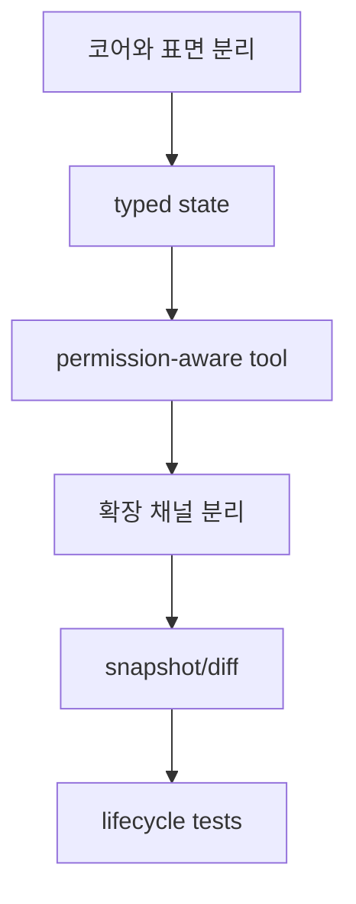

# 29장: OpenCode가 에이전트 하니스로서 잘하는 것

> **포지셔닝**: 이 장은 앞선 분석을 요약하는 대신, OpenCode가 반복적으로 보여 준 강한 설계 습관만 추출한다. 대상 독자: 구현 세부보다 재사용 가능한 하니스 패턴을 얻고 싶은 빌더.

## 왜 요약이 아니라 추출이 필요한가

좋은 해부의 목적은 파일 경로를 외우는 것이 아니다. 어떤 설계가 여러 계층에서 반복되는지 보는 것이다. OpenCode는 모든 부분이 완벽하지는 않지만, 몇 가지 패턴만큼은 아주 일관되게 잘 구현한다. 그 패턴이야말로 다른 시스템으로 옮길 가치가 있다.

## 패턴 1: 코어와 표면을 끝까지 분리한다

`packages/opencode`를 중심에 두고, TUI, 서버 라우트, SDK, 앱, 데스크톱, 문서가 그 위로 올라오는 구조는 이 저장소의 가장 큰 장점이다. 기능을 여러 표면에서 제공하면서도 핵심 로직이 UI 패키지로 새지 않게 막는다.

이 패턴 덕분에 OpenCode는 CLI 프로젝트이면서도 앱, 데스크톱, SDK를 함께 가질 수 있었다.

## 패턴 2: 상태를 텍스트보다 풍부하게 만든다

`message-v2`, `todo`, `status`, `revert`, `snapshot`, `share`, `workspace`를 보면 OpenCode는 작업 상태를 문자열 대화 로그에 억지로 우겨 넣지 않는다. 필요한 상태는 대화 밖으로 승격한다.

이 설계의 결과는 분명하다.

- compaction이 가능해진다
- revert가 가능해진다
- 공유가 live sync에 가까워진다
- UI가 현재 상태를 더 잘 보여 줄 수 있다

즉 좋은 하니스는 "모든 걸 채팅으로 표현"하지 않는다.

## 패턴 3: 유지 기능을 숨은 시스템 에이전트로 분리한다

`title`, `summary`, `compaction`은 메인 assistant에 섞인 helper 함수가 아니다. 각각 별도 agent다. 이 결정은 대단히 중요하다. 보조 기능도 같은 실행 인프라를 재사용하고, model/prompt/retry 규칙을 독립적으로 가질 수 있기 때문이다.

이 패턴은 메인 에이전트를 단순하게 유지하면서도 유지 기능의 품질을 높인다.

## 패턴 4: 확장 채널을 용도별로 나눈다

OpenCode는 확장을 하나의 메커니즘으로 통일하지 않는다.

- 서버 플러그인: 런타임 훅
- TUI 플러그인: UI 확장
- 스킬: 지식 자산
- MCP: 외부 capability 연결
- SDK: 외부 자동화 진입점

이 분리가 매우 중요하다. "확장"이라는 추상 명사 하나로 묶어 버리면 계약이 만능 인터페이스가 되기 쉽다.

## 패턴 5: 안전성을 UX와 함께 설계한다

OpenCode permission 계층은 `deny`만큼이나 `ask`와 `always`를 중요하게 본다. 외부 디렉터리, doom_loop, corrected feedback도 마찬가지다. 이 시스템은 보안 정책 엔진이면서 동시에 사용자가 에이전트와 협상하는 인터페이스다.

좋은 하니스는 안전성을 생산성의 반대말로 두지 않는다. 둘 사이를 조정하는 상태 모델을 만든다.

## 패턴 6: 예외는 예외 전용 계층에 가둔다

provider transform, Copilot bridge, plugin loader, patch parser를 보면 OpenCode는 예외가 생길 때 "상위 계층에도 조금, 여기에도 조금" 흩뿌리기보다 한 곳에 최대한 모아 둔다. 완벽하지는 않지만 방향은 분명하다.

이 습관은 시스템 전체를 단순하게 만들지는 못해도, 복잡성이 새는 범위를 줄인다.

## 안티패턴으로 읽으면 더 잘 보이는 것

OpenCode가 피한 선택을 뒤집어 보면 장점이 더 선명해진다.

- UI 표면마다 코어 로직을 복제하지 않았다.
- 권한 모델을 단순 boolean tool toggle로 끝내지 않았다.
- 파일 수정 도구를 하나의 만능 `editFile`로 뭉개지 않았다.
- 외부 확장을 무조건 plugin 한 종류로 통일하지 않았다.

## 빌더에게 남는 것

- 좋은 하니스는 기능 수보다 경계 품질로 기억된다.
- 대화형 에이전트의 상태는 텍스트 밖으로 많이 나가야 한다.
- 유지 기능, 확장 기능, 안전 기능을 메인 채팅 루프에 다 섞지 않는 편이 좋다.
- OpenCode의 진짜 강점은 혁신적 한 방보다, 여러 문제를 적당히 분리한 실전 감각에 있다.

마지막 장에서는 이 패턴을 따라 자기만의 에이전트 시스템을 설계하는 청사진을 정리한다.

<!-- opencode-book-expansion -->
## 소스 그라운딩 확장

### 참조 강좌에서 가져올 렌즈

이 장은 요약이 아니라 증류다. Claude 하니스와 OpenCode의 구현은 다르지만 프로덕션급 에이전트 시스템이 마주치는 문제는 반복된다. OpenCode의 가치는 그 문제를 경계와 계약으로 나눈 데 있다.

이 관점은 Claude 하니스의 구현을 그대로 복사하자는 뜻이 아니다. 같은 시스템 질문을 OpenCode 소스에 던지고, 다른 답이 나오는 지점을 분명히 하자는 뜻이다. 따라서 아래 흐름은 OpenCode의 실제 파일, 서비스, 상태 객체를 기준으로 다시 세운 읽기 지도다.

### 실제 OpenCode 흐름

### 확인해야 할 소스

- `packages/opencode/src/agent/agent.ts`
- `packages/opencode/src/session/prompt.ts`
- `packages/opencode/src/tool/registry.ts`
- `packages/opencode/src/permission/index.ts`
- `packages/opencode/src/plugin/index.ts`
- `packages/opencode/src/snapshot/index.ts`
- `packages/opencode/test`

### 구현에서 읽어야 할 메커니즘

- core와 surface를 분리해 새 UI를 붙여도 tool/permission/provider 의미론을 다시 검증하지 않는다.
- MessageV2 parts와 snapshot diff는 텍스트 이상의 상태를 제품에 제공한다.
- server plugin, TUI plugin, skill, MCP, workspace adaptor를 분리해 신뢰 경계와 lifecycle을 명확히 한다.

### 실패 모드와 설계 압력

- 하니스 패턴을 UI 컴포넌트 패턴으로 착각하면 중요한 설계가 사라진다.
- OpenCode 결정을 그대로 복사하면 자기 deployment 조건을 놓칠 수 있다.
- 테스트 없는 lifecycle 추상화는 plugin/worktree/snapshot 영역에서 금방 깨진다.

### 빌더에게 남는 질문

- 자기 시스템에서도 core, state, tool, permission, provider, extension을 분리할 수 있는가?
- 상태를 사람이 읽는 텍스트와 기계가 읽는 구조로 모두 남기는가?
- 확장 채널별 실패 영향이 제한되는가?

이 장의 핵심은 파일 이름을 외우는 것이 아니라 경계를 읽는 것이다. 어떤 상태가 어느 계층에서 만들어지고, 어떤 계약을 통과하며, 실패했을 때 어디서 관측되는지까지 따라가야 실제 하니스 설계로 옮길 수 있다.
