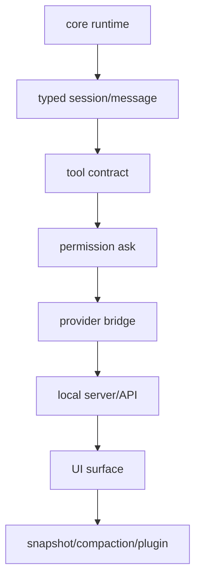

# 30장: OpenCode 패턴으로 나만의 에이전트 설계하기

> **포지셔닝**: 이 장은 OpenCode를 그대로 복제하는 대신, 그 설계 패턴을 가져와 자기 시스템을 설계하는 방법을 제안한다. 대상 독자: 지금까지 읽은 구조를 실제 구현 계획으로 바꾸고 싶은 빌더.

## 출발점: 무엇을 복사하고 무엇을 버릴 것인가

OpenCode 전체를 복제하는 것은 좋은 목표가 아니다. 이 저장소는 이미 제품 표면, provider 예외, 설치 전략, 워크스페이스, 공유 기능까지 가진 큰 시스템이다. 빌더가 가져가야 하는 것은 기능 목록이 아니라 설계 순서다.

즉 "OpenCode처럼 생긴 UI"보다 "OpenCode가 어떤 문제를 어떤 계층으로 밀어 넣었는가"를 복사해야 한다.

## 권장 청사진

### 1단계: 코어 런타임부터 만든다

먼저 필요한 것은 아래 다섯 개다.

1. agent 정의 계층
2. tool 실행 계약
3. session/message 상태 모델
4. prompt 조립기
5. permission 서비스

이 다섯 개가 없으면 나머지는 전부 데모 레이어가 된다.

### 2단계: 제품 표면을 바로 만들지 말고 제어면을 만든다

OpenCode가 server routes와 SDK를 별도 계층으로 둔 이유는 여러 UI를 가질 가능성을 미리 열어 두기 위해서다. 당신의 프로젝트가 CLI 하나로 끝날 것 같아도, 로컬 제어면을 잡아 두면 나중에 UI 추가 비용이 크게 줄어든다.

### 3단계: 상태를 충분히 승격한다

최소한 아래 상태는 대화 텍스트 밖으로 빼는 편이 좋다.

- tool result 메타데이터
- session status
- todo
- revert/snapshot 정보
- permission 승인 상태

이 상태들을 문자열에만 남기면 compaction, revert, share, 운영 UI가 모두 어려워진다.

### 4단계: 확장 채널을 처음부터 나눈다

OpenCode가 보여 준 가장 실용적인 교훈 중 하나는 확장을 하나의 만능 시스템으로 만들지 않는 것이다.

- 코드 훅 확장
- UI 확장
- 지식 자산
- 외부 capability 연결
- 외부 자동화 진입점

이 다섯 축은 가능하면 초기에 분리해 두는 편이 좋다. 나중에 분리하려면 이미 생태계 계약이 굳어 버린 뒤다.

### 5단계: 안전성을 UX 설계로 본다

permission은 마지막에 넣는 보안 체크가 아니라, 처음부터 상호작용 모델에 들어가야 한다. `ask`, `always`, `reject`, 외부 경로 경계, 반복 호출 브레이크 같은 개념은 단순 보안 기능이 아니라 사용자 경험을 만드는 재료다.

### 6단계: 장기적으로는 compaction과 summary가 필요해진다

초기 프로토타입에서는 긴 세션 압축과 숨은 시스템 에이전트를 과하게 느낄 수 있다. 하지만 제품이 길어질수록 결국 제목 생성, 요약, compaction, snapshot, revert 같은 유지 기능이 필요해진다. OpenCode는 이 문제를 꽤 일찍 시스템 계층으로 올렸다. 그 선택은 배울 만하다.

## 최소 구현 버전

만약 지금 당장 작은 하니스를 만든다면, 나는 다음 조합을 권한다.

| 계층 | 최소 버전 |
| --- | --- |
| agent | `build`, `plan` 두 개만 |
| tool | `read`, `grep`, `edit`, `write`, `bash`, `task` |
| session | part 기반 메시지 모델 |
| prompt | 기본 프롬프트 + 모드별 reminder |
| permission | `allow/ask/deny` + `once/always/reject` |
| control plane | 세션 라우트 몇 개 + 간단한 SDK |
| recovery | snapshot 혹은 최소 diff 기록 |

이 정도면 이미 꽤 실전적인 뼈대다.

## 시작부터 피해야 할 안티패턴

- 모든 확장을 하나의 plugin 인터페이스에 우겨 넣는 것
- 모든 상태를 채팅 텍스트에만 남기는 것
- provider별 예외 처리를 상위 세션 계층으로 흩뿌리는 것
- permission을 나중에 붙일 boolean toggle 정도로 생각하는 것
- 파일 수정을 하나의 만능 도구로 처리하는 것

## 마지막 조언

OpenCode를 읽고 나면 종종 "이 프로젝트는 너무 크다"는 인상만 남는다. 그 반응은 절반만 맞다. 실제로 큰 것은 기능 수보다, 기능을 기능답게 유지하기 위해 도입한 경계와 상태들이다. 그래서 가져갈 것은 전체 크기가 아니라, 어떤 문제를 어떤 층으로 보냈는지에 대한 판단이다.

좋은 에이전트 시스템은 결국 이런 질문으로 요약된다.

- 무엇을 텍스트로 남기고 무엇을 상태로 승격할 것인가
- 어떤 예외를 어디에 가둘 것인가
- 어떤 확장 채널을 분리할 것인가
- 어떤 안전 경계를 사용자 경험과 연결할 것인가

OpenCode는 이 질문들에 대한 꽤 실전적인 답안을 갖고 있다. 이 책의 목적은 그 답안을 외우게 하는 것이 아니라, 독자가 자기 코드베이스에서 다시 답하게 만드는 것이었다.

<!-- opencode-book-expansion -->
## 소스 그라운딩 확장

### 참조 강좌에서 가져올 렌즈

마지막 장의 목적은 OpenCode를 축소 복제하는 것이 아니다. OpenCode에서 드러난 순서를 참고해 작은 하니스가 먼저 가져야 할 골격과 나중에 추가할 서브시스템을 구분하는 것이다.

이 관점은 Claude 하니스의 구현을 그대로 복사하자는 뜻이 아니다. 같은 시스템 질문을 OpenCode 소스에 던지고, 다른 답이 나오는 지점을 분명히 하자는 뜻이다. 따라서 아래 흐름은 OpenCode의 실제 파일, 서비스, 상태 객체를 기준으로 다시 세운 읽기 지도다.

### 실제 OpenCode 흐름

### 확인해야 할 소스

- `packages/opencode/src/index.ts`
- `packages/opencode/src/session`
- `packages/opencode/src/tool`
- `packages/opencode/src/permission`
- `packages/opencode/src/provider`
- `packages/opencode/src/server`
- `packages/sdk/js`

### 구현에서 읽어야 할 메커니즘

- 프로젝트 context, config loader, session store, provider registry, tool registry를 먼저 만든다.
- 최소 버전이라도 user text, assistant text, tool call, file attachment, error를 typed part로 저장한다.
- 도구 함수가 바로 파일을 바꾸지 않고 schema validation, permission request, metadata diff, execution result를 가진 contract를 통과한다.
- provider별 예외는 bridge/transform 계층으로 밀고 session loop는 공통 model/tool/message 계약만 본다.

### 실패 모드와 설계 압력

- 처음부터 모든 확장을 만들면 core contract가 굳기 전에 API가 늘어난다.
- permission 없는 MVP는 빠르지만 사용자 신뢰를 회복하기 어렵다.
- provider 하나만 보고 설계하면 두 번째 provider에서 system/tool/schema 차이가 폭발한다.

### 빌더에게 남는 질문

- 작게 시작하되 core/runtime 경계는 처음부터 분명한가?
- 도구와 권한을 나중 일로 미루지 않는가?
- UI보다 API와 event stream을 먼저 안정화할 수 있는가?

이 장의 핵심은 파일 이름을 외우는 것이 아니라 경계를 읽는 것이다. 어떤 상태가 어느 계층에서 만들어지고, 어떤 계약을 통과하며, 실패했을 때 어디서 관측되는지까지 따라가야 실제 하니스 설계로 옮길 수 있다.
