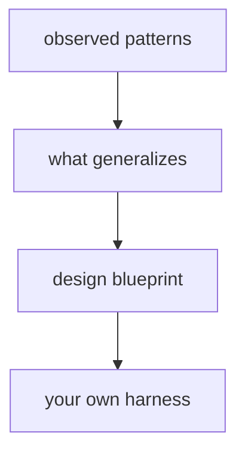

# 제7부: 무엇을 추출해 자기 시스템으로 옮길 것인가

마지막 파트는 요약이 아니다. 앞선 여섯 파트에서 본 것을 다시 정리하되, OpenCode 고유명사를 떼어 내고 재사용 가능한 설계 습관만 추출한다. 이 파트의 목적은 저장소를 잘 안다고 느끼게 하는 것이 아니라, 독자가 자기 시스템을 설계할 때 바로 써먹을 질문과 패턴을 남기는 것이다.

이 파트의 질문은 "OpenCode에서 무엇을 배워 어떤 순서로 옮길 것인가"다. 모든 설계를 그대로 가져갈 필요는 없다. 하지만 경계 설정, 상태 승격, 보조 시스템 에이전트, 확장 채널 분리, 권한을 UX로 다루는 방식은 다른 하니스에도 강하게 전이된다.

이 파트에서 중요하게 볼 것은 아래다.

- OpenCode가 반복적으로 잘한 선택은 무엇인가
- 그 선택은 어떤 문제를 실제로 줄였는가
- 무엇은 그대로 가져가고, 무엇은 상황에 맞게 축소해야 하는가

29장은 OpenCode가 하니스로서 일관되게 잘한 습관만 추출한다. 30장은 그 패턴을 따라 자신의 에이전트 시스템을 설계하는 청사진을 제시한다.

이 파트를 다 읽고 나면 독자는 더 이상 "OpenCode도 이런 기능이 있네" 수준에 머물지 않는다. 대신 "내 시스템은 어디에서 상태를 승격하고, 어디에서 안전성을 협상하고, 어디에서 복잡성을 가둘 것인가"를 직접 묻게 된다.

<!-- opencode-book-expansion -->
## 확장된 읽기 관점

이 부는 저장소 해설을 자기 시스템의 설계 청사진으로 바꾼다. 그대로 복사할 코드는 적어도, 경계와 계약을 나누는 질문은 반복해서 재사용할 수 있다.

### 핵심 소스

- `packages/opencode/src`
- `packages/opencode/test`
- `specs/v2/session.md`
