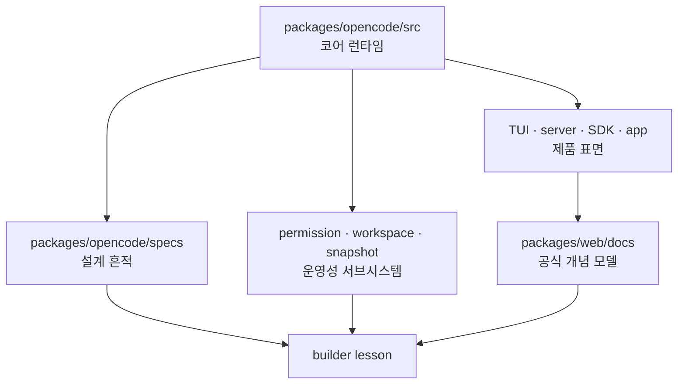
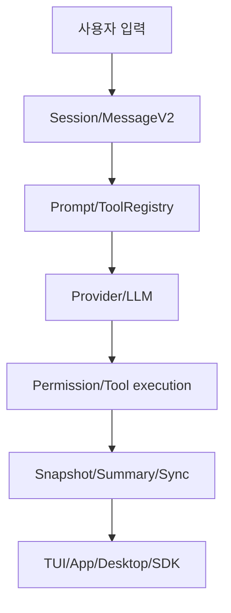

# 서문

이 책은 OpenCode를 "오픈소스 코딩 에이전트"로 소개하려고 쓰인 책이 아니다. 그 정도 설명은 이미 제품 문서나 README에도 있다. 이 책이 붙드는 대상은 그보다 안쪽이다. OpenCode가 어떻게 대화를 작업 상태로 바꾸고, 모델 출력을 실행 경로로 바꾸고, 위험한 행동을 협상 가능한 UX로 바꾸며, 하나의 코어를 여러 표면으로 퍼뜨리고, 다시 그 전체를 확장 가능하고 복구 가능한 시스템으로 묶는지를 보여 주려 한다.

즉 이 책의 진짜 주어는 기능이 아니라 경계다. 어떤 책임이 코어에 남고, 어떤 책임이 표면으로 올라가며, 어떤 예외가 별도 서브시스템으로 격리되고, 어떤 상태가 텍스트 바깥으로 승격되는지를 따라가다 보면 OpenCode는 더 이상 "채팅형 코딩 툴"이 아니라 운영 가능한 에이전트 하니스로 보이기 시작한다.

기준서인 `.../snapshot-dashscope/docs/book-ko`가 보여 준 교훈도 여기에 있다. 좋은 책은 소스 저장소를 요약하지 않는다. 대신 독자가 무엇을 보고 무엇을 버릴지, 어디에서 구현을 읽고 어디에서 설계 논지를 끌어낼지, 어떤 질문으로 코드를 다시 열어야 하는지를 강제한다. 이 책도 그 방식을 따른다.

## 이 책이 증명하려는 것

이 책이 끝날 때 독자에게 남겨야 하는 문장은 하나다.

> OpenCode는 채팅 UI가 아니라, 코딩 에이전트를 운영 가능한 시스템으로 바꾸는 하니스다.

이 주장을 성립시키려면 각 장은 결국 아래 다섯 질문 중 하나에 답해야 한다.

1. 대화를 어떻게 `작업 상태`로 승격하는가
2. 모델 출력을 어떻게 `행동 가능한 실행`으로 바꾸는가
3. 위험한 행동을 어떻게 `통제 가능한 UX`로 바꾸는가
4. 하나의 코어를 어떻게 `여러 제품 표면`으로 펼치는가
5. 시스템을 어떻게 `확장 가능하고 복구 가능하게` 유지하는가

어떤 장이 이 질문들 중 아무 데도 걸리지 않는다면, 그 장은 아직 책의 일부가 아니다. 단순 기능 소개거나, 저장소 안내문이거나, 사실 목록일 뿐이다.

## 이 책의 판정 기준

그래서 이 책은 OpenCode를 아래 기준으로 평가한다.

- 기능이 많으냐보다, 경계가 선명하냐
- 채팅이 자연스럽냐보다, 상태 모델이 풍부하냐
- 도구가 많으냐보다, 실행 계약이 분리되어 있느냐
- 확장 포인트가 있느냐보다, 용도별 채널이 구분되어 있느냐
- 보안 장치가 있느냐보다, 사용자가 협상 가능한 UX가 설계되어 있느냐

이 기준은 엄격하다. 어떤 장에서는 OpenCode의 좋은 분리를 칭찬하겠지만, 어떤 장에서는 무거운 서비스 파일, 두꺼운 orchestration 계층, provider 예외 처리, 표면 간 중복 책임도 드러날 것이다. 이 책은 홍보물이 아니라 해부 기록이어야 하므로, 장점과 부채를 함께 적는다.

## 책의 읽기 계약

이 책은 모든 장을 거의 같은 리듬으로 구성한다.

1. **포지셔닝**: 이 장이 어떤 시스템 문제를 다루는지 먼저 못 박는다.
2. **왜 중요한가**: 기능 설명이 아니라 운영 비용과 실패 비용으로 문제를 설명한다.
3. **소스 앵커**: 반드시 다시 열어 볼 파일과 타입을 지정한다.
4. **구조도 혹은 흐름도**: 계층, 제어 흐름, 데이터 흐름을 먼저 고정한다.
5. **핵심 메커니즘**: 함수, 서비스, 상태 객체, 정책 상수 단위로 해부한다.
6. **트레이드오프**: 무엇이 쉬워지고 무엇이 비싸졌는지 적는다.
7. **빌더에게 남는 것**: OpenCode 바깥으로 옮길 수 있는 설계 패턴만 남긴다.

이 리듬이 중요한 이유는 독서 태도를 바꾸기 때문이다. 저장소 안내를 읽을 때는 "무엇이 있나"를 보게 되지만, 시스템 해설을 읽을 때는 "왜 이 경계를 여기 세웠나"를 보게 된다.

## 코드와 문서를 왕복하는 이유

OpenCode를 읽을 때 문서만 보면 개념은 잡히지만 예외와 기본값이 빠진다. 코드만 보면 구현은 보이지만 설계 의도가 숨는다. 그래서 이 책은 `packages/opencode/src`를 중심으로 읽되, `packages/opencode/specs`, `packages/web/src/content/docs`, 그리고 배포/표면 패키지를 계속 왕복한다.

코어는 진실에 가장 가깝다. 하지만 진실이 언제나 설명되어 있지는 않다. 문서는 개념 모델을 제공한다. 하지만 개념 모델이 언제나 실제 기본값을 말해 주지는 않는다. 이 책은 그 사이의 긴장을 이용해 논지를 만든다.

## 일곱 개의 부는 무엇을 묻는가

이 책의 각 부는 단순 주제 묶음이 아니라 하나의 시스템 질문이다.

- **제1부**: 어디에 시스템 경계를 두는가
- **제2부**: 대화를 어떻게 상태와 문맥으로 바꾸는가
- **제3부**: 하나의 코어를 어떻게 여러 표면으로 펼치는가
- **제4부**: 확장을 어떻게 계약으로 나누는가
- **제5부**: 위험한 행동을 어떻게 협상 가능한 UX로 바꾸는가
- **제6부**: 복잡한 서브시스템을 어디에 가두는가
- **제7부**: 무엇을 추출해 자기 시스템으로 옮길 것인가

즉 Part 1은 저장소 구경이 아니다. 경계 배치의 문제다. Part 2는 세션 기능 소개가 아니다. 텍스트를 작업 상태로 승격하는 문제다. Part 5는 보안 기능 설명이 아니다. 안전성과 생산성 사이를 상태 모델로 협상하는 문제다.

## 추천 독서 경로

### 경로 A: 하니스의 뼈대부터 잡고 싶은 독자

`1장 -> 3장 -> 4장 -> 5장 -> 8장 -> 11장 -> 19장 -> 29장`

이 경로는 코어 토폴로지, agent 구조, 도구 실행, 세션 상태, compaction, 제어면, permission, 최종 교훈만 본다. "이 시스템의 뼈대가 어디 있나"를 가장 빨리 잡는다.

### 경로 B: 직접 코딩 에이전트 런타임을 설계하려는 빌더

`2장 -> 4장 -> 6장 -> 7장 -> 8장 -> 14장 -> 17장 -> 19장 -> 25장 -> 30장`

이 경로는 부트스트랩, 도구 계약, 프롬프트 조립, provider 변환, compaction, plugin/MCP, permission, 파일 수정 의미론, 최종 청사진을 묶어 본다. 구현 가능한 설계 감각을 가장 많이 준다.

### 경로 C: 제품 표면과 운영 제어면을 함께 보고 싶은 독자

`1장 -> 10장 -> 11장 -> 12장 -> 13장 -> 21장 -> 22장 -> 23장`

이 경로는 TUI, 서버 라우트, 앱/데스크톱/SDK, 저장소 지속성, 이벤트, 공유를 함께 본다. "어떻게 제품으로 묶였는가"와 "그걸 운영 가능하게 만든 상태는 무엇인가"를 같이 본다.

## 이 책이 끝까지 반복할 질문

- 어떤 계층이 시스템 경계를 정의하는가
- 어떤 상태가 메시지 텍스트 밖으로 나가야만 했는가
- 어떤 실행이 메인 채팅 루프가 아니라 별도 서비스나 에이전트가 되어야 했는가
- 어떤 예외가 provider bridge, patch parser, workspace adaptor 같은 별도 계층으로 밀려났는가
- 어떤 기능이 사실은 UX 문제가 아니라 운영성 문제였는가

이 질문을 붙잡고 읽으면 OpenCode는 훨씬 덜 신기하고, 훨씬 더 유용해진다. 신기한 제품 설명은 복제하기 어렵다. 하지만 경계, 상태 모델, 제어면, 안전성 협상 구조는 옮길 수 있다.

## 끝까지 읽고 남겨야 하는 것

이 책의 목적은 OpenCode를 찬양하는 것이 아니다. 더 정확히 말하면, 이 책은 OpenCode를 통해 좋은 에이전트 시스템이 어디서 시스템이 되는지를 보여 주려 한다. 대화가 상태가 되는 순간, 모델 호출이 실행 계약으로 바뀌는 순간, 권한이 팝업이 아니라 상태 머신이 되는 순간, 확장이 만능 인터페이스가 아니라 용도별 채널로 갈라지는 순간, 에이전트는 비로소 "도구"를 넘어 "운영 가능한 시스템"에 가까워진다.

그러니 각 장을 읽을 때 "OpenCode가 이 기능을 갖고 있나"보다 "이 기능을 위해 어떤 경계를 세웠나"를 먼저 보길 권한다. 기능은 쉽게 따라 한다. 경계와 상태 모델은 그렇지 않다.

<!-- opencode-book-expansion -->
## 이번 판의 확장 방향

이번 판은 기존 OpenCode 강좌의 얇은 장별 메모를 보존하면서, 각 장 끝에 소스 그라운딩 확장을 추가한다. 목적은 Claude 하니스 강좌의 시야를 거의 그대로 가져오되, 결론은 OpenCode 소스에서 다시 세우는 것이다.

### 반복해서 적용할 판정 기준

- 실제 파일 경로와 서비스 이름에 근거하는가?
- UI 설명보다 core runtime 상태 흐름을 먼저 설명하는가?
- 프롬프트, 도구, 권한, provider, storage가 어디서 만나는지 보여 주는가?
- 좋은 점뿐 아니라 실패 모드와 설계 압력을 적는가?
- 자기 에이전트 하니스를 만드는 사람이 가져갈 질문을 남기는가?

### 전체 흐름

